## Анализ кода `hypotez/src/ai/openai/model/header.py`

### 1. <алгоритм>

**Блок-схема:**

1.  **Начало**:
    *   Инициализация: `MODE = 'dev'`, импорт необходимых библиотек (`sys`, `json`, `Version`, `Path`).
2.  **`set_project_root(marker_files)`**:
    *   Определение текущего пути (`current_path`) на основе местоположения файла.
    *   Инициализация переменной `__root__` текущим путём.
    *   Цикл по текущему пути и его родительским директориям (`parent`):
        *   Проверка, существует ли какой-либо из `marker_files` в текущей директории (`parent`).
            *   Если да, присвоить `parent` переменной `__root__` и выйти из цикла.
        *   Пример:
            *   Пусть `current_path` = `/home/user/project/src/ai/openai/model`.
            *   `marker_files` = `('pyproject.toml', 'requirements.txt', '.git')`.
            *   Проверяется существование `/home/user/project/src/ai/openai/model/pyproject.toml`, `/home/user/project/src/ai/openai/model/requirements.txt`, `/home/user/project/src/ai/openai/model/.git`
            *   Если нет, проверяется `/home/user/project/src/ai/openai/pyproject.toml`, `/home/user/project/src/ai/openai/requirements.txt`, `/home/user/project/src/ai/openai/.git`
            *   Если нет, проверяется `/home/user/project/src/pyproject.toml`, `/home/user/project/src/requirements.txt`, `/home/user/project/src/.git`
            *   Если нет, проверяется `/home/user/project/pyproject.toml`, `/home/user/project/requirements.txt`, `/home/user/project/.git`
            *   Если в `/home/user/project/` есть `.git` , то  `__root__` = `/home/user/project/`
    *   Добавить `__root__` в `sys.path`, если его там нет.
    *   Возвращает `__root__`.
3.  **Инициализация `__root__`**:
    *   Вызов `set_project_root()` и присвоение результата `__root__`.
4.  **Импорт `gs`**:
    *   Импорт пакета `src.gs`, который, предположительно, использует `__root__` для поиска файлов и других модулей.
5.  **Загрузка `settings`**:
    *   Попытка открыть и загрузить файл `settings.json` из пути, построенного на основе `gs.path.root`.
    *   Если файл не найден или есть ошибка декодирования JSON, обрабатывается исключение (пропускается).
6. **Загрузка `doc_str`**:
    *   Попытка открыть и прочитать файл `README.MD` из пути, построенного на основе `gs.path.root`.
    *    Если файл не найден или есть ошибка декодирования JSON, обрабатывается исключение (пропускается).
7.  **Инициализация метаданных**:
    *   Инициализация переменных `__project_name__`, `__version__`, `__doc__`, `__details__`, `__author__`, `__copyright__` и  `__cofee__` на основе данных из `settings`, если они есть. В противном случае устанавливаются значения по умолчанию.
8. **Конец**.

```mermaid
graph LR
    A[Начало] --> B(set_project_root);
    B --> C{Поиск marker_files};
    C -- Найдено --> D[Установка __root__];
    C -- Не найдено --> E[Итерация родительского каталога];
    E --> C;
    D --> F{sys.path содержит __root__?};
    F -- Нет --> G[Добавить __root__ в sys.path];
    F -- Да --> H[Возврат __root__];
    G --> H;
     H --> I[Инициализация __root__];
    I --> J[Импорт gs];
    J --> K{Загрузка settings.json};
    K -- Успех --> L[settings = данные из JSON];
    K -- Ошибка --> M[Обработка ошибки];
    L --> N{Загрузка README.MD};
    M --> N
    N -- Успех --> O[doc_str = содержимое README.MD]
    N -- Ошибка --> P[Обработка ошибки]
    O --> Q[Инициализация метаданных]
    P --> Q
    Q --> R[Конец]

    style A fill:#f9f,stroke:#333,stroke-width:2px
    style B fill:#ccf,stroke:#333,stroke-width:2px
    style C fill:#ccf,stroke:#333,stroke-width:2px
    style D fill:#ccf,stroke:#333,stroke-width:2px
    style E fill:#ccf,stroke:#333,stroke-width:2px
    style F fill:#ccf,stroke:#333,stroke-width:2px
    style G fill:#ccf,stroke:#333,stroke-width:2px
    style H fill:#ccf,stroke:#333,stroke-width:2px
        style I fill:#ccf,stroke:#333,stroke-width:2px
    style J fill:#ccf,stroke:#333,stroke-width:2px
    style K fill:#ccf,stroke:#333,stroke-width:2px
    style L fill:#ccf,stroke:#333,stroke-width:2px
        style M fill:#ccf,stroke:#333,stroke-width:2px
        style N fill:#ccf,stroke:#333,stroke-width:2px
         style O fill:#ccf,stroke:#333,stroke-width:2px
          style P fill:#ccf,stroke:#333,stroke-width:2px
     style Q fill:#ccf,stroke:#333,stroke-width:2px
          style R fill:#ccf,stroke:#333,stroke-width:2px

```

### 2. <mermaid>

**Описание зависимостей:**

*   **`set_project_root`**: Функция, зависящая от `pathlib.Path` для работы с путями файловой системы и `sys` для модификации `sys.path`. Она не импортирует никакие сущности из `src.`, но обеспечивает начальную конфигурацию путей для всех последующих импортов.
*   **`__root__`**: Глобальная переменная, устанавливается функцией `set_project_root` и используется `gs.path.root`.
*   **`src.gs`**: Модуль, предположительно использующий переменную `__root__` для поиска файлов внутри проекта.
*   **`settings`**: Словарь, который зависит от `json` для декодирования `settings.json`.  Используется для получения метаданных проекта.
*   `doc_str`: Строковая переменная, которая зависит от содержимого файла README.MD.
*   **Метаданные**: Переменные `__project_name__`, `__version__`, `__doc__`, `__details__`, `__author__`, `__copyright__`, `__cofee__` зависят от наличия данных в `settings`.

### 3. <объяснение>

**Импорты:**

*   `sys`: Используется для доступа к системным переменным и функциям, в частности для изменения `sys.path`.
*   `json`: Используется для работы с JSON файлами, загрузка `settings.json`.
*   `packaging.version.Version`: Используется для сравнения версий пакетов, в текущем коде не используется.
*   `pathlib.Path`: Используется для представления путей файловой системы в кроссплатформенном формате.

**Классы:**

*   Нет классов, только функции.

**Функции:**

*   **`set_project_root(marker_files)`**:
    *   **Аргументы:** `marker_files` - кортеж имен файлов или каталогов, которые используются для определения корня проекта.
    *   **Возвращаемое значение:** `Path` - объект, представляющий путь к корневой директории проекта.
    *   **Назначение:** Находит корень проекта, начиная с каталога файла, идя вверх по дереву каталогов, до первого каталога, содержащего хотя бы один из `marker_files`.
        *   Пример: Если файл `hypotez/src/ai/openai/model/header.py`, а маркерный файл `.git` лежит в `hypotez/`, то функция вернет путь к `hypotez/`.
    *   После нахождения корневого каталога проекта добавляет его в `sys.path`, что позволяет импортировать модули из любого места проекта.

**Переменные:**

*   `MODE`: Строковая константа, задающая режим работы приложения, по умолчанию `'dev'`.
*   `__root__`: `Path`,  хранит путь к корневой директории проекта.
*    `settings`: `dict`  хранит параметры проекта, загруженные из `settings.json`.
*    `doc_str`: `str` хранит контент из файла `README.MD`.
*   `__project_name__`: `str`, имя проекта.
*   `__version__`: `str`, версия проекта.
*   `__doc__`: `str`, документация проекта.
*   `__details__`: `str`, дополнительная информация о проекте.
*   `__author__`: `str`, автор проекта.
*   `__copyright__`: `str`, информация о копирайте проекта.
*   `__cofee__`: `str`, сообщение про поддержку разработчика.

**Потенциальные ошибки и области для улучшения:**

*   **Обработка ошибок:** Обработка ошибок при загрузке `settings.json` и `README.MD` слишком простая, в production-окружении следует добавить логирование или вывод предупреждений.
*   **Зависимость от `gs`**:  Зависимость от `src.gs` делает этот файл менее самодостаточным.
*   **Поиск корневой директории**: Поиск корневой директории  может не работать, если маркерные файлы располагаются в не стандартном месте. Следует предоставить возможность конфигурации маркерных файлов.
*   **Отсутствие проверок** Переменные `__version__` , `__doc__`, `__details__`, `__author__`, `__copyright__`  могут быть пустыми, следует предусмотреть значения по умолчанию для важных переменных.

**Цепочка взаимосвязей с другими частями проекта:**

1.  **`header.py`** определяет `__root__` и добавляет его в `sys.path`.
2.  **`__root__`** используется в `src.gs` для формирования путей к файлам проекта.
3.  **`settings.json`** (используется через `gs`) содержит метаданные проекта, которые загружаются в переменные.
4.  Другие модули проекта, импортируя через `src.*`, используют этот механизм для доступа к модулям проекта и используют `settings` для получения настроек.

Этот файл устанавливает базовую конфигурацию проекта, позволяя всем модулям проекта находить друг друга и настраивать параметры проекта из `settings.json`.