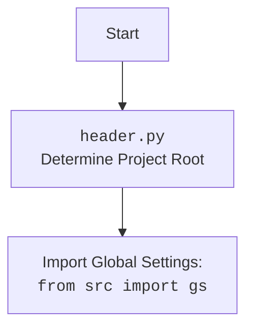

## АНАЛИЗ КОДА: `src/logger/header.py`

### 1. <алгоритм>
####  `set_project_root`
1. **Начало**: Функция `set_project_root` вызывается с параметром `marker_files`, по умолчанию `('__root__', '.git')`.
2. **Получение текущего пути**:  Определяется абсолютный путь к директории, где находится файл `header.py` (`current_path`).
   *   Пример: если `header.py` находится в `/home/user/project/src/logger/`, `current_path` будет `/home/user/project/src/logger`.
3. **Инициализация корня**:  Изначально корневым путем (`__root__`) устанавливается `current_path`.
4. **Поиск маркеров**:  
   - Итерируется по текущему пути и всем его родительским директориям.
   - Для каждой директории проверяется, существует ли в ней хотя бы один из `marker_files`.
   -  Пример: если `marker_files`  = `('__root__', '.git')`, проверяется, есть ли в директории файл `__root__` или папка `.git`.
5. **Обновление корня**: Если маркер найден, `__root__` обновляется до этой родительской директории, и цикл завершается.
   *   Пример: если в  `/home/user/project/`  существует файл `__root__`, `__root__` становится `/home/user/project/`.
6. **Добавление в `sys.path`**:  Если путь `__root__` отсутствует в `sys.path`, он добавляется в начало списка, чтобы обеспечить возможность импорта модулей из проекта.
7. **Возврат корня**: Функция возвращает `__root__` (тип `pathlib.Path`).

#### Загрузка настроек и документации
1. **Загрузка настроек**:
    -   Пытается открыть файл `settings.json` по пути `gs.path.root / 'src' / 'settings.json'`.
        * `gs.path.root` - корневой каталог проекта, который был определен ранее с помощью `set_project_root()`.
        *  Пример: если  `gs.path.root` `/home/user/project/`, то  файл будет `/home/user/project/src/settings.json`
    -   Если файл существует, его содержимое загружается как `json` в словарь `settings`.
    -   Если файл не найден или `json` не валидный, то `settings` остается `None`.
2.  **Загрузка документации**:
    -   Пытается открыть файл `README.MD` по пути `gs.path.root / 'src' / 'README.MD'`.
        * `gs.path.root` - корневой каталог проекта, который был определен ранее с помощью `set_project_root()`.
         * Пример: если  `gs.path.root` `/home/user/project/`, то  файл будет `/home/user/project/src/README.MD`
    -   Если файл существует, то его содержимое читается как строка в переменную `doc_str`
    -   Если файл не найден, то `doc_str` остается `None`.
3.  **Инициализация глобальных переменных**:
    -   Переменные `__project_name__`, `__version__`, `__doc__`, `__details__`, `__author__`, `__copyright__`, `__cofee__`  инициализируются значениями из словаря `settings`.
    - Если словаря `settings` не существует (он равен `None`), то используются значения по умолчанию.
    - Пример: Если `settings` = `{'project_name': 'my_project', 'version': '1.0', 'author': 'John Doe'}` , то `__project_name__` = `'my_project'`, `__version__` =  `'1.0'`, `__author__` =  `'John Doe'`, и.т.д.
    - Если словаря `settings` нет, то  `__project_name__` = `'hypotez'`, `__version__` =  `''` и.т.д.

### 2. <mermaid>

```mermaid
flowchart TD
    Start[Start] --> FindRoot[<code>set_project_root()</code> <br> Find Project Root]
    FindRoot -- Return Root Path --> SetRootPath[Set Project Root Path<br><code>__root__</code>]
    SetRootPath --> LoadSettings[Load Settings: <br><code>settings.json</code>]
    LoadSettings --> LoadDocString[Load Documentation: <br><code>README.MD</code>]
    LoadDocString --> InitGlobals[Initialize Global Variables: <br> <code>__project_name__</code>, <code>__version__</code>, <code>__doc__</code>, ...]
    InitGlobals --> End[End]
    
    style FindRoot fill:#f9f,stroke:#333,stroke-width:2px
    style LoadSettings fill:#ccf,stroke:#333,stroke-width:2px
    style LoadDocString fill:#ccf,stroke:#333,stroke-width:2px

```



#### Анализ `mermaid` диаграммы:

**Основная диаграмма:**
- **Start**: Начало выполнения кода.
- **FindRoot**: Вызов функции `set_project_root()`, которая находит корневую директорию проекта.
- **SetRootPath**: Переменная `__root__` устанавливается на основе результатов работы `set_project_root()`.
- **LoadSettings**: Загрузка настроек проекта из файла `settings.json`, используя `gs.path.root` (глобальные настройки пути).
- **LoadDocString**: Загрузка документации проекта из файла `README.MD`, используя `gs.path.root`.
- **InitGlobals**: Инициализация глобальных переменных `__project_name__`, `__version__`, `__doc__` и т.д. с использованием данных из настроек и документации, или значения по умолчанию.
- **End**: Конец выполнения.

**Диаграмма `header.py`:**
- **Start**: Начало процесса импорта и определения путей.
- **Header**: Указывает на файл `header.py` и его основную функцию — определение корневой директории проекта.
- **import**: Показывает, что `header.py` импортирует глобальные настройки из `src.gs`.

**Зависимости:**

- `pathlib`:  Используется для работы с путями к файлам и директориям. Импортируется из стандартной библиотеки python.
- `sys`: Используется для изменения путей поиска модулей. Импортируется из стандартной библиотеки python.
- `json`: Используется для работы с `json` файлами. Импортируется из стандартной библиотеки python.
- `packaging.version`: Используется для работы с версиями. Импортируется из сторонней библиотеки `packaging`.
-  `src.gs`:  Глобальные настройки, используемые для определения пути к файлам настроек и документации. Зависимость от собственного пакета.

### 3. <объяснение>

#### Импорты:

-   `import sys`: Используется для добавления пути к корневой директории проекта в `sys.path`. Это позволяет импортировать модули из проекта, независимо от текущего пути запуска.
-   `import json`: Используется для загрузки данных из файла `settings.json`, который содержит общую конфигурацию проекта.
-   `from pathlib import Path`: Используется для работы с путями к файлам и директориям, делает код более читаемым и переносимым.
-  `from packaging.version import Version`:  Используется для сравнения версий проекта.
-   `from src import gs`: Импортирует глобальные настройки проекта из модуля `src.gs`.  Это  часть инфраструктуры проекта и связывает данный модуль с другими частями.

#### Классы:

-   **`pathlib.Path`**:  Используется для представления путей к файлам и директориям. Этот класс предоставляет методы для более удобной работы с файловой системой.

#### Функции:

-   **`set_project_root(marker_files: tuple = ('__root__', '.git')) -> Path`**:
    -   **Аргументы**:
        -   `marker_files` (tuple): Кортеж с именами файлов или директорий, которые используются для идентификации корневой директории проекта.
    -   **Возвращаемое значение**:
        -   `Path`:  Объект `Path`, представляющий корневую директорию проекта.
    -   **Назначение**:
        -   Функция ищет корневую директорию проекта, поднимаясь по директориям, пока не найдет маркерный файл или директорию. Это обеспечивает независимость от текущей директории запуска скрипта.
    -   **Примеры**:
        -   Вызов `set_project_root()` вернет путь к корню проекта на основе маркеров `__root__` или `.git`.
        -   Вызов `set_project_root(marker_files = ('my_marker',))`  вернет путь к корню проекта на основе маркера `my_marker`.

#### Переменные:

-   `__root__`:  Переменная типа `Path`, хранит путь к корневой директории проекта.
-   `settings`: Словарь, хранящий настройки проекта, загруженные из `settings.json`. Изначально `None`, заполняется при успешной загрузке.
-   `doc_str`: Строка, содержащая текст из файла `README.MD`. Изначально `None`, заполняется при успешной загрузке.
-  `__project_name__`: Название проекта, загружается из `settings` или устанавливается значение по умолчанию.
-   `__version__`: Версия проекта, загружается из `settings` или устанавливается значение по умолчанию.
-   `__doc__`:  Документация проекта, загружается из `README.MD`.
-    `__details__`: Детальная информация о проекте.
-   `__author__`: Автор проекта, загружается из `settings` или устанавливается значение по умолчанию.
-   `__copyright__`: Информация об авторских правах, загружается из `settings` или устанавливается значение по умолчанию.
-   `__cofee__`:  Текст с призывом поддержать разработчика.

####  Взаимосвязи:

-   `header.py` зависит от `src.gs` для получения доступа к глобальным настройкам, что делает его частью системы конфигурации проекта.
-   `header.py` устанавливает  путь к корню проекта и добавляет его в  `sys.path`. Это обеспечивает возможность импорта модулей из других частей проекта и таким образом связывает все модули друг с другом.
-    Инициализация переменных `__project_name__`, `__version__`, `__doc__` и т.д., позволяет получить базовую информацию о проекте, которая в дальнейшем используется в других частях проекта.

####  Потенциальные ошибки и области для улучшения:

-   **Отсутствие обработки исключений**:  Код обрабатывает исключения `FileNotFoundError` и `json.JSONDecodeError` при чтении `settings.json` и `README.MD` просто `...`. Было бы лучше логировать ошибки и установить более понятные значения по умолчанию.
-   **Использование  `__root__` как глобальной переменной**: Использование глобальных переменных затрудняет тестирование и может привести к конфликтам имен. Возможно стоит перенести логику определения пути в класс-конфигуратор.
-  **Жестко заданные пути**: Путь к файлам `settings.json` и `README.MD`  задан в коде, было бы лучше вынести эти пути в конфигурацию или использовать более гибкие механизмы.
- **Неоднозначность маркеров**: Использование нескольких маркеров для определения корня проекта может привести к неоднозначности. Например, `.git` может присутствовать в поддиректориях.

#### Вывод:

`header.py` играет ключевую роль в проекте, определяя его корневую директорию и устанавливая базовые настройки. Он обеспечивает возможность импорта модулей из разных частей проекта и устанавливает основные параметры проекта. Потенциальные улучшения касаются более надежной обработки исключений, большей гибкости в конфигурации и уменьшения использования глобальных переменных.