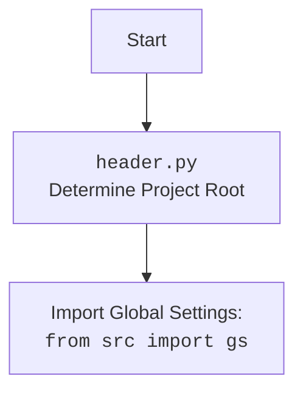

## АНАЛИЗ КОДА `src/logger/header.py`

### <алгоритм>

1.  **`set_project_root(marker_files)`:**
    *   **Вход:** Список `marker_files` (по умолчанию `('__root__', '.git')`).
    *   **Действие:**
        *   Определяет путь к текущему файлу и его родительскую директорию.
        *   Итеративно перебирает текущую директорию и ее родительские директории.
        *   Для каждой директории проверяет наличие хотя бы одного из `marker_files`.
        *   Если находит, то устанавливает эту директорию как корневую (`__root__`) и прерывает цикл.
        *   Если не найдено, то `__root__` устанавливается в текущую директорию.
        *   Добавляет `__root__` в `sys.path`, если его там нет.
    *   **Выход:** Путь к корневой директории проекта (`Path`).
    *   **Пример:** Если `marker_files = ('__root__', '.git')` и файл `__root__` найден в директории `/home/user/project`, то `set_project_root()` вернет `/home/user/project`
2.  **Установка корневой директории:**
    *   **Действие:** Вызывает функцию `set_project_root()` и сохраняет результат в глобальную переменную `__root__`.
3.  **Загрузка настроек:**
    *   **Действие:**
        *   Пытается открыть файл `settings.json` из папки `src` относительно корня проекта.
        *   Загружает настройки из JSON.
        *   Если файл не найден или есть ошибка декодирования JSON, то `settings` = `None`.
    *   **Пример:** если settings.json имеет структуру ```{"project_name": "hypotez", "version": "1.0.0", "author": "John Doe"}```, то `settings` будет `{ "project_name": "hypotez", "version": "1.0.0", "author": "John Doe" }`
4.  **Загрузка документации:**
    *   **Действие:**
        *   Пытается открыть файл `README.MD` из папки `src` относительно корня проекта.
        *   Загружает содержимое `README.MD` в переменную `doc_str`.
        *   Если файл не найден, то `doc_str` останется `None`.
    *   **Пример:** если README.MD имеет содержимое ```#Hypotez Project\nThis is a project description```, то `doc_str` будет  `#Hypotez Project\nThis is a project description`.
5.  **Инициализация глобальных переменных:**
    *   **Действие:**
        *   Инициализирует глобальные переменные `__project_name__`, `__version__`, `__doc__`, `__details__`, `__author__`, `__copyright__`, `__cofee__`
        *   Значения берутся из `settings` или используются значения по умолчанию.
        *   `__details__` устанавливается в пустую строку.
        *   `__doc__` устанавливается в `doc_str`, если оно не `None`, иначе в пустую строку.
        *   `__cofee__` устанавливается в значение по умолчанию, если в settings не установлено.
    *   **Пример:** при settings = `{ "project_name": "hypotez", "version": "1.0.0", "author": "John Doe" }` и doc_str = `"#Hypotez Project\nThis is a project description"`, то `__project_name__ = 'hypotez'`, `__version__ = '1.0.0'`, `__doc__ = "#Hypotez Project\nThis is a project description"`, `__author__ = "John Doe"`, а `__details__` будет ''.

### <mermaid>

```mermaid
flowchart TD
    Start --> FindRoot[set_project_root()<br> Find Project Root]
    FindRoot --> SetRootPath[__root__ = Path]
    SetRootPath --> CheckMarker[Check for marker files: '__root__', '.git']
    CheckMarker -- Found marker file --> SetProjectRootPath[__root__ = parent dir]
    SetProjectRootPath --> AddPath[sys.path.insert(0, str(__root__))]
    CheckMarker -- Not Found marker file --> CurrentDirAsRoot[__root__ = current dir]
    CurrentDirAsRoot --> AddPath
    AddPath --> LoadSettings[Load settings.json]
    LoadSettings --> SetSettings[settings = json.load(settings_file)]
    SetSettings --> HandleLoadErr[catch FileNotFoundError, JSONDecodeError]
     HandleLoadErr -- Error --> LoadReadme[Load README.MD]
    SetSettings -- Success --> LoadReadme
    LoadReadme --> SetDoc[doc_str = settings_file.read()]
     SetDoc --> HandleReadErr[catch FileNotFoundError, JSONDecodeError]
     HandleReadErr -- Error --> InitGlobalVars[Initialize global variables]
    SetDoc -- Success --> InitGlobalVars
    InitGlobalVars --> SetProjectName[__project_name__]
    InitGlobalVars --> SetVersion[__version__]
    InitGlobalVars --> SetDocStr[__doc__]
    InitGlobalVars --> SetDetails[__details__ = ""]
    InitGlobalVars --> SetAuthor[__author__]
    InitGlobalVars --> SetCopyright[__copyright__]
    InitGlobalVars --> SetCofee[__cofee__]
    SetProjectName --> End
    SetVersion --> End
    SetDocStr --> End
    SetDetails --> End
    SetAuthor --> End
    SetCopyright --> End
     SetCofee --> End
```



**Объяснение:**

1. **`Start`:**  Начало выполнения скрипта.
2.  **`FindRoot[set_project_root()]`:** Вызов функции `set_project_root` для определения корневой директории проекта.
3.  **`SetRootPath[__root__ = Path]`:**  Установка начального значения переменной `__root__` в путь к текущей директории скрипта.
4.  **`CheckMarker[Check for marker files]`:** Проверка наличия маркерных файлов (например, `__root__`, `.git`) в текущей директории или ее родительских директориях.
5.  **`SetProjectRootPath[__root__ = parent dir]`:** Если маркерный файл найден, устанавливаем родительскую директорию в качестве корневой директории проекта.
6.   **`CurrentDirAsRoot[__root__ = current dir]`**: Если маркерный файл не найден, то устанавливаем текущую директорию в качестве корня проекта.
7.  **`AddPath[sys.path.insert(0, str(__root__))]`:** Добавление корневой директории проекта в `sys.path` для корректного импорта модулей.
8.  **`LoadSettings[Load settings.json]`:** Попытка загрузить настройки из файла `settings.json` из папки `src` относительно корня проекта.
9.  **`SetSettings[settings = json.load(settings_file)]`:** Загрузка настроек из JSON файла в переменную settings
10.  **`HandleLoadErr[catch FileNotFoundError, JSONDecodeError]`**: Обработка исключений, если файл настроек не найден или при декодировании JSON.
11. **`LoadReadme[Load README.MD]`:** Попытка загрузить документацию из файла `README.MD` из папки `src` относительно корня проекта.
12. **`SetDoc[doc_str = settings_file.read()]`:** Чтение содержимого файла README.MD и сохранения его в переменную doc_str
13. **`HandleReadErr[catch FileNotFoundError, JSONDecodeError]`**: Обработка исключений, если файл документации не найден.
14. **`InitGlobalVars[Initialize global variables]`:** Инициализация глобальных переменных.
15. **`SetProjectName[__project_name__]`:** Установка имени проекта.
16. **`SetVersion[__version__]`:** Установка версии проекта.
17. **`SetDocStr[__doc__]`:** Установка документации проекта.
18. **`SetDetails[__details__ = ""]`:** Установка пустой строки для деталей проекта.
19. **`SetAuthor[__author__]`:** Установка автора проекта.
20. **`SetCopyright[__copyright__]`:** Установка копирайта проекта.
21. **`SetCofee[__cofee__]`:** Установка приглашения на кофе для разработчика.
22. **`End`**: Конец выполнения скрипта.

**Дополнительный `mermaid` блок:**

Этот блок описывает зависимость от импорта `from src import gs`:

1.  **`Start`:** Начало.
2.  **`Header`:** Указывает на файл `header.py` и его роль в определении корня проекта.
3.  **`import`:** Показывает импорт глобальных настроек из `src` в виде `from src import gs`.

### <объяснение>

**Импорты:**

*   `sys`: Используется для доступа к параметрам и функциям, специфичным для системы (например, `sys.path`).
*   `json`: Используется для работы с JSON-данными (загрузка настроек из файла `settings.json`).
*   `packaging.version.Version`: Используется для сравнения версий.
*   `pathlib.Path`:  Используется для представления и манипулирования путями к файлам и директориям.
*   `src.gs`: Импорт глобальных настроек проекта, таких как путь к корневой директории (`gs.path.root`). Это важная часть для организации структуры проекта и доступа к общим ресурсам.

**Функции:**

*   `set_project_root(marker_files)`:
    *   **Назначение:** Определяет корневой каталог проекта, начиная с каталога, в котором находится текущий файл. Поиск происходит по родительским каталогам, пока не будет найден один из файлов-маркеров (`__root__` или `.git`).
    *   **Аргументы:** `marker_files` - кортеж строк, представляющий имена файлов или каталогов, которые используются для идентификации корневого каталога.
    *   **Возвращает:** `Path` объект, представляющий корневой каталог проекта. Если ни один из маркерных файлов не найден, возвращается каталог, где находится скрипт.
    *   **Примеры:**
        *   Если `marker_files` равен `('__root__', '.git')` и в родительском каталоге существует файл `.git`, то корневым каталогом будет родительский каталог.
        *   Если `marker_files` равен `('__root__', '.git')` и в текущем каталоге существует файл `__root__`, то корневым каталогом будет текущий каталог.
        *   Если маркеры не найдены, то возвращается путь к текущему каталогу скрипта.
*   `open()` - встроенная функция для открытия файла.
*   `json.load()` -  метод для загрузки данных из JSON файла в Python dict.

**Переменные:**

*   `__root__`: `Path` - глобальная переменная, которая хранит путь к корневой директории проекта.
*   `settings`: `dict` - глобальная переменная, которая хранит загруженные из файла `settings.json` настройки проекта в виде словаря.
*   `doc_str`: `str` - глобальная переменная, которая хранит строку с документацией из файла `README.MD`.
*   `__project_name__`: `str` - глобальная переменная, которая хранит название проекта. Значение по умолчанию 'hypotez'.
*   `__version__`: `str` - глобальная переменная, которая хранит версию проекта. Значение по умолчанию ''.
*   `__doc__`: `str` - глобальная переменная, которая хранит документацию проекта.
*   `__details__`: `str` - глобальная переменная, которая хранит детали проекта (всегда пустая строка).
*   `__author__`: `str` - глобальная переменная, которая хранит автора проекта. Значение берется из `settings` или используется по умолчанию ''.
*   `__copyright__`: `str` - глобальная переменная, которая хранит копирайт проекта. Значение берется из `settings` или используется по умолчанию ''.
*    `__cofee__`: `str` - глобальная переменная, которая хранит текст с предложением выпить кофе за разработчика. Значение берется из `settings` или используется значение по умолчанию "Treat the developer to a cup of coffee for boosting enthusiasm in development: https://boosty.to/hypo69".

**Взаимосвязи с другими частями проекта:**

*   Модуль `header.py` устанавливает корневой путь проекта, который используется в других частях проекта для импорта модулей и доступа к ресурсам.
*   Импорт `from src import gs` показывает, что Модуль зависит от глобальных настроек, хранящихся в `src/gs`.
*   Модуль загружает `settings.json` и `README.MD` и создает глобальные переменные, которые могут использоваться другими модулями.
*   Цепочка: `src.logger.header` --> `src.gs` --> `settings.json` --> `README.MD`

**Потенциальные ошибки и области для улучшения:**

*   Обработка ошибок при загрузке `settings.json` и `README.MD`  происходит через `try ... except`, но код не выполняет никаких действий в блоке except кроме "...", что может затруднить отладку. Было бы полезно добавить логирование или выдачу предупреждения.
*   Отсутствует явная обработка случая, когда `settings` или `doc_str` = `None`, в таком случае переменные инициализируются  значениями по умолчанию, но это поведение  не всегда ожидаемо. Можно было бы, например, добавить проверку и поднимать исключение.
*   `__details__` всегда инициализируется пустой строкой, возможно, стоит пересмотреть эту логику.
*   Использование `...` в блоке `except` не рекомендуется, лучше использовать `pass` или логировать ошибку.
*   Не используются возможности версионирования из `packaging.version`.
*   Следует добавить type hinting для переменных (особенно в  блоке инициализации глобальных переменных, таких как `__project_name__`, `__version__`, `__doc__`, `__author__`, и т.д.) для улучшения читаемости и поддержки кода.

Этот подробный анализ и объяснение должны дать полное представление о функциональности и внутреннем устройстве кода `src/logger/header.py`.