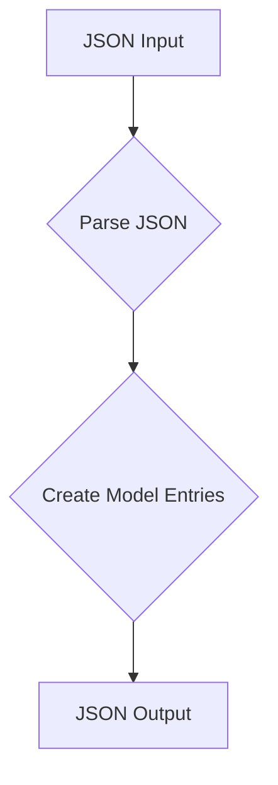
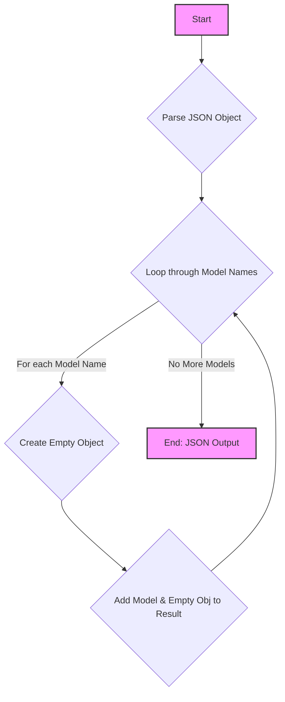

## АНАЛИЗ КОДА

### 1. **<алгоритм>**

Код представляет собой JSON-объект, который определяет структуру данных для хранения информации о различных моделях искусственного интеллекта. Каждая модель представлена как ключ в этом объекте, а значением является пустой объект. Это означает, что в текущей версии кода не заданы никакие параметры или настройки для моделей.

**Пример логического блока:**

- **Ввод:** JSON-объект, содержащий ключи, которые представляют названия моделей ИИ.
- **Обработка:** Создание JSON-объекта, где каждый ключ является названием модели. Значение каждого ключа - пустой объект (на данный момент).
- **Вывод:**  JSON-объект, отражающий перечень доступных моделей ИИ.

**Поток данных:**



### 2. **<mermaid>**



**Объяснение зависимостей:**

В этом коде нет импортированных библиотек или модулей. Он представляет собой структуру данных в формате JSON. Зависимости от внешних библиотек, таких как `json` или `collections` , могут возникнуть в месте, где этот JSON-объект будет использоваться и обрабатываться.
В данном случае, это просто описание структуры данных.

### 3. **<объяснение>**

**Импорты:**

- В данном коде отсутствуют импорты, так как он представлен в формате JSON. Импорты будут использоваться в коде, где этот JSON будет использоваться и интерпретироваться.

**Классы:**

- Отсутствуют классы, так как это JSON-объект, а не Python-код.

**Функции:**

- Отсутствуют функции, так как это JSON-объект, а не Python-код.

**Переменные:**

- Основная "переменная" — это JSON-объект.
    - **Тип:** JSON Object (который будет представлен как `dict` в Python).
    - **Использование:** Представляет структуру данных, содержащую ключи (имена моделей ИИ) и пустые объекты в качестве значений (для будущих параметров).

**Общее объяснение:**

Данный JSON-объект представляет собой конфигурацию, которая, вероятно, используется для определения списка доступных моделей ИИ. Каждый ключ соответствует имени модели, а пустой объект в качестве значения указывает на то, что на данный момент для каждой модели не заданы параметры или дополнительные настройки.

**Потенциальные ошибки/области для улучшения:**

- В текущем виде JSON-объект только хранит имена моделей. В будущем, чтобы быть полезным, потребуется расширить структуру данных, включив параметры и настройки для каждой модели.
- Проверку формата JSON (например, уникальность ключей) можно было бы добавить на этапе обработки этого JSON, если это не проверяется автоматически.

**Цепочка взаимосвязей с другими частями проекта:**

- Этот файл `models.json`, вероятно, используется в других частях проекта, где происходит выбор и взаимодействие с различными моделями ИИ.
- Структура данных будет загружаться и обрабатываться Python-кодом, где будет происходить парсинг JSON и использование полученной информации.
- Возможно, будут функции, которые считывают этот файл, интерпретируют его и используют для выбора модели, передачи входных данных и получения результатов.

**Пример использования в Python:**

```python
import json

# Чтение JSON из файла
with open('hypotez/src/ai/openai/model/models.json', 'r') as f:
    models_data = json.load(f)

# Пример использования
for model_name, params in models_data.items():
    print(f"Model: {model_name}, Parameters: {params}")

# Вывод:
# Model: gpt-3.5-turbo-instruct, Parameters: {}
# Model: gpt-4o, Parameters: {}
# Model: gpt-4o-mini, Parameters: {}
# Model: gpt-4o-turbo, Parameters: {}
# Model: o1-preview-2024-09-12, Parameters: {}
```