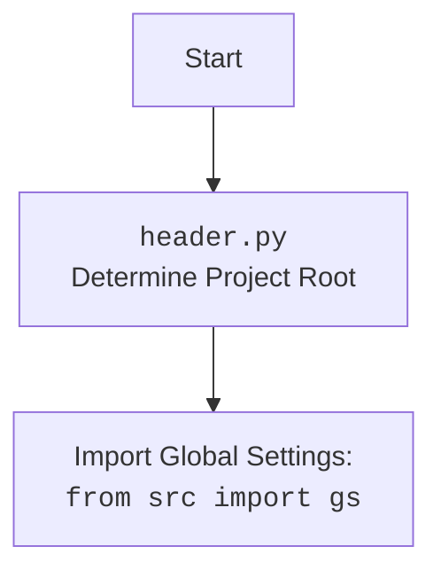

## АНАЛИЗ КОДА: `hypotez/src/ai/openai/model/training.py`

### <алгоритм>

**1. Инициализация `OpenAIModel`:**
   - Создается экземпляр класса `OpenAIModel`.
   - В конструкторе:
     - Инициализируется клиент OpenAI с использованием API-ключа из `gs.credentials.openai`.
     - Устанавливается `current_job_id` в `None`.
     - Устанавливается `assistant_id` либо из аргумента, либо из `gs.credentials.openai.assistant_id.code_assistant`.
     - Загружается ассистент с помощью `self.client.beta.assistants.retrieve(self.assistant_id)`.
     - Создается поток (thread) с помощью `self.client.beta.threads.create()`.
   - Пример:
     ```python
     model = OpenAIModel(system_instruction="You are a helpful assistant.", assistant_id="asst_dr5AgQnhhhnef5OSMzQ9zdk9")
     ```

**2. Получение списка моделей (`list_models`):**
   - Вызывается метод `list_models`.
   - Запрашивается список доступных моделей через `self.client.models.list()`.
   - Извлекаются идентификаторы моделей из полученных данных.
   - Возвращается список идентификаторов моделей.
   - Пример:
     ```python
     models = model.list_models
     # Возвращает ['gpt-4o-mini', 'gpt-4o-2024-08-06' и т.д.]
     ```

**3. Получение списка ассистентов (`list_assistants`):**
   - Вызывается метод `list_assistants`.
   - Загружается список ассистентов из `assistants.json` с помощью `j_loads_ns`.
   - Извлекаются имена ассистентов из загруженного списка.
   - Возвращается список имен ассистентов.
   - Пример:
     ```python
      assistants = model.list_assistants
     # Возвращает ['assistant_name_1', 'assistant_name_2' и т.д.]
     ```

**4. Установка ассистента (`set_assistant`):**
   - Вызывается метод `set_assistant` с `assistant_id`.
   - Устанавливается `self.assistant_id`.
   - Загружается ассистент с помощью `self.client.beta.assistants.retrieve(assistant_id)`.
   - Пример:
     ```python
     model.set_assistant(assistant_id="some_other_assistant_id")
     ```

**5. Сохранение диалога (`_save_dialogue`):**
   - Вызывается метод `_save_dialogue`.
   - Сохраняет текущий диалог `self.dialogue` в JSON файл, путь к которому хранится в `self.dialogue_log_path`.

**6. Определение тональности (`determine_sentiment`):**
   - Вызывается метод `determine_sentiment` с текстом сообщения.
   - Проверяет наличие позитивных, негативных или нейтральных слов в сообщении.
   - Возвращает тональность (`positive`, `negative` или `neutral`).
    - Пример:
      ```python
      sentiment = model.determine_sentiment("This is a great product")
      # Возвращает "positive"
      ```

**7. Отправка сообщения (`ask`):**
   - Вызывается метод `ask` с сообщением, опциональным системным сообщением и количеством попыток.
   - Формируется список сообщений, включая системное (если есть) и пользовательское.
   - Отправляется запрос в OpenAI API с помощью `self.client.chat.completions.create`.
   - Полученный ответ анализируется и извлекается текст ответа.
   - Анализируется тональность ответа с помощью `determine_sentiment`.
   - Сообщения, включая текст и тональность, добавляются в `self.dialogue`.
   - Диалог сохраняется с помощью `_save_dialogue`.
   - В случае ошибки делается попытка повторить запрос (с уменьшенным количеством попыток).
   - Возвращает ответ модели.
   - Пример:
     ```python
     response = model.ask(user_input, system_instruction="Be concise.", attempts=2)
     # Возвращает ответ модели
     ```

**8. Описание изображения (`describe_image`):**
   - Вызывается метод `describe_image` с путем к изображению и опциональным запросом и системной инструкцией.
   - Кодирует изображение в base64 с помощью `base64encode`.
   - Формирует запрос к OpenAI API, включая изображение в формате base64.
   - Отправляет запрос в OpenAI API с помощью `self.client.chat.completions.create`.
   - Извлекает ответ, если нет ошибок, возвращает его как `namespace` объект.
   - Пример:
      ```python
      description = model.describe_image(image_path, prompt="Describe the scene.")
      # Возвращает описание изображения
      ```

**9. Описание изображения через requests (`describe_image_by_requests`):**
   - Вызывается метод `describe_image_by_requests` с путем к изображению и опциональным запросом.
   - Кодирует изображение в base64 с помощью `base64encode`.
   - Формирует HTTP запрос к OpenAI API, включая изображение в формате base64.
   - Отправляет запрос в OpenAI API с помощью `requests.post`.
   - Полученный ответ обрабатывается (ожидает JSON).
   - Пример:
      ```python
      description = model.describe_image_by_requests(image_path, prompt="Describe the colors.")
      # Возвращает описание изображения
      ```

**10. Динамическое обучение (`dynamic_train`):**
    - Вызывается метод `dynamic_train`.
    - Загружает историю диалогов из `dailogue.json`.
    - Если история диалогов существует, отправляет ее для обучения через `self.client.chat.completions.create`.
    - Если истории нет, выводит информационное сообщение.

**11. Обучение (`train`):**
    - Вызывается метод `train` с данными для обучения (текст или файл), каталогом данных и флагом тональности.
    - Загружает документы для обучения, используя `j_loads`.
    - Отправляет запрос на обучение через `self.client.Training.create`.
    - Записывает `job_id` в `self.current_job_id`.
    - Возвращает `job_id`.
    - Пример:
        ```python
        job_id = model.train(data_file=gs.path.google_drive / 'AI' / 'training_data.csv', positive=True)
        # Возвращает идентификатор задания обучения
        ```

**12. Сохранение job_id (`save_job_id`):**
    - Вызывается метод `save_job_id` с `job_id`, описанием и именем файла.
    - Формирует словарь с `job_id`, описанием и временем создания.
    - Сохраняет данные в JSON файл, обновляя список существующих job_id, если файл существует.

**13. `main` Функция:**
    - Создаёт объект `OpenAIModel`.
    - Выводит список доступных моделей и ассистентов.
    - Отправляет сообщение, используя `ask`.
    - Запускает динамическое обучение с помощью `dynamic_train`.
    - Запускает обучение с помощью `train`.
    - Сохраняет `job_id` с помощью `save_job_id`.
    - Вызывает метод `describe_image` для описания изображения.

### <mermaid>

```mermaid
flowchart TD
    subgraph OpenAI Model Class
        A[<code>__init__</code><br>Initialize Model] --> B[Set API Key and Assistant ID]
        B --> C[Retrieve Assistant]
        C --> D[Create Thread]

        E[<code>list_models</code><br>Fetch Available Models] --> F[Get Model List from OpenAI]
        F --> G[Return Model IDs]

        H[<code>list_assistants</code><br>Fetch Available Assistants] --> I[Load Assistants from JSON]
        I --> J[Return Assistant Names]
        
        K[<code>set_assistant</code><br>Set Active Assistant] --> L[Set Assistant ID]
        L --> M[Retrieve Assistant]

        N[<code>_save_dialogue</code><br>Save Conversation Log] --> O[Save Dialogue to JSON]
    
        P[<code>determine_sentiment</code><br>Analyze Message Sentiment] --> Q[Check for positive, negative, neutral words]
        Q --> R[Return Sentiment]
        
        S[<code>ask</code><br>Send Message to OpenAI] --> T[Prepare Messages (system and user)]
        T --> U[Send Message to OpenAI API]
        U --> V[Analyze and Add Sentiment]
        V --> N
        V --> W[Return Model Response]

        X[<code>describe_image</code><br>Describe Image] --> Y[Encode Image to Base64]
        Y --> Z[Prepare Image Description Request]
        Z --> AA[Send Request to OpenAI API]
        AA --> AB[Return Image Description]
        
        AC[<code>describe_image_by_requests</code><br>Describe Image via Requests] --> AD[Encode Image to Base64]
        AD --> AE[Create HTTP Request]
        AE --> AF[Send HTTP Request to OpenAI API]
        AF --> AG[Return Image Description]
    
        AH[<code>dynamic_train</code><br>Dynamic Fine-tuning] --> AI[Load Dialogue History]
        AI --> AJ[Send Dialogue for Fine-tuning]

        AK[<code>train</code><br>Train Model] --> AL[Load Training Data]
        AL --> AM[Send Data for Training]
        AM --> AN[Get Job ID]
        
        AO[<code>save_job_id</code><br>Save Training Job ID] --> AP[Prepare Job Data]
        AP --> AQ[Save Job Data to JSON]

        Start --> A
        Start --> E
        Start --> H
        Start --> K
    
        Start --> N
        Start --> P
        Start --> S
        Start --> X
        Start --> AC
        Start --> AH
        Start --> AK
        Start --> AO

    end

    subgraph Main Function
    
        MN[<code>main</code><br>Main Function] --> MI[Initialize OpenAI Model Class]
        MI --> ML[Print Available Models]
        ML --> MK[Print Available Assistants]
        MK --> MJ[Send Message]
        MJ --> MH[Dynamic Training]
        MH --> MG[Start Model Training]
        MG --> MF[Save Training Job ID]
        MF --> ME[Describe Image]
        
        StartMain --> MN
    end

    StartMain --> Start
```

**Объяснение зависимостей в `mermaid` диаграмме:**

*   `OpenAI Model Class`: Представляет класс `OpenAIModel`, инкапсулирующий методы для взаимодействия с OpenAI API.
*   `__init__`: Конструктор класса, инициализирующий объект.
*   `list_models`: Метод для получения списка доступных моделей OpenAI.
*   `list_assistants`: Метод для получения списка доступных ассистентов.
*    `set_assistant`: Метод для установки текущего ассистента.
*   `_save_dialogue`: Метод для сохранения истории диалога.
*    `determine_sentiment`: Метод для определения тональности сообщения.
*   `ask`: Метод для отправки сообщений и получения ответов от модели.
*   `describe_image`: Метод для описания изображений через OpenAI API.
*   `describe_image_by_requests`: Метод для описания изображений через HTTP-запросы.
*   `dynamic_train`: Метод для динамической дообучения модели.
*   `train`: Метод для обучения модели на предоставленных данных.
*   `save_job_id`: Метод для сохранения информации о задании обучения.
*   `Main Function`: Представляет функцию `main`, демонстрирующую использование `OpenAIModel`.

**Объяснение `header.py` (предполагаемое из `from src import gs`):**



`header.py` отвечает за определение корневого каталога проекта и инициализацию глобальных настроек (представленных `gs`).

### <объяснение>

**Импорты:**

-   `time`: Для работы со временем, используется для задержек между попытками запросов к API.
-   `pathlib.Path`: Для работы с путями к файлам и каталогам.
-   `types.SimpleNamespace`: Для создания простых объектов, используется для ассистентов.
-   `typing.List, Dict, Optional`: Для аннотации типов.
-   `pandas as pd`: Для работы с данными, в данном коде не используется напрямую, но импортируется.
-   `openai.OpenAI`: Клиент для взаимодействия с OpenAI API.
-   `requests`: Для HTTP запросов к API.
-   `PIL.Image`: Для работы с изображениями, в данном коде не используется напрямую.
-   `io.BytesIO`: Для работы с потоками байтов.
-   `src.gs`: Глобальные настройки проекта (предполагается, что `header.py` определяет корень проекта).
-   `src.utils.jjson.j_loads, j_loads_ns, j_dumps`: Функции для работы с JSON. `j_loads` - загружает данные JSON в словарь, `j_loads_ns` - загружает данные JSON как `SimpleNamespace`, `j_dumps` - преобразовывает данные в JSON строку.
-   `src.utils.csv.save_csv_file`: Функция для сохранения данных в CSV файл.
-   `src.utils.printer.pprint`: Функция для печати данных.
-   `src.utils.convertors.base64.base64encode`: Функция для кодирования данных в base64.
-   `src.utils.convertors.md2dict.md2dict`: Функция для преобразования markdown в словарь.
-   `src.logger.logger`: Модуль для логирования.

**Класс `OpenAIModel`:**

-   **Назначение**: Представляет модель OpenAI и методы для взаимодействия с API.
-   **Атрибуты:**
    -   `model: str`: Имя модели, по умолчанию "gpt-4o-mini".
    -   `client: OpenAI`: Клиент OpenAI.
    -   `current_job_id: str`: ID текущего задания обучения.
    -   `assistant_id: str`: ID текущего ассистента.
    -   `assistant`: Объект ассистента.
    -   `thread`: Объект потока (thread).
    -   `system_instruction: str`: Системная инструкция для модели.
    -   `dialogue_log_path: str | Path`: Путь к файлу с историей диалога.
    -   `dialogue: List[Dict[str, str]]`: Список диалогов.
    -   `assistants: List[SimpleNamespace]`: Список доступных ассистентов.
    -   `models_list: List[str]`: Список доступных моделей.
-   **Методы:**
    -   `__init__`: Инициализация объекта, установка API ключа, ID ассистента и загрузка ассистента и потока.
    -   `list_models`: Загружает список доступных моделей из API OpenAI.
    -   `list_assistants`: Загружает список доступных ассистентов из файла.
    -   `set_assistant`: Устанавливает ID ассистента.
    -   `_save_dialogue`: Сохраняет диалог в JSON файл.
    -   `determine_sentiment`: Определяет тональность сообщения.
    -   `ask`: Отправляет сообщение модели и возвращает ответ, анализирует тональность.
    -  `describe_image`: Отправляет изображение и описание к OpenAI API и получает описание изображения.
    -  `describe_image_by_requests`: Отправляет изображение и описание к OpenAI API (через HTTP-запрос) и получает описание изображения.
    -   `dynamic_train`: Загружает историю диалога и производит дообучение модели.
    -   `train`: Обучает модель на предоставленных данных.
    -   `save_job_id`: Сохраняет ID задания обучения в файл.

**Функции:**

-   `main`: Основная функция для демонстрации работы с классом `OpenAIModel`.

**Переменные:**

-   `MODE`: Режим работы (в данном случае `'dev'`).
-   Внутри класса используются переменные, описанные в разделе "Класс `OpenAIModel`", такие как `model`, `client`, `assistant_id` и другие.

**Объяснения:**

1.  **Инициализация:**
    -   Класс `OpenAIModel` предназначен для взаимодействия с OpenAI API, включая отправку сообщений, получение ответов, обучение и работу с изображениями.
    -   При инициализации создается клиент OpenAI, устанавливается ID ассистента и загружается ассистент из API.

2.  **Работа с моделями и ассистентами:**
    -   `list_models` динамически загружает список доступных моделей из OpenAI API.
    -   `list_assistants` загружает список доступных ассистентов из файла `assistants.json`.
    -   Метод `set_assistant` позволяет динамически изменять используемого ассистента.

3.  **Тональность и диалог:**
    -   Метод `determine_sentiment` анализирует тональность сообщений.
    -   Метод `_save_dialogue` сохраняет историю диалога в JSON файл для последующего использования (например, для дообучения).

4.  **Взаимодействие с API:**
    -   Метод `ask` отправляет сообщения в OpenAI API и возвращает ответы.
    -   Метод `describe_image`  отправляет изображения и текстовый запрос в OpenAI API и возвращает описание.
    -   Метод `describe_image_by_requests` отправляет изображения и текстовый запрос в OpenAI API через HTTP запрос и возвращает описание.
    -   Метод `dynamic_train` использует историю диалога для дообучения модели.
    -   Метод `train` используется для обучения модели на новых данных.

5.  **Обучение и сохранение job_id:**
    -   Метод `train` отправляет данные на обучение и возвращает `job_id`.
    -   Метод `save_job_id` сохраняет `job_id` для последующего мониторинга статуса обучения.

6.  **Главная функция `main`:**
    -   Показывает примеры использования методов класса `OpenAIModel`, включая получение списков моделей и ассистентов, отправку сообщений, динамическое и полное обучение.
    -  Также показывает пример использования функции `describe_image`

**Потенциальные ошибки и области для улучшения:**

-   **Обработка ошибок:**
    -   В коде присутствует `try-except`, но обработка ошибок может быть улучшена (например, более детальные сообщения об ошибках).
-   **Логирование:**
    -   Логирование может быть улучшено добавлением более подробных сообщений.
-   **Настройки:**
    -   Настройки (`model`, `api_key`, `assistant_id`) могут быть вынесены в отдельный конфигурационный файл.
-   **Зависимости:**
    -   Зависимость от `gs` может быть ослаблена, если передавать необходимые параметры в конструктор или через методы.
-   **Обучение:**
    -   Метод `train` использует `j_loads` для загрузки данных обучения, что ограничивает его гибкость. Может быть улучшено чтением данных из CSV файла.
-   **Отсутствие возврата значения:**
   -  Метод `describe_image_by_requests` в случае ошибки ничего не возвращает
-   **Разные способы вызова API:**
    - В коде присутствуют 2 функции для описания изображений, `describe_image`, и `describe_image_by_requests`. Первая использует `openai.OpenAI`, вторая - `requests`.

**Взаимосвязи с другими частями проекта:**

-   Зависимость от `src.gs` указывает на то, что код зависит от глобальных настроек проекта.
-   Зависимость от модулей `src.utils.jjson`, `src.utils.csv`, `src.utils.printer`, `src.utils.convertors.base64`, `src.utils.convertors.md2dict` и `src.logger.logger` говорит об использовании утилит из `src`.
-   Диалог сохранения использует путь `gs.path.google_drive / 'AI' / f"{model}_{gs.now}.json"`
-   Динамическое обучение использует `gs.path.google_drive / 'AI' / 'conversation' / 'dailogue.json'`
-   Обучение использует `gs.path.google_drive / 'AI' / 'training'` или `gs.path.google_drive / 'AI' / 'training_data.csv'`
- Сохранение job_id использует `gs.path.google_drive / filename`
- Описание изображения использует `gs.path.google_drive / 'images' / 'example_image.jpg'`

Этот анализ предоставляет полное описание функциональности кода, алгоритма, зависимостей и возможных улучшений.