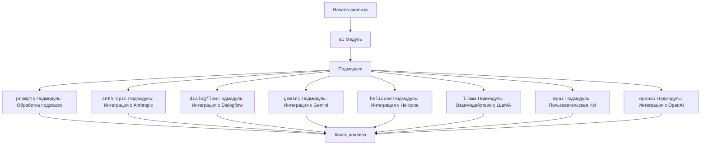

## ИНСТРУКЦИЯ:

Анализируй предоставленный код подробно и объясни его функциональность. Ответ должен включать три раздела:  

1. **<алгоритм>**: Опиши рабочий процесс в виде пошаговой блок-схемы, включая примеры для каждого логического блока, и проиллюстрируй поток данных между функциями, классами или методами.  
2. **<mermaid>**: Напиши код для диаграммы в формате `mermaid`, проанализируй и объясни все зависимости, 
    которые импортируются при создании диаграммы. 
    **ВАЖНО!** Убедитесь, что все имена переменных, используемые в диаграмме `mermaid`, 
    имеют осмысленные и описательные имена. Имена переменных вроде `A`, `B`, `C`, и т.д., не допускаются!  
    
    **Дополнительно**: Если в коде есть импорт `import header`, добавьте блок `mermaid` flowchart, объясняющий `header.py`:\
    ```mermaid
    flowchart TD
        Start --> Header[<code>header.py</code><br> Determine Project Root]
    
        Header --> import[Import Global Settings: <br><code>from src import gs</code>] 
    ```

3. **<объяснение>**: Предоставьте подробные объяснения:  
   - **Импорты**: Их назначение и взаимосвязь с другими пакетами `src.`.  
   - **Классы**: Их роль, атрибуты, методы и взаимодействие с другими компонентами проекта.  
   - **Функции**: Их аргументы, возвращаемые значения, назначение и примеры.  
   - **Переменные**: Их типы и использование.  
   - Выделите потенциальные ошибки или области для улучшения.  

Дополнительно, постройте цепочку взаимосвязей с другими частями проекта (если применимо).  

Это обеспечивает всесторонний и структурированный анализ кода.
## Формат ответа: `.md` (markdown)
**КОНЕЦ ИНСТРУКЦИИ**

## <алгоритм>

Данный код представляет собой обзор модуля `ai` и его подмодулей в рамках проекта. Он описывает структуру и назначение различных частей, связанных с управлением моделями ИИ.  Вот пошаговый алгоритм обработки данного описания:

1.  **Начало**: Анализ начинается с корневого модуля `ai`.
    *   *Пример*: Проект обращается к модулю `ai` для доступа к моделям ИИ.

2.  **Идентификация подмодулей**: Модуль `ai` включает несколько подмодулей, каждый из которых отвечает за интеграцию с конкретной моделью ИИ или API.
    *   *Пример*: `prompts`, `anthropic`, `dialogflow`, `gemini`, `helicone`, `llama`, `myai`, `openai`.

3.  **Обработка подмодулей**:  Каждый подмодуль обрабатывается для понимания его специфического назначения.
    *   *Пример*:
        *   `prompts`: Обработка и настройка подсказок.
        *   `anthropic`: Интеграция с моделями Anthropic.
        *   `dialogflow`: Интеграция с Google Dialogflow для NLU.
        *   `gemini`: Интеграция с моделями Gemini.
        *   `helicone`: Интеграция с моделями Helicone.
        *   `llama`: Взаимодействие с LLaMA.
        *   `myai`: Пользовательские конфигурации моделей ИИ.
        *   `openai`: Интеграция с API OpenAI (например, GPT).

4. **Конец**: Завершение анализа модуля `ai` и его подмодулей.
    *   *Пример*: Пользователь получил представление о том, как различные части модуля `ai` взаимодействуют с моделями ИИ.

## <mermaid>



**Объяснение диаграммы:**

*   `Start`: Начало процесса анализа.
*   `AIModule`: Обозначает корневой модуль `ai`.
*   `Submodules`: Представляет группу подмодулей, входящих в состав `ai`.
*   `Prompts`, `Anthropic`, `Dialogflow`, `Gemini`, `Helicone`, `Llama`, `Myai`, `OpenAI`: Конкретные подмодули, отвечающие за различные аспекты интеграции с моделями ИИ.
*   `End`: Завершение анализа модуля `ai`.

Диаграмма показывает, что модуль `ai` является центральным элементом, включающим множество подмодулей. Каждый подмодуль отвечает за взаимодействие с конкретным API или моделью ИИ. Диаграмма показывает иерархическую структуру модуля `ai` и обеспечивает наглядное представление его организации.

## <объяснение>

**Общее описание:**

Представленный код — это описание структуры модуля `ai` и его подмодулей в проекте. Основная цель модуля `ai` — управление и взаимодействие с различными моделями и API искусственного интеллекта.  Он содержит подмодули, которые выполняют конкретные функции.
**Описание подмодулей:**

1.  **prompts**:
    *   **Назначение**: Отвечает за создание и настройку подсказок для моделей ИИ. Это позволяет тонко настраивать входные данные для достижения наилучших результатов.
    *   **Пример**: Предоставление разных формулировок для GPT-модели, чтобы влиять на качество и точность ее ответов.
2.  **anthropic**:
    *   **Назначение**: Обеспечивает интеграцию с моделями ИИ Anthropic, позволяя использовать их возможности для анализа и генерации текста.
    *   **Пример**: Использование модели Claude от Anthropic для анализа больших объемов текста.
3.  **dialogflow**:
    *   **Назначение**: Интегрируется с Google Dialogflow, предоставляя возможности для понимания естественного языка и создания разговорных интерфейсов.
    *   **Пример**: Разработка чат-бота, способного понимать пользовательские запросы и отвечать на них.
4.  **gemini**:
    *   **Назначение**: Управляет подключениями к моделям ИИ Gemini, предоставляя доступ к их уникальным возможностям.
    *   **Пример**: Использование мультимодальных возможностей Gemini для анализа изображений и текста.
5.  **helicone**:
    *   **Назначение**: Подключается к моделям Helicone, предоставляя доступ к их специализированным функциям для пользовательских решений ИИ.
    *   **Пример**: Интеграция специализированных моделей Helicone для узкоспециализированных задач.
6.  **llama**:
    *   **Назначение**: Взаимодействует с LLaMA (Large Language Model Meta AI), позволяя использовать ее для задач, связанных с обработкой естественного языка.
    *   **Пример**: Использование LLaMA для генерации текста и ответов на вопросы.
7.  **myai**:
    *   **Назначение**: Это пользовательский подмодуль ИИ, разработанный для специализированных конфигураций моделей и реализаций, позволяющий реализовывать уникальные функции ИИ.
    *   **Пример**: Создание собственных алгоритмов ИИ, специфичных для проекта.
8.  **openai**:
    *   **Назначение**: Интегрируется с API OpenAI, предоставляя доступ к различным моделям, включая GPT.
    *   **Пример**: Использование GPT-3 для генерации текста, перевода, классификации и других задач.

**Потенциальные ошибки и области для улучшения:**

*   **Отсутствие подробностей**: Описание модуля и его подмодулей не содержит конкретных имён классов, функций, переменных. Для более глубокого анализа требуется изучение исходного кода каждого модуля.
*   **Зависимости**: Дополнительно необходимо рассмотреть зависимости между модулями проекта и определить, как они влияют на модуль `ai`.
*   **Конфигурация**: Описание не содержит информации о том, как настраиваются параметры для интеграции с различными API и моделями.
*   **Обработка ошибок**: Нет информации о том, как обрабатываются ошибки при работе с различными API.

**Цепочка взаимосвязей:**

Модуль `ai` является ключевым компонентом проекта, так как он обеспечивает интеграцию с различными моделями ИИ. Этот модуль, вероятно, зависит от модулей для обработки данных (`data`), настройки параметров (`config`) и управления ресурсами (`resource`).  Он также связан с модулем пользовательского интерфейса (`ui`), который может использовать результаты, полученные с помощью моделей ИИ.

В целом, `ai` является центральным модулем, который обеспечивает доступ к возможностям ИИ, но для более глубокого анализа требуется изучение конкретных реализаций подмодулей.