## ИНСТРУКЦИЯ:

Анализируй предоставленный код подробно и объясни его функциональность. Ответ должен включать три раздела:  

1. **<алгоритм>**: Опиши рабочий процесс в виде пошаговой блок-схемы, включая примеры для каждого логического блока, и проиллюстрируй поток данных между функциями, классами или методами.  
2. **<mermaid>**: Напиши код для диаграммы в формате `mermaid`, проанализируй и объясни все зависимости, 
    которые импортируются при создании диаграммы. 
    **ВАЖНО!** Убедитесь, что все имена переменных, используемые в диаграмме `mermaid`, 
    имеют осмысленные и описательные имена. Имена переменных вроде `A`, `B`, `C`, и т.д., не допускаются!  
    
    **Дополнительно**: Если в коде есть импорт `import header`, добавьте блок `mermaid` flowchart, объясняющий `header.py`:
    ```mermaid
    flowchart TD
        Start --> Header[<code>header.py</code><br> Determine Project Root]
    
        Header --> import[Import Global Settings: <br><code>from src import gs</code>] 
    ```

3. **<объяснение>**: Предоставьте подробные объяснения:  
   - **Импорты**: Их назначение и взаимосвязь с другими пакетами `src.`.  
   - **Классы**: Их роль, атрибуты, методы и взаимодействие с другими компонентами проекта.  
   - **Функции**: Их аргументы, возвращаемые значения, назначение и примеры.  
   - **Переменные**: Их типы и использование.  
   - Выделите потенциальные ошибки или области для улучшения.  

Дополнительно, постройте цепочку взаимосвязей с другими частями проекта (если применимо).  

Это обеспечивает всесторонний и структурированный анализ кода.
## Формат ответа: `.md` (markdown)
**КОНЕЦ ИНСТРУКЦИИ**

## <алгоритм>

1. **Обзор модуля `ai`**:
   - Модуль `ai` является центральным элементом для управления и интеграции различных моделей искусственного интеллекта.
   - Он предоставляет структуру для взаимодействия с внешними API и локальными моделями, облегчая их использование в проекте.
   - Примеры: Использование OpenAI для генерации текста, Anthropic для ответов на вопросы, Dialogflow для создания чат-ботов.

2. **Подмодуль `prompts`**:
    -   **Назначение:** Создание и управление подсказками для моделей ИИ.
    -   **Блок-схема:**
        -   `Start`: Начало процесса.
        -   `Input`: Пользовательский ввод (например, шаблон подсказки, параметры).
        -   `Prompt Generation`: Функция, создающая и настраивающая подсказку на основе ввода.
        -   `Output`: Готовая к использованию подсказка.
    -   **Примеры**:
        -   Шаблон: "Ответь на вопрос: {question}."
        -   Ввод пользователя: `question` = "Какой сегодня день?"
        -   Выход: "Ответь на вопрос: Какой сегодня день?"

3. **Подмодуль `anthropic`**:
    -   **Назначение**: Интеграция с моделями Anthropic.
    -   **Блок-схема:**
        -   `Start`: Начало запроса к модели Anthropic.
        -   `Prompt`: Подготовленная подсказка (из модуля `prompts` или напрямую).
        -   `API Call`: Запрос к API Anthropic с подсказкой.
        -   `Response`: Полученный ответ от модели.
        -   `Output`: Обработанный ответ.
    -   **Примеры**:
        -   Ввод: "Напиши короткое стихотворение о весне."
        -   Выход: (Сгенерированное стихотворение от Anthropic).

4. **Подмодуль `dialogflow`**:
    -   **Назначение**: Интеграция с Google Dialogflow.
    -   **Блок-схема:**
        -   `Start`: Начало взаимодействия с Dialogflow.
        -   `User Input`: Пользовательский ввод (текст или голос).
        -   `Dialogflow API`: Отправка запроса в Dialogflow.
        -   `Intent`: Определение намерения пользователя.
        -   `Response`: Ответ Dialogflow.
        -   `Output`: Обработанный ответ для пользователя.
    -   **Примеры**:
        -   Ввод: "Узнать погоду"
        -   Выход: "Сегодня в городе [название] будет [погода]."

5. **Подмодуль `gemini`**:
    -   **Назначение**: Интеграция с моделями Gemini.
    -   **Блок-схема:**
         -   `Start`: Начало взаимодействия с Gemini.
         -  `Prompt`: Подготовленная подсказка.
        -   `API Call`: Запрос к API Gemini.
        -   `Response`: Полученный ответ.
        -   `Output`: Обработанный ответ.
    -   **Примеры**:
        -   Ввод: "Опиши картину с изображением заката."
        -   Выход: (Текстовое описание заката от Gemini).

6. **Подмодуль `helicone`**:
    -   **Назначение**: Интеграция с моделями Helicone.
    -   **Блок-схема:**
         -   `Start`: Начало взаимодействия с Helicone.
         -  `Prompt`: Подготовленная подсказка.
        -   `API Call`: Запрос к API Helicone.
        -   `Response`: Полученный ответ.
        -   `Output`: Обработанный ответ.
    -   **Примеры**:
        -   Ввод: "Проанализируй текст и выдели основные тезисы"
        -   Выход: (Список тезисов)

7. **Подмодуль `llama`**:
   -   **Назначение**: Интеграция с моделями LLaMA.
   -   **Блок-схема:**
         -   `Start`: Начало взаимодействия с LLaMA.
         -  `Prompt`: Подготовленная подсказка.
        -   `API Call`: Запрос к API LLaMA.
        -   `Response`: Полученный ответ.
        -   `Output`: Обработанный ответ.
    -   **Примеры**:
        -   Ввод: "Переведи это на английский: Привет, мир!"
        -   Выход: (Переведенный текст)

8. **Подмодуль `myai`**:
    -   **Назначение**: Пользовательские модели и конфигурации ИИ.
    -   **Блок-схема:**
         -  `Start`: Начало взаимодействия с пользовательской моделью.
         -  `Prompt`: Подготовленная подсказка или входные данные.
        -   `Custom Model`: Обработка запроса пользовательской моделью.
        -  `Response`: Полученный ответ от пользовательской модели.
        -   `Output`: Обработанный ответ.
    -   **Примеры**:
        -   Ввод: "Специализированный анализ данных"
        -   Выход: (Анализ данных от пользовательской модели)

9. **Подмодуль `openai`**:
    -   **Назначение**: Интеграция с API OpenAI (GPT).
    -   **Блок-схема:**
        -   `Start`: Начало запроса к OpenAI.
        -   `Prompt`: Подготовленная подсказка.
        -   `API Call`: Запрос к API OpenAI.
        -   `Response`: Полученный ответ.
        -   `Output`: Обработанный ответ.
    -   **Примеры**:
        -   Ввод: "Напиши короткий рассказ о космосе"
        -   Выход: (Сгенерированный рассказ от OpenAI)

```mermaid
flowchart TD
    subgraph ai Module
        StartAI[Start: AI Module] --> PromptModule[prompts: Prompt Generation and Management]
        PromptModule --> AnthropicModule[anthropic: Anthropic Models Integration]
        PromptModule --> DialogflowModule[dialogflow: Google Dialogflow Integration]
         PromptModule --> GeminiModule[gemini: Gemini Models Integration]
        PromptModule --> HeliconeModule[helicone: Helicone Models Integration]
         PromptModule --> LlamaModule[llama: LLaMA Models Integration]
         PromptModule --> MyAIModule[myai: Custom AI Models]
        PromptModule --> OpenAIModule[openai: OpenAI Models Integration]
    end
    
    
    
    subgraph prompts Submodule
      StartPrompts[Start: Prompts Submodule] --> InputPrompt[Input: User Prompt and Parameters]
      InputPrompt --> PromptGeneration[PromptGeneration: Generate Configured Prompt]
      PromptGeneration --> OutputPrompt[Output: Configured Prompt]
    end

    subgraph anthropic Submodule
      StartAnthropic[Start: Anthropic Submodule] --> AnthropicPrompt[Input: Prepared Prompt]
      AnthropicPrompt --> AnthropicAPICall[API Call: Anthropic API Request]
      AnthropicAPICall --> AnthropicResponse[Response: Anthropic API Response]
      AnthropicResponse --> AnthropicOutput[Output: Processed Response]
    end
    
        subgraph dialogflow Submodule
      StartDialogflow[Start: Dialogflow Submodule] --> DialogflowUserInput[Input: User Text Input]
      DialogflowUserInput --> DialogflowAPI[API Call: Dialogflow API Request]
        DialogflowAPI --> DialogflowIntent[Intent: Intent Detection]
      DialogflowIntent --> DialogflowResponse[Response: Dialogflow API Response]
     DialogflowResponse --> DialogflowOutput[Output: Processed Response]
    end
    
            subgraph gemini Submodule
      StartGemini[Start: Gemini Submodule] --> GeminiPrompt[Input: Prepared Prompt]
      GeminiPrompt --> GeminiAPICall[API Call: Gemini API Request]
      GeminiAPICall --> GeminiResponse[Response: Gemini API Response]
      GeminiResponse --> GeminiOutput[Output: Processed Response]
    end

    subgraph helicone Submodule
      StartHelicone[Start: Helicone Submodule] --> HeliconePrompt[Input: Prepared Prompt]
     HeliconePrompt --> HeliconeAPICall[API Call: Helicone API Request]
      HeliconeAPICall --> HeliconeResponse[Response: Helicone API Response]
    HeliconeResponse --> HeliconeOutput[Output: Processed Response]
    end

      subgraph llama Submodule
      StartLlama[Start: Llama Submodule] --> LlamaPrompt[Input: Prepared Prompt]
      LlamaPrompt --> LlamaAPICall[API Call: Llama API Request]
      LlamaAPICall --> LlamaResponse[Response: Llama API Response]
     LlamaResponse --> LlamaOutput[Output: Processed Response]
    end
    
      subgraph myai Submodule
      StartMyAI[Start: MyAI Submodule] --> MyAIPrompt[Input: Prepared Prompt or Data]
      MyAIPrompt --> MyAIModel[Process: Custom AI Model Logic]
       MyAIModel --> MyAIResponse[Response: Custom Model Response]
      MyAIResponse --> MyAIOutput[Output: Processed Response]
    end


    subgraph openai Submodule
      StartOpenAI[Start: OpenAI Submodule] --> OpenAIPrompt[Input: Prepared Prompt]
      OpenAIPrompt --> OpenAIAPICall[API Call: OpenAI API Request]
      OpenAIAPICall --> OpenAIResponse[Response: OpenAI API Response]
      OpenAIResponse --> OpenAIOutput[Output: Processed Response]
    end
```

## <mermaid>



**Описание `mermaid` диаграммы:**

1.  **`ai Module`**: Основной контейнер, представляющий модуль управления моделями ИИ.
2.  **`prompts Submodule`**:  Управляет генерацией и настройкой подсказок.
    -   `StartPrompts`: Начало работы с модулем подсказок.
    -   `InputPrompt`: Принимает пользовательский ввод и параметры.
    -   `PromptGeneration`: Генерирует и настраивает подсказку.
    -   `OutputPrompt`: Возвращает готовую подсказку.
3.  **`anthropic Submodule`**: Интегрирует модели Anthropic.
    -   `StartAnthropic`: Начало работы с Anthropic.
    -   `AnthropicPrompt`: Принимает подготовленную подсказку.
    -   `AnthropicAPICall`: Делает запрос к API Anthropic.
    -   `AnthropicResponse`: Получает ответ от Anthropic.
    -   `AnthropicOutput`: Обрабатывает и возвращает ответ.
4.  **`dialogflow Submodule`**: Интегрирует Google Dialogflow.
    -   `StartDialogflow`: Начало работы с Dialogflow.
    -   `DialogflowUserInput`: Принимает пользовательский ввод.
    -   `DialogflowAPI`: Делает запрос к API Dialogflow.
    -  `DialogflowIntent`: Определяет намерение пользователя.
    -   `DialogflowResponse`: Получает ответ от Dialogflow.
    -   `DialogflowOutput`: Обрабатывает и возвращает ответ.
5.   **`gemini Submodule`**: Интегрирует модели Gemini.
    -   `StartGemini`: Начало работы с Gemini.
    -   `GeminiPrompt`: Принимает подготовленную подсказку.
    -   `GeminiAPICall`: Делает запрос к API Gemini.
    -   `GeminiResponse`: Получает ответ от Gemini.
    -   `GeminiOutput`: Обрабатывает и возвращает ответ.
6.  **`helicone Submodule`**: Интегрирует модели Helicone.
    -   `StartHelicone`: Начало работы с Helicone.
    -   `HeliconePrompt`: Принимает подготовленную подсказку.
    -  `HeliconeAPICall`: Делает запрос к API Helicone.
    -   `HeliconeResponse`: Получает ответ от Helicone.
    -   `HeliconeOutput`: Обрабатывает и возвращает ответ.
7.  **`llama Submodule`**: Интегрирует модели LLaMA.
    -   `StartLlama`: Начало работы с LLaMA.
    -   `LlamaPrompt`: Принимает подготовленную подсказку.
    -   `LlamaAPICall`: Делает запрос к API LLaMA.
    -   `LlamaResponse`: Получает ответ от LLaMA.
    -  `LlamaOutput`: Обрабатывает и возвращает ответ.
8.  **`myai Submodule`**: Пользовательский модуль для специализированных конфигураций.
    -   `StartMyAI`: Начало работы с MyAI.
    -   `MyAIPrompt`: Принимает подготовленную подсказку.
    -   `MyAIModel`: Обрабатывает запрос пользовательской моделью.
    -  `MyAIResponse`: Получает ответ от пользовательской модели.
    -   `MyAIOutput`: Обрабатывает и возвращает ответ.
9.  **`openai Submodule`**: Интегрирует API OpenAI.
    -   `StartOpenAI`: Начало работы с OpenAI.
    -   `OpenAIPrompt`: Принимает подготовленную подсказку.
    -   `OpenAIAPICall`: Делает запрос к API OpenAI.
    -   `OpenAIResponse`: Получает ответ от OpenAI.
    -   `OpenAIOutput`: Обрабатывает и возвращает ответ.

**Зависимости:**
- Все подмодули (anthropic, dialogflow, gemini, helicone, llama, myai, openai) используют `prompts` для управления подсказками.
- Все подмодули (anthropic, dialogflow, gemini, helicone, llama, myai, openai) взаимодействуют с внешними API или локальными моделями ИИ.

## <объяснение>

**Общее назначение модуля `ai`:**

Модуль `ai` служит контейнером для управления различными моделями искусственного интеллекта в проекте. Он обеспечивает абстракцию от специфических деталей реализации каждой модели, позволяя разработчикам легко переключаться между ними и использовать их в унифицированном стиле.

**Подмодули:**

1.  **`prompts`:**
    -   **Назначение:** Управляет созданием и настройкой подсказок, используемых для взаимодействия с моделями ИИ.
    -   **Функциональность:** Предоставляет средства для форматирования входных данных, добавления параметров и управления структурой запросов.
    -   **Связь с другими пакетами `src`:** Может взаимодействовать с модулями настроек (например, `src.gs` ) для получения доступа к глобальным параметрам.
2.  **`anthropic`:**
    -   **Назначение:** Обеспечивает интеграцию с моделями Anthropic.
    -   **Функциональность:** Позволяет вызывать API Anthropic, обрабатывать ответы и адаптировать модели к потребностям проекта.
    -   **Связь с другими пакетами `src`:** Может использовать общие инструменты для обработки данных и сетевых запросов, например, из `src.utils`.
3.  **`dialogflow`:**
    -   **Назначение:** Интегрирует Google Dialogflow для понимания естественного языка.
    -   **Функциональность:** Обеспечивает взаимодействие с API Dialogflow для распознавания намерений пользователя и управления диалогом.
    -   **Связь с другими пакетами `src`:** Может взаимодействовать с модулем `src.ui` для создания интерфейса пользователя.
4.  **`gemini`:**
    -   **Назначение:** Обеспечивает интеграцию с моделями Gemini.
    -   **Функциональность:** Позволяет использовать API Gemini для генерации текста, обработки изображений и других задач.
    -   **Связь с другими пакетами `src`:** Может использовать общие инструменты для обработки данных и сетевых запросов, например, из `src.utils`.
5.  **`helicone`:**
    -   **Назначение:** Обеспечивает интеграцию с моделями Helicone.
    -   **Функциональность:** Позволяет вызывать API Helicone для специализированных задач, например, для анализа данных.
    -   **Связь с другими пакетами `src`:** Может использовать общие инструменты для обработки данных и сетевых запросов, например, из `src.utils`.
6.  **`llama`:**
    -   **Назначение:** Интегрирует модели LLaMA от Meta AI.
    -   **Функциональность:** Позволяет использовать API LLaMA для задач обработки естественного языка, включая генерацию текста, перевод и классификацию.
    -   **Связь с другими пакетами `src`:** Может использовать общие инструменты для обработки данных и сетевых запросов, например, из `src.utils`.
7.  **`myai`:**
    -   **Назначение:** Предоставляет пользовательский модуль для специфических конфигураций моделей ИИ.
    -   **Функциональность:** Позволяет разработчикам создавать и использовать собственные модели и интеграции.
    -   **Связь с другими пакетами `src`:** Может использовать любые модули из пакета `src` в зависимости от пользовательской реализации.
8.  **`openai`:**
    -   **Назначение:** Интегрирует API OpenAI для использования моделей GPT.
    -   **Функциональность:** Позволяет вызывать API OpenAI для выполнения задач, таких как генерация текста, классификация, перевод и т. д.
    -   **Связь с другими пакетами `src`:** Может взаимодействовать с модулями `src.utils` для обработки данных и ошибок.

**Классы:**

В представленном описании не показаны конкретные классы, но каждый подмодуль может содержать классы для управления соединениями с API, обработки данных и реализации логики приложения.

**Функции:**

-   Функции в каждом подмодуле будут отвечать за:
    -   Формирование подсказок (`prompts`).
    -   Вызов API соответствующих моделей (например, `anthropic`, `dialogflow`, `gemini`, `helicone`, `llama`, `openai`).
    -   Обработку ответов от API.
    -   Предоставление результатов в удобном формате.

**Переменные:**

-   В основном это будут параметры конфигурации, ключи API, данные запросов и ответов.

**Возможные ошибки и области для улучшения:**

1.  **Обработка ошибок:** Необходима более подробная обработка ошибок в каждом подмодуле, включая перехват исключений API, обработку некорректных ответов и журналирование.
2.  **Конфигурация:** Следует предоставить гибкий механизм конфигурации для каждого подмодуля, позволяющий настраивать параметры API, ключи и другие параметры.
3.  **Асинхронность:** Для повышения производительности при работе с API имеет смысл использовать асинхронные вызовы.
4.  **Тестирование:** Необходимы тесты для каждого подмодуля, чтобы убедиться в его корректной работе.
5.  **Документация:** Каждый подмодуль должен быть хорошо задокументирован, чтобы облегчить использование и понимание.

**Цепочка взаимосвязей с другими частями проекта:**

-   Модуль `ai` может взаимодействовать с модулями:
    -   `src.config` для получения настроек.
    -   `src.utils` для обработки данных, ошибок и сетевых запросов.
    -   `src.ui` для создания пользовательского интерфейса, использующего модели ИИ.
    -   `src.database` для хранения данных и результатов, связанных с моделями ИИ.
    - `src.logs` для записи событий.

В заключение, модуль `ai` является ключевым компонентом проекта, обеспечивающим интеграцию и использование различных моделей ИИ. Он включает несколько подмодулей для работы с конкретными моделями и API, а также модуль `prompts` для управления подсказками. В дальнейшей разработке стоит уделить внимание обработке ошибок, конфигурации, тестированию и документации каждого подмодуля.