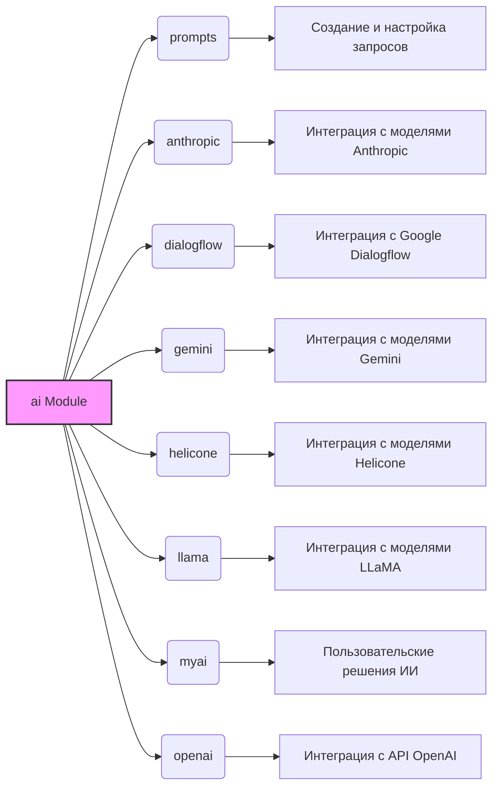

# Анализ модуля `ai`

## 1. <алгоритм>
Модуль `ai` представляет собой структуру для управления и интеграции различных моделей искусственного интеллекта. Вот пошаговое описание его работы:

1. **Инициализация**:
   - Модуль `ai` не является самостоятельным исполняемым модулем, а скорее контейнером для других подмодулей. 
   - Он не имеет непосредственных функций или классов, но служит для организации функциональности ИИ в рамках проекта.

2. **Использование подмодулей**:
   - Разработчик выбирает необходимый подмодуль в зависимости от задачи: `prompts`, `anthropic`, `dialogflow`, `gemini`, `helicone`, `llama`, `myai`, `openai`.
   - Каждый подмодуль обеспечивает специфическую функциональность для взаимодействия с конкретным API или моделью ИИ.

3. **Примеры использования**:
    - `prompts`: Для создания и управления шаблонами запросов.
    - `anthropic`: Для использования моделей Anthropic, таких как Claude.
    - `dialogflow`: Для разработки чат-ботов с использованием Google Dialogflow.
    - `gemini`: Для использования моделей Gemini, предлагаемых Google.
    - `helicone`: Для доступа к моделям Helicone.
    - `llama`: Для интеграции с моделями LLaMA.
    - `myai`: Для пользовательских решений ИИ.
    - `openai`: Для использования моделей OpenAI, таких как GPT.

4. **Обработка данных и передача**:
   - Примеры использования:
    - Подмодуль `openai` принимает входной текст, обрабатывает его с помощью API OpenAI и возвращает результат (например, сгенерированный текст).
    - Подмодуль `dialogflow` обрабатывает пользовательский ввод, отправляет запрос в Dialogflow, получает ответ и возвращает его пользователю.

5. **Обработка результатов**:
    - Каждый подмодуль обрабатывает результаты работы моделей ИИ в соответствии со своими целями.

## 2. <mermaid>

**Анализ зависимостей:**

- `ai Module`: Является центральным модулем, который управляет другими подмодулями. Он не имеет прямых зависимостей, но управляет зависимостями всех других модулей.
- `prompts`:  Зависит от модуля `ai` и отвечает за создание и настройку подсказок.
- `anthropic`: Зависит от модуля `ai` и обеспечивает интеграцию с моделями Anthropic.
- `dialogflow`: Зависит от модуля `ai` и обеспечивает интеграцию с Google Dialogflow.
- `gemini`: Зависит от модуля `ai` и обеспечивает интеграцию с моделями Gemini.
- `helicone`: Зависит от модуля `ai` и обеспечивает интеграцию с моделями Helicone.
- `llama`: Зависит от модуля `ai` и обеспечивает интеграцию с моделями LLaMA.
- `myai`: Зависит от модуля `ai` и предоставляет пользовательские решения ИИ.
- `openai`: Зависит от модуля `ai` и обеспечивает интеграцию с API OpenAI.

## 3. <объяснение>

### Общее описание:
Модуль `ai` является организующей структурой для различных ИИ-моделей и API, используемых в проекте. Он не реализует никаких функций самостоятельно, а предоставляет структуру для управления и доступа к другим подмодулям.

### Подмодули:
- **`prompts`**: Отвечает за обработку подсказок. Позволяет настраивать ввод для моделей ИИ, тем самым повышая точность и релевантность результатов.
- **`anthropic`**:  Обеспечивает интеграцию с API Anthropic, позволяя использовать модели Anthropic для задач генерации текста, понимания языка и т.д.
- **`dialogflow`**:  Интегрируется с Google Dialogflow, позволяя разрабатывать чат-боты и интерактивные приложения на основе естественного языка.
- **`gemini`**:  Предназначен для работы с моделями Gemini от Google.
- **`helicone`**: Предоставляет доступ к моделям Helicone, разработанным для конкретных нужд проекта.
- **`llama`**: Обеспечивает интеграцию с LLaMA, моделью от Meta AI, для работы с текстом.
- **`myai`**:  Пользовательский подмодуль, который может использоваться для реализации уникальных специфичных для проекта решений ИИ.
- **`openai`**:  Интегрируется с API OpenAI, давая доступ к моделям GPT для различных задач (генерация текста, классификация, перевод).

### Взаимодействие с другими частями проекта:
Модуль `ai` может быть связан с любой частью проекта, где необходимы функции ИИ. Например, если есть модуль для обработки пользовательского ввода, он может использовать `dialogflow` для обработки естественного языка. Модуль обработки данных может использовать `openai` для анализа текста и классификации.

### Потенциальные ошибки и области для улучшения:
- **Отсутствие единого интерфейса**: Каждый подмодуль имеет свою собственную логику интеграции, что может усложнить взаимодействие между ними. В будущем можно было бы разработать общий интерфейс для всех подмодулей, чтобы стандартизировать их использование.
- **Управление зависимостями**: Необходимо явно управлять зависимостями от сторонних библиотек. Было бы полезно иметь централизованную систему управления зависимостями.

### Заключение:
Модуль `ai` представляет собой гибкую структуру для организации и управления различными ИИ-моделями и API. Он обеспечивает необходимую абстракцию и позволяет легко интегрировать различные ИИ-функции в проект. В дальнейшем можно улучшить его структуру за счет стандартизации интерфейсов и управления зависимостями.