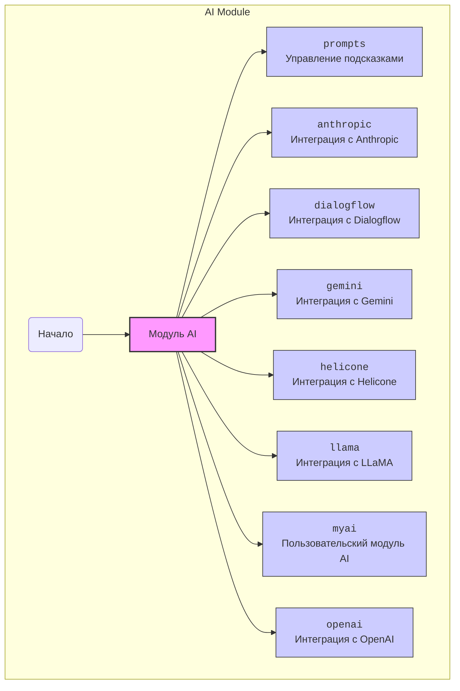

## ИНСТРУКЦИЯ:

Анализируй предоставленный код подробно и объясни его функциональность. Ответ должен включать три раздела:  

1. **<алгоритм>**: Опиши рабочий процесс в виде пошаговой блок-схемы, включая примеры для каждого логического блока, и проиллюстрируй поток данных между функциями, классами или методами.  
2. **<mermaid>**: Напиши код для диаграммы в формате `mermaid`, проанализируй и объясни все зависимости, 
    которые импортируются при создании диаграммы. 
    **ВАЖНО!** Убедитесь, что все имена переменных, используемые в диаграмме `mermaid`, 
    имеют осмысленные и описательные имена. Имена переменных вроде `A`, `B`, `C`, и т.д., не допускаются!  
    
    **Дополнительно**: Если в коде есть импорт `import header`, добавьте блок `mermaid` flowchart, объясняющий `header.py`:\
    ```mermaid
    flowchart TD
        Start --> Header[<code>header.py</code><br> Determine Project Root]
    
        Header --> import[Import Global Settings: <br><code>from src import gs</code>] 
    ```

3. **<объяснение>**: Предоставьте подробные объяснения:  
   - **Импорты**: Их назначение и взаимосвязь с другими пакетами `src.`.  
   - **Классы**: Их роль, атрибуты, методы и взаимодействие с другими компонентами проекта.  
   - **Функции**: Их аргументы, возвращаемые значения, назначение и примеры.  
   - **Переменные**: Их типы и использование.  
   - Выделите потенциальные ошибки или области для улучшения.  

Дополнительно, постройте цепочку взаимосвязей с другими частями проекта (если применимо).  

Это обеспечивает всесторонний и структурированный анализ кода.
## Формат ответа: `.md` (markdown)
**КОНЕЦ ИНСТРУКЦИИ**

## Анализ кода

### <алгоритм>

1.  **Описание модуля `ai`**:
    - Модуль `ai` является центральной точкой для управления и интеграции различных моделей ИИ.
    - Он содержит подмодули для конкретных моделей ИИ, таких как `anthropic`, `dialogflow`, `gemini`, `helicone`, `llama`, `myai`, `openai`.
    - Также включает `prompts` для управления созданием и настройкой входных данных для моделей ИИ.

2.  **Подмодули и их функции**:
    - `prompts`: Управляет созданием и настройкой подсказок для моделей ИИ.
        - Пример: формирование текстового запроса с определенными параметрами перед отправкой в OpenAI.
    - `anthropic`: Взаимодействует с моделями Anthropic.
        - Пример: отправка текстового запроса в модель Claude и получение ответа.
    - `dialogflow`: Интегрируется с Google Dialogflow для обработки естественного языка.
        - Пример: получение интента и сущностей из пользовательского ввода через Dialogflow API.
    - `gemini`: Взаимодействует с моделями Google Gemini.
         - Пример: отправка запроса на генерацию изображения в модель Gemini Pro Vision.
    - `helicone`: Подключается к моделям Helicone для доступа к их специализированным функциям.
        - Пример: отправка запроса на анализ текста через Helicone API.
    - `llama`: Взаимодействует с моделями LLaMA от Meta AI.
        - Пример: отправка текстового запроса в модель LLaMA и получение сгенерированного текста.
    - `myai`: Пользовательский модуль для специфичных для проекта конфигураций моделей.
        - Пример: использование собственной модели, обученной на данных проекта, для классификации текстов.
    - `openai`: Интегрируется с API OpenAI для использования GPT моделей.
        - Пример: отправка запроса в GPT-3 для генерации текста или перевода.

### <mermaid>



**Объяснение диаграммы `mermaid`**:

*   Диаграмма `mermaid` представляет структуру модуля `ai` в виде графа.
*   `AI` является центральным узлом, представляющим весь модуль.
*   От `AI` исходят связи к подмодулям, таким как `prompts`, `anthropic`, `dialogflow`, `gemini`, `helicone`, `llama`, `myai` и `openai`.
*   Каждый подмодуль представляет собой отдельный модуль, предназначенный для конкретной задачи или интеграции.

### <объяснение>

1.  **Импорты**:
    *   В предоставленном коде нет явных `import`, так как это описание архитектуры модуля, а не исполняемый код. Однако, подразумевается, что каждый подмодуль (`prompts`, `anthropic` и т.д.) будет содержать собственные импорты, необходимые для взаимодействия с соответствующими API или библиотеками. Например, `openai` будет импортировать библиотеку `openai`, `dialogflow` будет использовать клиентскую библиотеку Google Dialogflow и так далее.

2. **Классы**:
    * В данном описании нет классов, но подразумевается, что каждый из подмодулей может иметь свои классы. Например:
        * `openai`: может иметь классы для взаимодействия с API OpenAI (например, `OpenAIClient`).
        * `myai`: может иметь классы для загрузки и использования пользовательской обученной модели (например, `CustomModel`).
        * `prompts`: может иметь классы для создания и управления подсказками (например, `PromptTemplate`).
        * Атрибуты и методы будут специфичны для каждого класса.
3.  **Функции**:
    *   Функции также будут определены в каждом из подмодулей. Например:
        * `openai`: может иметь функцию `generate_text(prompt)` для генерации текста с использованием API OpenAI.
        * `dialogflow`: может иметь функцию `detect_intent(user_input)` для определения интента пользовательского ввода.
        * `anthropic`: может иметь функцию `complete(prompt)` для получения ответов от модели Claude.
4. **Переменные**:
    *   В описании кода нет переменных, но подразумевается использование переменных в каждом подмодуле. Например:
        * `openai`: API key, model ID, параметры запроса, и т.д.
        * `dialogflow`:  ID проекта, учетные данные и т.д.

**Цепочка взаимосвязей**:

*   Модуль `ai` является частью более крупной архитектуры проекта, предназначенной для работы с различными моделями искусственного интеллекта.
*   Подмодули внутри `ai` зависят от внешних API, таких как OpenAI, Google Dialogflow, Anthropic API, Helicone API и библиотек, таких как LLaMA от Meta AI.
*   Конфигурации и учетные данные для каждого API, вероятно, будут управляться из глобальных настроек проекта, возможно, с использованием `gs` (global settings), как указано в дополнительном блоке mermaid.
*   Подмодули могут взаимодействовать с другими частями проекта, например, с модулями, отвечающими за хранение данных, взаимодействие с пользователем или логику приложения.

**Потенциальные ошибки и области улучшения**:

*   Необходимо уделить внимание обработке ошибок, так как взаимодействие с внешними API может быть подвержено сбоям.
*   Необходимо настроить управление учетными данными для API, чтобы обеспечить безопасность и гибкость конфигурации.
*   Необходимо добавить логирование, чтобы отслеживать взаимодействие с API и обнаруживать потенциальные проблемы.
*   Потенциальная сложность в управлении разными моделями и API. Возможно потребуется единый интерфейс для управления моделями.