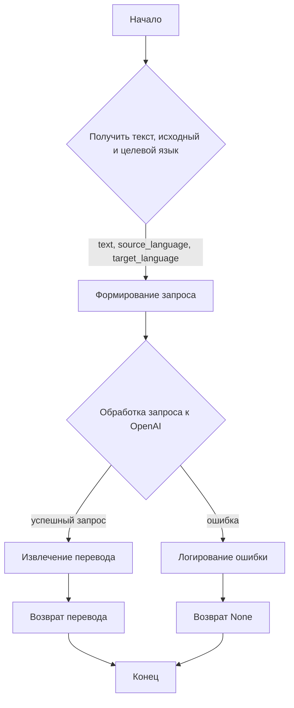
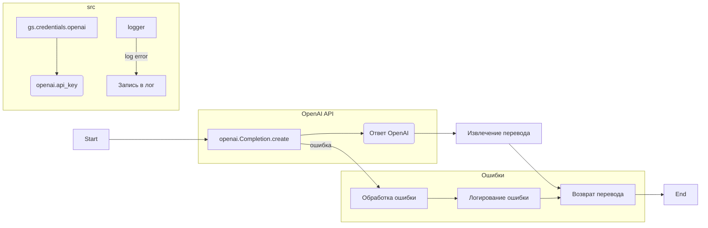

```MD
# <input code>

```python
## \file hypotez/src/ai/openai/translator.py
# -*- coding: utf-8 -*-
#! venv/Scripts/python.exe
#! venv/bin/python/python3.12

"""
.. module:: src.ai.openai
    :platform: Windows, Unix
    :synopsis: Модуль для перевода текста с использованием OpenAI API.
"""

MODE = 'dev'

import openai
from src import gs
from src.logger import logger

openai.api_key = gs.credentials.openai

def translate(text, source_language, target_language):
    """
    Перевод текста с использованием OpenAI API.

    Этот метод отправляет текст для перевода на указанный язык с помощью модели OpenAI и возвращает переведённый текст.

    Аргументы:
        text (str): Текст для перевода.
        source_language (str): Язык исходного текста.
        target_language (str): Язык для перевода.

    Возвращает:
        str: Переведённый текст.

    Пример использования:
        >>> source_text = "Привет, как дела?"
        >>> source_language = "Russian"
        >>> target_language = "English"
        >>> translation = translate_text(source_text, source_language, target_language)
        >>> print(f"Translated text: {translation}")
    """
    
    # Формируем запрос к OpenAI API
    prompt = (
        f"Translate the following text from {source_language} to {target_language}:\\n\\n"
        f"{text}\\n\\n"
        f"Translation:"
    )

    try:
        # Отправляем запрос к OpenAI API
        response = openai.Completion.create(
            engine="text-davinci-003",  # Укажите нужную модель
            prompt=prompt,
            max_tokens=1000,
            n=1,
            stop=None,
            temperature=0.3
        )

        # Извлекаем перевод из ответа API
        translation = response.choices[0].text.strip()
        return translation
    except Exception as ex:
        # Логируем ошибку
        logger.error("Error during translation", ex)
        return
```

# <algorithm>

**Блок-схема алгоритма:**



**Примеры:**

* **Ввод:** `text = "Привет, как дела?", source_language = "Russian", target_language = "English"`
* **Шаг C (Формирование запроса):** `prompt = "Translate the following text from Russian to English:\n\nПривет, как дела?\n\nTranslation:"`
* **Шаг D (Обработка запроса):** OpenAI API возвращает ответ с переводом.
* **Шаг E (Извлечение перевода):** Извлечение перевода из ответа OpenAI.
* **Шаг F (Возврат перевода):** Возвращение переведенного текста.


# <mermaid>



# <explanation>

**Импорты:**

* `openai`: Библиотека для работы с API OpenAI.
* `src`:  Очевидно,  это корневой каталог проекта.  `gs` и `logger` находятся вложенными в `src`, что указывает на структуру проекта, где `gs` (вероятно, `google_services`) и `logger` —  модули, относящиеся к  общей инфраструктуре.  Связь определяется импортом из `src`.


**Классы:**

В предоставленном коде нет классов.

**Функции:**

* `translate(text, source_language, target_language)`: Эта функция предназначена для перевода текста с помощью API OpenAI.
    * **Аргументы:**
        * `text`: Исходный текст для перевода (строка).
        * `source_language`: Язык исходного текста (строка).
        * `target_language`: Язык для перевода (строка).
    * **Возвращаемые значения:**
        * Строка с переведенным текстом, если запрос к API был успешен.
        * `None`, если произошла ошибка.
    * **Описание:** Функция формирует запрос к API OpenAI для перевода текста, обрабатывает ответ и возвращает переведенный текст или None при ошибке. Обработка ошибок важна для устойчивости приложения.


**Переменные:**

* `MODE`: Строковая переменная, используемая, скорее всего, для определения режима работы программы (например, 'dev', 'prod').
* `openai.api_key`:  Переменная, содержащая API ключ OpenAI, который устанавливается с помощью значения из `gs.credentials.openai`.
* `prompt`: Строковая переменная, хранящая сформированный запрос к OpenAI.
* `response`: Объект, содержащий ответ OpenAI API.
* `translation`: Строковая переменная, хранящая переведенный текст.


**Возможные ошибки и улучшения:**

* **Обработка ошибок:**  Функция  обрабатывает исключения, но для повышения надежности следует добавить более подробную информацию об ошибке в лог, например, код ошибки, чтобы помочь в отладке.
* **Детализация лога:**  Добавление в лог кода ошибки, позволит отследить источник проблемы в API OpenAI.
* **Управление временем ожидания:** Важно добавить проверку, чтобы не допускать бесконечного ожидания ответа от OpenAI.
* **Управление квотами:**  Для предотвращения блокировки аккаунта из-за превышения квоты, стоит включить логику мониторинга запросов к OpenAI.
* **Выбор модели:**  Проверка и выбор более подходящей модели OpenAI для конкретного случая может повысить точность и производительность.
* **Валидация входных данных:**  Добавление проверки типов аргументов и валидации входных данных для предотвращения ошибок и некорректных запросов.

**Взаимосвязи с другими частями проекта:**

Функция `translate` использует  `gs.credentials.openai` (вероятно, это доступ к переменным, хранящим данные о Google Cloud или схожей инфраструктуре), и `src.logger`, что указывает на то, что она взаимодействует с другими частями проекта, обеспечивающими аутентификацию и логирование.  Необходимость импорта `gs` и `logger` указывает на более сложную структуру проекта и использование сервисных функций/классов.