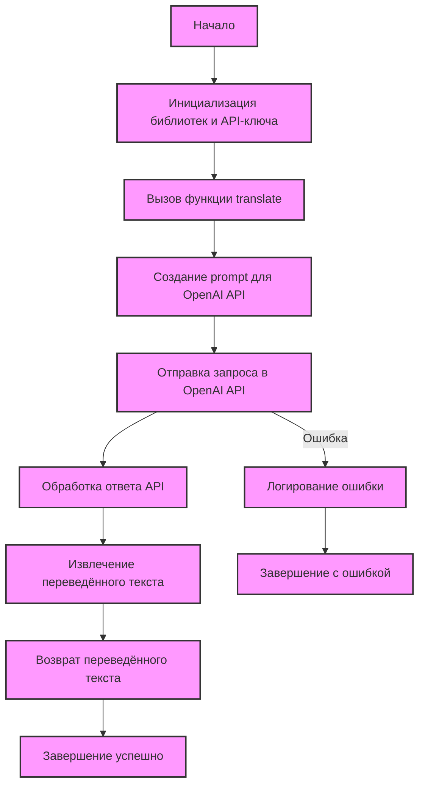
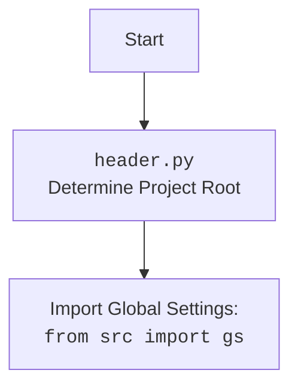

## АНАЛИЗ КОДА: `src/ai/openai/translator.py`

### 1. <алгоритм>

**Блок-схема процесса перевода текста:**

1. **Начало**:
   - Инициализация: Загружаются необходимые библиотеки `openai`, `src.gs` и `src.logger.logger`.
     ```python
     import openai
     from src import gs
     from src.logger.logger import logger
     ```
   - Настройка: Устанавливается API-ключ OpenAI из глобальных настроек.
     ```python
     openai.api_key = gs.credentials.openai
     ```

2. **Входные данные функции `translate`**:
   - Принимает текст для перевода (`text`, тип `str`), исходный язык (`source_language`, тип `str`) и целевой язык (`target_language`, тип `str`).
     ```python
     def translate(text, source_language, target_language):
     ```
   - Пример:
     ```python
     text = "Привет, мир!"
     source_language = "Russian"
     target_language = "English"
     ```

3. **Формирование запроса**:
   - Создание `prompt` (текстового запроса) для OpenAI API, включающего инструкции по переводу, исходный текст и целевой язык.
     ```python
     prompt = (
            f"Translate the following text from {source_language} to {target_language}:\n\n"
            f"{text}\n\n"
            f"Translation:"
        )
     ```
   - Пример `prompt`:
     ```
     Translate the following text from Russian to English:

     Привет, мир!

     Translation:
     ```

4. **Отправка запроса**:
   - Вызов метода `openai.Completion.create` для отправки запроса к OpenAI API.
     - Передаются параметры: модель (`engine`), запрос (`prompt`), максимальное количество токенов (`max_tokens`), количество возвращаемых вариантов (`n`), остановка (`stop`) и температура (`temperature`).
     ```python
     response = openai.Completion.create(
             engine="text-davinci-003",
             prompt=prompt,
             max_tokens=1000,
             n=1,
             stop=None,
             temperature=0.3
     )
     ```
   - Запрос отправляется, и ответ сохраняется в переменной `response`.

5. **Обработка ответа**:
   - Извлечение переведённого текста из ответа API.
     ```python
     translation = response.choices[0].text.strip()
     ```
   - Переведённый текст сохраняется в переменной `translation`.

6. **Возврат результата**:
   - Возврат переведённого текста (`translation`).
     ```python
     return translation
     ```
   - Пример:
     ```
     "Hello, world!"
     ```

7. **Обработка ошибок**:
   - В случае возникновения ошибки:
     - Логирование ошибки с помощью `logger.error`.
       ```python
       logger.error("Error during translation", ex)
       ```
     - Функция возвращает `None`.
     ```python
     return
     ```

### 2. <mermaid>



**Объяснение диаграммы `mermaid`:**

-   **`Start`**: Начальная точка процесса.
-   **`Initialize`**: Инициализирует необходимые библиотеки и устанавливает API-ключ OpenAI.
-   **`FunctionCall`**: Вызывает функцию `translate` с входными данными (текст, исходный язык, целевой язык).
-   **`CreatePrompt`**: Формирует текстовый запрос (prompt) для OpenAI API, включая инструкции по переводу и исходный текст.
-   **`SendRequest`**: Отправляет запрос в OpenAI API.
-   **`ProcessResponse`**: Обрабатывает ответ от OpenAI API.
-   **`ExtractTranslation`**: Извлекает переведённый текст из ответа API.
-   **`ReturnTranslation`**: Возвращает переведённый текст.
-   **`LogError`**: Логирует ошибку, если она произошла во время отправки запроса.
-   **`EndError`**: Завершает работу функции в случае ошибки.
-   **`EndSuccess`**: Завершает работу функции успешно.

**Зависимости:**

-   **`openai`**: Основная библиотека для взаимодействия с OpenAI API. Используется для отправки запросов на перевод и обработки ответов.
-   **`src.gs`**: Модуль с глобальными настройками проекта, откуда берётся API-ключ OpenAI (`gs.credentials.openai`).
-   **`src.logger.logger`**: Модуль для логирования ошибок и других событий во время выполнения программы.



**Объяснение `header.py` (mermaid):**
-   **`Start`**: Начальная точка, показывающая начало процесса загрузки модуля.
-   **`Header`**: Представляет скрипт `header.py`, который предназначен для определения корневой директории проекта. Это важно для правильной импортации модулей.
-   **`import`**:  Модуль `header.py` импортирует глобальные настройки из `src import gs`. Эти настройки, вероятно, включают в себя API-ключ OpenAI и другую конфигурацию.

### 3. <объяснение>

**Импорты:**

-   **`import openai`**: Импортирует библиотеку `openai`, которая обеспечивает взаимодействие с OpenAI API. Эта библиотека используется для создания и отправки запросов на перевод текста.
-   **`from src import gs`**: Импортирует модуль `gs` из пакета `src`, который, вероятно, содержит глобальные настройки приложения, включая API-ключ OpenAI. Этот ключ используется для аутентификации запросов к API.
-   **`from src.logger.logger import logger`**: Импортирует объект `logger` из модуля `logger` в пакете `src`. `logger` используется для записи сообщений об ошибках и других событий во время выполнения программы, помогая в отладке и мониторинге.

**Функции:**

-   **`translate(text, source_language, target_language)`**:
    -   **Аргументы**:
        -   `text` (`str`): Текст, который нужно перевести.
        -   `source_language` (`str`): Язык исходного текста.
        -   `target_language` (`str`): Язык, на который нужно перевести текст.
    -   **Возвращает**:
        -   `str`: Переведённый текст, если перевод выполнен успешно.
        -   `None`: Если произошла ошибка во время перевода.
    -   **Назначение**:
        -   Эта функция принимает текст, исходный язык и целевой язык, формирует запрос к OpenAI API и возвращает переведённый текст.
        -   Функция обрабатывает ошибки, возникающие в процессе перевода, логирует их и возвращает `None` в случае ошибки.
    -   **Пример:**
        ```python
        translated_text = translate("Hello, world!", "English", "Russian")
        print(translated_text) # Output: "Привет, мир!"
        ```

**Переменные:**

-   `openai.api_key`: API-ключ OpenAI, который устанавливается из глобальных настроек (`gs.credentials.openai`). Этот ключ используется для аутентификации запросов к OpenAI API.
-   `prompt`: Текстовый запрос (строка), который формируется для отправки в OpenAI API. Включает инструкции по переводу, исходный текст и целевой язык.
-   `response`: Объект ответа, возвращаемый OpenAI API после отправки запроса. Содержит информацию о переведённом тексте и другую метаинформацию.
-   `translation`: Строка, содержащая переведённый текст, извлечённый из ответа API.
- `ex`: Переменная исключения, используется для захвата и логирования любых ошибок, возникающих в блоке `try-except`.

**Потенциальные ошибки и области для улучшения:**

-   **Обработка ошибок**: Функция обрабатывает общие исключения (`Exception`), что может скрыть более конкретные ошибки. Следует предусмотреть более точную обработку, например, `openai.error.OpenAIError` или `requests.exceptions.RequestException`.
-   **Выбор модели**: Модель `text-davinci-003` может быть устаревшей или не самой оптимальной. Рассмотреть возможность использования более современных моделей OpenAI, таких как `gpt-3.5-turbo-instruct` или `gpt-4`, с учётом контекста задачи.
-  **Максимальное количество токенов**: `max_tokens=1000` может быть недостаточным для длинных текстов. Следует либо динамически определять требуемое количество токенов, либо использовать разбивку текста на части.
-   **Параметры API**: Параметры `n`, `stop`, `temperature` могут быть сделаны настраиваемыми, чтобы предоставить пользователям больше контроля над процессом перевода.
- **Языковая модель**: Необходимо продумать возможность выбора разных языковых моделей в зависимости от задачи или использовать более гибкую логику для управления языковой моделью.
- **Валидация входных данных**: Добавить проверку входных данных на корректность, чтобы исключить ошибки.

**Цепочка взаимосвязей с другими частями проекта:**

-   Модуль `translator.py` зависит от `src.gs` для получения API-ключа, что связывает его с конфигурацией проекта.
-   Модуль также зависит от `src.logger.logger` для логирования ошибок, что делает его частью системы мониторинга и отладки проекта.
-   Функция `translate` используется в других частях проекта для перевода текста, например, в модулях для обработки пользовательского ввода или для генерации документации.

Таким образом, `src/ai/openai/translator.py` является ключевым компонентом для обеспечения функциональности перевода текста с использованием OpenAI API в проекте.