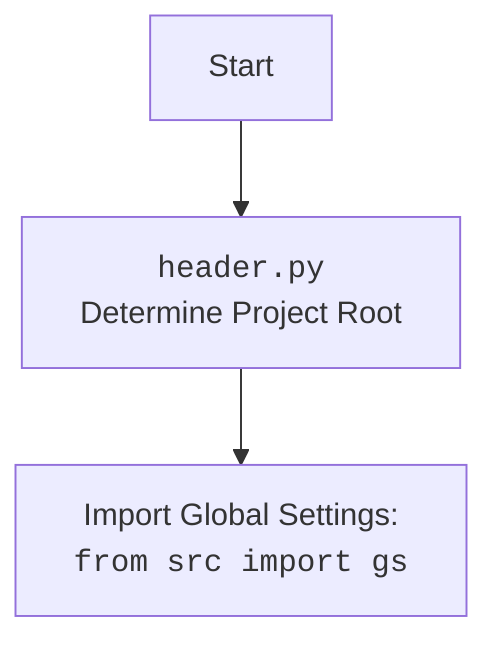

## Анализ кода `hypotez/src/ai/openai/translator.py`

### <алгоритм>

1.  **Инициализация:**
    *   Устанавливается режим работы ``.
    *   Импортируются необходимые библиотеки: `openai`, `src.gs`, `src.logger.logger`.
    *   Устанавливается ключ API OpenAI из глобальных настроек `gs.credentials.openai`.
    
    _Пример:_
    ```python
    
    import openai
    from src import gs
    from src.logger.logger import logger
    openai.api_key = gs.credentials.openai
    ```

2.  **Функция `translate(text, source_language, target_language)`:**
    *   Принимает текст для перевода (`text`), язык исходного текста (`source_language`) и язык перевода (`target_language`) как аргументы.
    *   Формирует текстовый запрос (`prompt`) для OpenAI API, включая инструкции для перевода.
        _Пример:_
        ```
        prompt = f"Translate the following text from Russian to English:\n\nПривет, как дела?\n\nTranslation:"
        ```
    *   Вызывает OpenAI API (`openai.Completion.create`) для получения перевода, используя модель "text-davinci-003", параметры `max_tokens`, `n`, `stop`, `temperature`, и сформированный `prompt`.
        _Пример:_
        ```python
        response = openai.Completion.create(
            engine="text-davinci-003",
            prompt=prompt,
            max_tokens=1000,
            n=1,
            stop=None,
            temperature=0.3
        )
        ```
    *   Извлекает переведенный текст из ответа API (`response.choices[0].text.strip()`).
    *   Возвращает переведенный текст.
    *   Если возникает ошибка, логирует ее с помощью `logger.error` и возвращает `None`.
    
        _Пример обработки ответа:_
        ```python
        translation = response.choices[0].text.strip()
        return translation
        ```

### <mermaid>

```mermaid
flowchart TD
    Start --> SetMode[]
    SetMode --> ImportLibs[Import Libraries:<br><code>openai</code>, <code>src.gs</code>,<br><code>src.logger.logger</code>]
    ImportLibs --> SetAPIKey[Set OpenAI API Key:<br><code>openai.api_key = gs.credentials.openai</code>]
    SetAPIKey --> TranslateFunc[<code>translate(text, source_language, target_language)</code>]
    TranslateFunc --> CreatePrompt[Create Prompt for OpenAI API]
    CreatePrompt --> SendRequest[Send Request to OpenAI API<br><code>openai.Completion.create(...)</code>]
    SendRequest -- Success --> ExtractTranslation[Extract Translation]
    ExtractTranslation --> ReturnTranslation[Return Translated Text]
    SendRequest -- Error --> LogError[Log Error using <code>logger.error</code>]
    LogError --> ReturnNone[Return None]
    ReturnTranslation --> End
    ReturnNone --> End

    
    
```
**Объяснение зависимостей `mermaid`:**

*   **`Start`**: Начало выполнения скрипта.
*   **`SetMode`**:  Установка режима работы скрипта в 'dev'.
*  **`ImportLibs`**: Импортирование необходимых библиотек для работы с OpenAI API, глобальных настроек и логирования. `openai` для взаимодействия с OpenAI API, `src.gs` для получения глобальных настроек (включая API ключ), и `src.logger.logger` для логирования ошибок.
*   **`SetAPIKey`**:  Установка ключа API OpenAI из глобальных настроек, полученных через `src.gs.credentials.openai`.
*   **`TranslateFunc`**: Вызов функции `translate` с аргументами (исходный текст, язык оригинала, целевой язык).
*  **`CreatePrompt`**: Формирование текстового запроса (prompt) для отправки в OpenAI API, содержащего текст для перевода и инструкции по языкам.
*   **`SendRequest`**: Отправка запроса в OpenAI API с использованием метода `openai.Completion.create` для получения перевода.
*   **`ExtractTranslation`**: Извлечение переведенного текста из ответа API.
*   **`ReturnTranslation`**: Возврат переведенного текста.
*   **`LogError`**: Логирование ошибки, возникшей при запросе к API, с использованием `src.logger.logger.error`.
*    **`ReturnNone`**: Возврат `None` в случае ошибки.
*   **`End`**: Завершение выполнения скрипта.


**Объяснение зависимостей `header.py`**
* `Start`: Начало скрипта
* `Header`: Определение корневой директории проекта в скрипте `header.py`
* `import`: Импортирование глобальных настроек `gs` из  `src`
### <объяснение>

**Импорты:**

*   `import openai`: Импортирует библиотеку `openai` для взаимодействия с API OpenAI. Она необходима для отправки запросов на перевод текста и получения результатов.
*   `from src import gs`: Импортирует глобальные настройки `gs` из пакета `src`.  В `gs` хранятся различные глобальные параметры, такие как API ключи, настройки окружения и т.д. В данном случае используется для получения `openai.api_key`.
*   `from src.logger.logger import logger`: Импортирует объект `logger` для логирования ошибок из пакета `src.logger.logger`. `logger` используется для записи ошибок и отладочной информации в лог файл или иное хранилище.

**Переменные:**

*   ``: Определяет режим работы приложения, используется для переключения между режимами разработки и продакшена, влияет на поведение некоторых функций, в данном случае не используется, но может пригодится для вывода более детального лога в режиме разработки.
*   `openai.api_key`: Ключ API для доступа к сервисам OpenAI, устанавливается из `gs.credentials.openai`, что является частью глобальных настроек проекта.

**Функции:**

*   `translate(text, source_language, target_language)`:
    *   **Аргументы**:
        *   `text` (str): Текст для перевода.
        *   `source_language` (str): Язык исходного текста.
        *   `target_language` (str): Язык, на который нужно перевести текст.
    *   **Возвращаемое значение**:
        *   `str`: Переведённый текст, если перевод успешен.
        *   `None`: В случае ошибки во время перевода.
    *   **Назначение**:
        *   Основная функция для перевода текста с использованием API OpenAI. Она формирует запрос к OpenAI, получает ответ и извлекает переведенный текст. В случае ошибки логирует ее.
    *   **Примеры**:
        *   `translate("Hello", "English", "Russian")` вернёт `"Привет"` (приблизительно).
        *   При ошибке вернёт `None` и запишет ошибку в лог.

**Объяснение:**

Этот код предназначен для перевода текста с использованием API OpenAI. Он импортирует необходимые библиотеки, настраивает API ключ, и определяет функцию `translate`, которая отправляет текст на перевод и возвращает результат.

**Взаимосвязь с другими частями проекта:**

*   `src.gs`: Модуль глобальных настроек, хранит данные, необходимые для работы программы, такие как API ключи, пути к файлам и т.д.
*   `src.logger.logger`: Модуль для логирования ошибок и другой важной информации, позволяет отслеживать работу программы и выявлять проблемы.

**Потенциальные ошибки и области для улучшения:**

*   **Обработка ошибок:**
    *   Код перехватывает общее исключение `Exception` при вызове API OpenAI. Желательно добавить более конкретную обработку различных типов исключений `openai.error`, чтобы более точно отслеживать проблемы (например `openai.error.AuthenticationError`, `openai.error.APIError`, `openai.error.RateLimitError`).
    *   В случае ошибки функция возвращает `None`, что может усложнить обработку ошибок на уровне выше. Лучше поднимать исключение, так как возвращая `None` не всегда очевидно, что произошла ошибка.
*   **Модель:**
    *   Используется модель `text-davinci-003`, которая со временем может стать устаревшей.  Лучше использовать последнюю доступную модель и сделать ее настраиваемой.
*    **Параметры запроса:** Параметры `max_tokens`, `n`, `stop`, `temperature` можно сделать настраиваемыми через `src.gs` или передавать как аргументы функции.
*   **API Key:** Использование API key через `src.gs`  может подойти для локальной разработки, но в продакшене лучше использовать переменные окружения.

**Улучшения:**

1.  Добавить обработку специфичных исключений `openai`.
2.  Сделать модель и параметры запроса настраиваемыми.
3.  Использовать переменные окружения для хранения API Key в продакшене.
4.  Поднимать исключения вместо возврата `None` в случае ошибки.