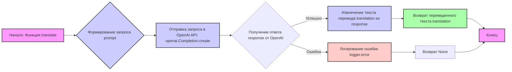

## <алгоритм>

1. **Начало**: Функция `translate` принимает на вход три аргумента: `text` (текст для перевода), `source_language` (язык исходного текста) и `target_language` (язык перевода).
    *   Пример: `text` = "Hello, world!", `source_language` = "English", `target_language` = "Russian".

2. **Формирование запроса**: Создается строка `prompt`, которая является запросом к OpenAI API. Запрос содержит инструкции по переводу текста с указанием исходного и целевого языков.
    *   Пример: `prompt` = "Translate the following text from English to Russian:\n\nHello, world!\n\nTranslation:".

3. **Отправка запроса к OpenAI API**: Функция `openai.Completion.create` отправляет запрос на перевод текста в OpenAI.  Указываются параметры модели (`text-davinci-003`), запрос (`prompt`), максимальное количество токенов (`max_tokens`), количество сгенерированных вариантов (`n`), стоп-слова (`stop`), и температура модели (`temperature`).
    *   Пример: Вызывается `openai.Completion.create(engine="text-davinci-003", prompt=prompt, max_tokens=1000, n=1, stop=None, temperature=0.3)`.

4. **Получение ответа**: OpenAI возвращает объект `response`, содержащий результаты перевода.
    *   Пример: `response` содержит JSON с текстом перевода.

5. **Извлечение перевода**: Из объекта `response` извлекается текст перевода. При помощи `.choices[0].text.strip()` извлекается текст из первого варианта перевода и удаляются лишние пробелы.
    *   Пример: `translation` = "Привет, мир!".

6. **Возврат результата**: Функция `translate` возвращает переведённый текст.
    *   Пример: Функция возвращает строку "Привет, мир!".

7. **Обработка ошибок**: В случае возникновения ошибки во время запроса к OpenAI API, исключение перехватывается. Функция `logger.error` логирует ошибку, и функция возвращает `None`.
    *   Пример: Если OpenAI API не доступен, вызывается `logger.error("Error during translation", ex)` и функция возвращает `None`.

## <mermaid>

**Зависимости в диаграмме `mermaid`:**

1.  **Начало: Функция translate (A)**: Начальная точка процесса, принимает текст, исходный и целевой языки.
2.  **Формирование запроса prompt (B)**:  Создаёт строку запроса для OpenAI API, используя входные данные.
3.  **Отправка запроса в OpenAI API: openai.Completion.create (C)**: Отправляет запрос к OpenAI API для получения перевода. Зависит от библиотеки `openai`.
4.  **Получение ответа response от OpenAI (D)**: Получает ответ от OpenAI API в виде объекта `response`.
5.  **Извлечение текста перевода translation из response (E)**: Извлекает переведенный текст из ответа OpenAI API.
6.  **Возврат переведенного текста translation (F)**: Возвращает переведенный текст.
7.  **Логирование ошибки logger.error (G)**: Если при запросе к API возникает ошибка, она логируется с помощью `logger.error`. Зависит от модуля логирования `src.logger.logger`.
8.   **Возврат None (H)**: В случае ошибки функция возвращает `None`.
9.  **Конец (I)**: Конечная точка процесса.

## <объяснение>

**Импорты:**

*   `openai`: Импортирует библиотеку `openai`, которая обеспечивает взаимодействие с OpenAI API для выполнения задач, таких как перевод текста.
*   `src`:
    *   `gs`: Модуль `gs` из пакета `src`, вероятно, содержит глобальные переменные, включая учетные данные для доступа к OpenAI API. В данном коде используется `gs.credentials.openai` для получения ключа API.
    *   `src.logger.logger`: Модуль `logger` используется для записи ошибок или другой отладочной информации в лог.

**Переменные:**

*   `MODE`: Строковая константа `'dev'`, вероятно, обозначает режим разработки. Она не используется в представленном коде, но может влиять на поведение программы в других частях.
*   `openai.api_key`: Глобальная переменная, устанавливаемая из `gs.credentials.openai`. Она содержит ключ API для доступа к OpenAI.

**Функции:**

*   `translate(text, source_language, target_language)`:
    *   **Аргументы**:
        *   `text` (str): Текст, который нужно перевести.
        *   `source_language` (str): Язык исходного текста.
        *   `target_language` (str): Язык, на который нужно перевести текст.
    *   **Возвращаемое значение**:
        *   `str`: Переведённый текст.
        *   `None`: Если во время запроса к OpenAI API произошла ошибка.
    *   **Назначение**: Функция отправляет текст на перевод в OpenAI API и возвращает переведенный текст.
        *   Пример: `translate("Hello", "English", "Russian")` вернет `"Привет"`.
    *   **Логика**:
        1.  Формирует `prompt` - запрос к OpenAI API, включая текст для перевода, исходный и целевой языки.
        2.  Вызывает `openai.Completion.create` с необходимыми параметрами для выполнения запроса к API.
        3.  Извлекает переведенный текст из ответа API.
        4.  Возвращает переведенный текст или `None` в случае ошибки.
    * **Примеры:**
         *  `translate("This is a test", "English", "Spanish")`  вернет `Esto es una prueba`.
        *   `translate("Bonjour le monde", "French", "English")` вернет `Hello world`.
        *   При ошибке вернет `None`

**Классы:**

*   В данном коде классы не используются.

**Цепочка взаимосвязей:**

1.  Модуль `translator.py` зависит от:
    *   библиотеки `openai` для работы с OpenAI API.
    *   модуля `gs` для получения ключа API из глобальных настроек.
    *   модуля `logger` для логирования ошибок.
2.  Другие части проекта, использующие этот модуль, будут импортировать функцию `translate` для перевода текста, например `from src.ai.openai.translator import translate`.

**Потенциальные ошибки и области для улучшения:**

1.  **Обработка ошибок**: В текущей реализации обрабатываются только общие исключения. Можно добавить более точную обработку конкретных ошибок OpenAI API (например, `openai.error.AuthenticationError`, `openai.error.RateLimitError` и т.д.) для более надежной работы.
2.  **Управление моделями**: Модель `text-davinci-003` задана в коде. Можно сделать выбор модели настраиваемым параметром или использовать более современные модели.
3. **Конфигурация:** Параметры запроса `max_tokens`, `temperature` и т.д. можно вынести в конфигурационный файл для более удобного управления.
4.  **Языковая валидация**: Можно добавить проверку на корректность языковых кодов.
5. **Обработка пустых строк:** При передачи пустой строки в `text` будет вызван метод `strip()` для пустой строки, это не вызовет ошибок, но можно добавить проверку на пустую строку.
6. **Кеширование:** Можно добавить кеширование для уже переведенных текстов, что позволит ускорить работу программы, не обращаясь каждый раз к API.
7. **Асинхронность:** При необходимости можно сделать функцию асинхронной, чтобы не блокировать выполнение основного потока.
8. **Контекст:**  Сейчас перевод выполняется без контекста, в некоторых случаях это может привести к неточному переводу. Можно передавать в промпте контекст для более точного перевода.

**Дополнительные заметки:**

*   Файл начинается с директив `# -*- coding: utf-8 -*-` и shebang'ов `#! venv/Scripts/python.exe` и `#! venv/bin/python/python3.12`, что указывает на использование кодировки UTF-8 и путей к интерпретатору Python в виртуальном окружении.
*   Документация в начале файла, включая docstring функции `translate`, соответствует PEP 257 и является хорошей практикой.