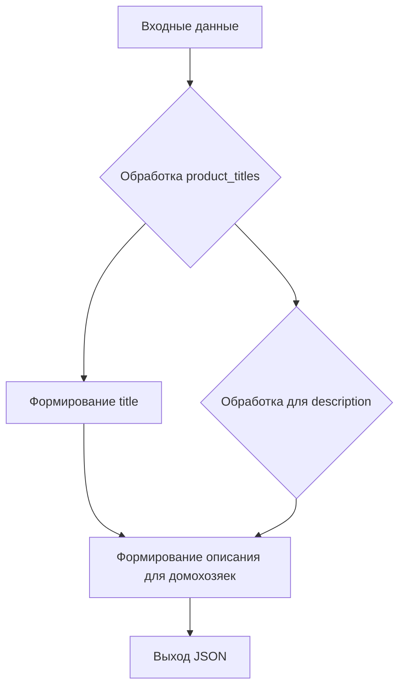

# Анализ кода для создания описания кампании AliExpress

**1. <input code>**

```
your role: `promo_creater`
I send you the category name, a list of product titles, and the language to use. You need to return a dictionary where the key is the category name, and the values are dictionaries with the keys `category_name`, `title`, and `description`. 
`category_name` should be equal to the category name. 
`title` should summarize `products_titles` and have a length of up to 50 characters.
`description` Create a note for housewives based on the names of products. Use products to diversify the note. The length should not exceed 1200 characters.
A note ас from a household calendar is called a calendar note or calendar entry. In traditional calendars, especially household or tear-off ones, such notes contain various useful tips, information about events, historical facts, folk signs, astrological forecasts or useful household recommendations for each day.
Use the language defined in `language`. Output format: `JSON`

Example input:
language = "RU"
category_name = "liitokala_18650"
products_titles = [Зарядное устройство LiitoKala Lii-M4S-M4 для аккумуляторных батарей, 3,7 в, 18650, 26650, 21700, 18500, литий-ионный, 1,2 в, Ni-MH, AA, испытательная Емкость
LiitoKala Lii-S12 Lii-D4XL-Lii S8 LCD 21700 18650 3,7 V Li-Ion 3,2 V LiFePO4 1,2 V NiMH/Cd 26650 32700 D AA AAA 9V зарядное устройство
LiitoKala Lii-S12 Lii-S8 Lii-PD4 Lii-PD2 Lii-500S 3,7 V 18650 18350 зарядное устройство для аккумуляторов с автоматическим определение полярности 26650 21700 1,2 V AA AAA
LiitoKala Lii-M4 18650 Зарядное устройство с ЖК-дисплеем Универсальное смарт-зарядное устройство Тестовая емкость 26650 18650 21700 AA AAA Батарея 4 слота 5V 2A
Умное зарядное устройство с ЖК-дисплеем, 18650 в, 3,7, 26650, 18350, 21700 в, 4 слота
Liitokala Lii-202 Lii-402 1,2 В 3,7 В 3,2 В 3,85 В 18650 18350 26650 18490 AA AAA 14500 21700 Интеллектуальное зарядное устройство для литиевых Ni-MH аккумуляторов
Аккумуляторное зарядное устройство Liitokala для 18650 3,7 V 9V 26650 18350 16340 18500 14500 1,2 V AA AAA
Зарядное устройство LiitoKala для батарей li-ion 3,7 V и NiMH 1,2 V, подходит для батарей 18650 26650 21700 26700 AA AAA 12V5A
LiitoKala Lii-D4 21700 для 18650 18350 26650 16340 RCR123 14500 3,7 v 1,2 V Ni-MH/Cd, зарядное устройство AA AAA SC D C
Зарядное устройство LiitoKala для аккумуляторов 3,7 в 1,2 в 18650 26650 21700 14500 18350 AA AAA A C и других батарей.
OPUS BT-C3100 4 слота умное Универсальное зарядное устройство адаптер для перезаряжаемых литий-ионных батарей NiCd NiMH AA AAA 10440 18650
Зарядное устройство LiitoKala для Li-Ion LiFePO4 Ni-MH Ni-Cd батарей с ЖК-дисплеем 9 В 21700 20700 26650 18350 RCR123 18650
Умное зарядное устройство LiitoKala Lii-M4S + U1 18650 с ЖК-дисплеем для батарей 26650 21700 32650 18500 20700 CR123A AA AAA
Зарядное устройство Liitokala Lii-PD2 18650, 3,7 в 26650 18350 16340 18500 14500 1,2 в Ni-MH AA AAA LCD многофункциональное зарядное устройство
Зарядное устройство LiitoKala Lii-PD2 для литиевых и NiMH батарей 18650, 26650, 21700, AA, AAA, 18350 в, 3,7 в
Зарядное устройство LiitoKala для аккумуляторов AA AAA 10440 14500 16340 17335 17500 18490 17670

]
```

**2. <algorithm>**

(Блок-схема отсутствует, алгоритм описан словесно)

Функция принимает на вход:

* `category_name` (строка)
* `products_titles` (список строк)
* `language` (строка)

Возвращает словарь в формате JSON:

```json
{
  "category_name": {
    "category_name": "category_name",
    "title": "summary of products",
    "description": "description for housewives"
  }
}
```

Алгоритм работы:

1. Обрабатывает входные данные `products_titles` и формирует краткое описание товаров (`title`).
2. Создает описание для домохозяек (`description`) на основе названий товаров, добавляя разнообразие и структурированность.
3. Возвращает сформированный словарь в формате JSON.

**3. <mermaid>**



**4. <explanation>**

* **Импорты:**  Нет импортируемых модулей. Код представляет собой описание функции, которая должна выполняться на уровне вызова.
* **Классы:**  Нет определенных классов.
* **Функции:**  Описание функции `promo_creater` задает логику обработки входных данных для создания описания кампании на AliExpress.
* **Переменные:**  `language`, `category_name`, `products_titles` — входные данные функции.
* **Возможные ошибки или области для улучшения:**

    * Нет проверки на корректность входных данных (например, пустой `products_titles`).
    * Необходимо добавить логику обработки текста, например, очистку от лишних пробелов, ненужных символов, а также обработку разных типов данных (возможно вхождения разных типов значений).
    *  Необходимо учесть возможность обработки нескольких языков.
    *  Необходимо определить алгоритм формирования `description` (сейчас он просто описан словесно) и добавить механизм контроля длины текста.
    * Пример ввода (example input) не содержит валидации.

**Цепочка взаимосвязей с другими частями проекта:**

Код представляет собой описание функции, которая, скорее всего, будет вызываться другой частью проекта для генерации описаний кампаний.  Например, эта функция может быть частью API, управляющего созданием и обработкой рекламных кампаний на AliExpress.


**Примечание:**  Без доступа к исходному коду остальной части проекта невозможно построить полную схему взаимодействия.  Представленный код описывает только узкую часть процесса обработки данных для генерации текста.