## Анализ правил оформления кода

### <алгоритм>

1.  **Начало**: Анализ начинается с проверки общих принципов кода, таких как консистентность стиля.
2.  **Комментарии**: 
    *   Проверяется наличие комментариев после `#`.
        *   **Пример**: `# This is a comment`.
    *   Комментарии после `#` не должны изменяться, должны быть понятными.
    *   Внутренние комментарии должны объяснять следующий блок кода.
    *   Все комментарии должны быть в формате reStructuredText (RST).
    *   Комментарии должны избегать слов "get", "do" и использовать пассивные формы.
    *   Пустые строки в комментариях (`...`) не документируются.
    *   Комментарии после `"""` могут быть оптимизированы.
3.  **Документация**:
    *   Проверяется наличие `docstring` в стиле Sphinx для каждой функции, метода и класса.
        *   **Пример**: 
        ```python
        def function(param: str, param1: Optional[str | dict] = None) -> dict | None:
            """
            Function description.

            :param param: Description of the `param` parameter.
            :param param1: (Optional) Description of the `param1` parameter.
            :return: Description of the return value.
            :raises SomeError: Conditions for the exception.
            """
        ```
    *   Проверяется наличие описания модуля в начале каждого файла.
        *   **Пример**:
        ```python
        """
        Module for working with a programmer assistant
        =========================================================================================

        Description of the module functionality.

        Example usage
        -------------

        .. code-block:: python

            example_usage()
        """
        ```
4.  **Форматирование кода**:
    *   Используются одинарные кавычки вместо двойных.
        *   **Пример**: `'string'`
    *   Проверяется наличие пробелов вокруг оператора присваивания `=`.
        *   **Пример**: `a = 1`
    *   Проверяется консистентность пробелов в выражениях.
        *   **Пример**: `result = 10 if x > 5 else 20`
    *   Проверяется наличие `import header` в начале файла.
    *   Проверяется наличие `...` между `logger` и `return` для отладки.
        *   **Пример**:
        ```python
        logger.error('Error while executing task', ex)
        ...
        return
        ```
5.  **Параметры функций**:
    *   Проверяется явное указание типов параметров.
    *   Использование `Optional`, если значение по умолчанию `None`.
        *   **Пример**: `def critical(self, message: str, ex: Optional = None, exc_info: Optional[bool] = True):`
    *   Запрещено использование `Union`.
6.  **Pydantic**:
    *   Используется Pydantic для валидации данных, если это уместно.
    *   Предпочтение Pydantic моделям для классов, работающих со структурированными данными.
7.  **Логирование**:
    *   Используется `from src.logger.logger import logger` вместо стандартного `logging`.
        *   **Пример**:
        ```python
        logger.error('Error while starting bot: ', ex)
        ...
        return
        ```
8.  **Константы**:
    *   В коде всегда должна присутствовать глобальная константа `MODE`.
9. **Формат ответа**:
    *   Ответ должен быть в Markdown формате.
    *   Ответ должен включать улучшенный код и список изменений с объяснениями.
    *   Код должен быть заключен в теги для подсветки синтаксиса.

```mermaid
graph LR
    A[Начало] --> B(Общие принципы);
    B --> C{Комментарии?};
    C -- Да --> D[Проверка и форматирование комментариев];
    C -- Нет --> E{Документация?};
    D --> E;
    E -- Да --> F[Проверка docstring и описания модуля];
    E -- Нет --> G{Форматирование кода?};
    F --> G;
    G -- Да --> H[Форматирование: кавычки, пробелы, импорты, отладка];
    G -- Нет --> I{Параметры функций?};
    H --> I;
    I -- Да --> J[Проверка типов параметров и Optional];
    I -- Нет --> K{Pydantic?};
    J --> K;
    K -- Да --> L[Проверка использования Pydantic];
    K -- Нет --> M{Логирование?};
    L --> M;
    M -- Да --> N[Проверка использования logger];
    M -- Нет --> O{Константы?};
    N --> O;
    O -- Да --> P[Проверка наличия константы MODE];
    O -- Нет --> Q[Формат ответа];
    P --> Q;
     Q --> Z[Конец];
    
    style A fill:#f9f,stroke:#333,stroke-width:2px
    style Z fill:#f9f,stroke:#333,stroke-width:2px
    
    classDef decision fill:#ccf,stroke:#333,stroke-width:2px;
    class C,E,G,I,K,M,O decision
```

### <mermaid>


**Описание диаграммы:**

Диаграмма представляет собой блок-схему, описывающую процесс анализа и применения правил кодирования.

*   **`A` (Начало)**: Начальная точка процесса.
*   **`B` (Общие принципы)**: Проверка соблюдения общих принципов кодирования (консистентность стиля).
*   **`C` (Комментарии?)**: Проверка наличия комментариев.
    *   **`Да`**: Переход к блоку **`D`**.
    *   **`Нет`**: Переход к блоку **`E`**.
*   **`D` (Проверка и форматирование комментариев)**: Проверка и форматирование комментариев в соответствии с правилами (формат RST, пассивные формы, и т.д.).
*   **`E` (Документация?)**: Проверка наличия документации.
    *   **`Да`**: Переход к блоку **`F`**.
    *   **`Нет`**: Переход к блоку **`G`**.
*   **`F` (Проверка docstring и описания модуля)**: Проверка наличия и правильного форматирования `docstring` и описания модуля.
*   **`G` (Форматирование кода?)**: Проверка форматирования кода.
    *   **`Да`**: Переход к блоку **`H`**.
    *   **`Нет`**: Переход к блоку **`I`**.
*   **`H` (Форматирование: кавычки, пробелы, импорты, отладка)**: Применение правил форматирования кода.
*   **`I` (Параметры функций?)**: Проверка параметров функций.
    *   **`Да`**: Переход к блоку **`J`**.
    *   **`Нет`**: Переход к блоку **`K`**.
*  **`J` (Проверка типов параметров и Optional)**: Проверка типов параметров и использование `Optional`.
*   **`K` (Pydantic?)**: Проверка использования Pydantic.
    *   **`Да`**: Переход к блоку **`L`**.
    *   **`Нет`**: Переход к блоку **`M`**.
*   **`L` (Проверка использования Pydantic)**: Проверка использования Pydantic для валидации данных.
*   **`M` (Логирование?)**: Проверка использования логирования.
    *   **`Да`**: Переход к блоку **`N`**.
    *   **`Нет`**: Переход к блоку **`O`**.
*   **`N` (Проверка использования logger)**: Проверка использования правильного логгера (`src.logger.logger`).
*   **`O` (Константы?)**: Проверка наличия констант.
    *   **`Да`**: Переход к блоку **`P`**.
    *   **`Нет`**: Переход к блоку **`Q`**.
*   **`P` (Проверка наличия константы MODE)**: Проверка наличия глобальной константы `MODE`.
*   **`Q` (Формат ответа)**: Подготовка ответа в соответствии с правилами.
*   **`Z` (Конец)**: Конечная точка процесса.

**Зависимости:**

Диаграмма не имеет явных импортов или внешних зависимостей. Она описывает логический процесс применения набора правил.

### <объяснение>

#### Общее описание

Данный документ описывает набор правил оформления кода, которые должны соблюдаться разработчиками. Основная цель этих правил - обеспечение консистентности, читаемости и документированности кода. Правила охватывают различные аспекты, начиная от общих принципов и заканчивая конкретными требованиями к форматированию и использованию библиотек.

#### Импорты
В документе не описано никаких импортов, так как это правила форматирования кода, а не сам код. Однако, в правилах есть указание на использование:
- `from src.logger.logger import logger` - для логирования. Это подразумевает, что в проекте есть пакет `src`, внутри которого есть модуль `logger` с объектом `logger` для логирования.

#### Классы

В правилах напрямую не описаны классы, но есть указание на использование Pydantic моделей:
- **Pydantic**:  Если в коде используются классы, работающие со структурированными данными, предпочтительно использовать модели Pydantic для валидации. Это означает, что в коде могут встречаться классы, унаследованные от `pydantic.BaseModel` и использующие валидацию данных с помощью аннотаций типов.

#### Функции

В правилах описаны требования к функциям:
- **Документация**: Каждая функция должна иметь `docstring` в стиле Sphinx.  
- **Параметры**: Параметры функций должны быть явно типизированы, и если значение по умолчанию `None`, должен использоваться `Optional`.
- **Избегать `Union`**:  Использование `Union` не рекомендуется.

**Примеры:**
    *   `def add_numbers(a: int, b: int) -> int:` - функция с аннотациями типов.
    *   `def critical(self, message: str, ex: Optional = None, exc_info: Optional[bool] = True):` - функция с `Optional` параметрами.

#### Переменные

- **Типизация**:  В правилах не делается явных указаний на то, как нужно именовать переменные, но в примерах подразумевается использование осмысленных имен переменных.
- **Константы**: Обязательное наличие глобальной константы `MODE` в коде.

#### Области для улучшения
- **Именование**: Добавить явные правила именования для переменных, функций и классов, чтобы повысить читаемость кода.
- **Ограничение длины строк**: Добавить ограничение на длину строки кода, чтобы код был более читаемым.
- **Структура проекта**: Добавить общие правила по структуре проекта, чтобы все компоненты проекта были в правильных местах.

#### Цепочка взаимосвязей

Данные правила используются как руководство для написания и проверки кода в проекте. Они связаны с каждым модулем, классом, функцией и переменной в проекте. Нарушение правил приводит к тому, что код считается не соответствующим стандартам проекта.