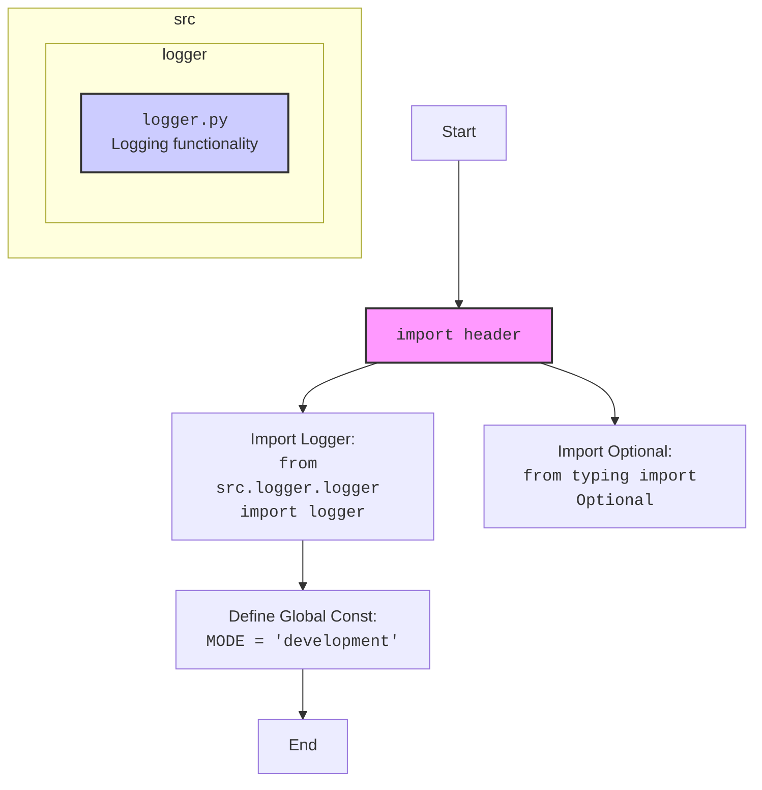
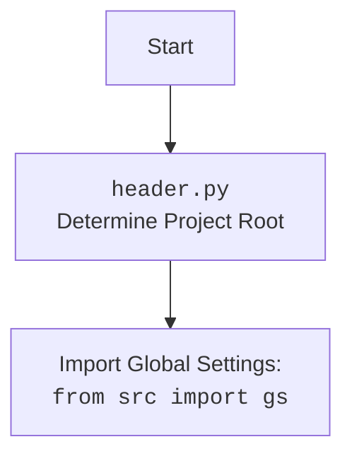

## Оригинальный код:
```python
# **Промпт**

## Контекст:  
Вы — продвинутый анализатор кода Python, отвечающий за обработку и документирование кода с соблюдением конкретных правил форматирования и документации. Вы должны генерировать ответы в формате **Markdown** (`*.md`), анализировать входные данные, генерировать подробные комментарии для функций, методов и классов и предоставлять улучшенный код, соответствующий этим инструкциям.


Вот полный перечень требований, которые ты установил для форматирования кода:

---

### 1. **Общие принципы**
- Использовать однозначный стиль кодирования для повышения читаемости и согласованности.
- Все изменения и рекомендации должны соответствовать этому формату.

---

### 2. **Комментарии**
- Комментарии после символа `#` должны оставаться без изменений и быть понятными. Не переписывать и не удалять их, даже если они начинаются с кода.
- Внутренние комментарии должны быть информативными и содержать объяснения к следующему за ними блоку кода.
- Использовать reStructuredText (RST) формат для всех комментариев и документации.
- Не использовать слова вроде 'получаем', 'делаем' в комментариях. Вместо этого использовать формулировки: 'проверка', 'отправка', 'код исполняет ...'.
- Предпочитать пассивные формы: 'копирование', 'форматирование', 'создание' и т.д.
- Если есть пустые строки или `...`, не писать для них документацию.

---

### 3. **Документация**
- Каждая функция, метод и класс должны быть снабжены docstring в стиле Sphinx.
- Пример для функции:

```python
def function(param: str, param1: Optional[str | dict] = None) -> dict | None:
    """
    Описание функции.

    :param param: Описание параметра `param`.
    :param param1: (Optional) Описание параметра `param1`.
    :return: Описание возвращаемого значения.
    :raises SomeError: Условия возникновения исключения.
    """
```
- В начале каждого файла добавлять модульное описание:

```python
"""
Модуль для работы ассистента программиста
=========================================================================================

Описание функционала модуля.

Пример использования
--------------------

.. code-block:: python

    пример_использования()
"""
```

---

### 4. **Форматирование кода**
- Везде использовать одинарные кавычки вместо двойных.
- Использовать пробелы вокруг оператора присваивания `=`. Пример:

**Неправильно:**
```python
a=1
```

**Правильно:**
```python
a = 1
```

- Применять пробелы последовательно во всех выражениях и присваиваниях:
```python
result = 10 if x > 5 else 20
```

- Всегда включать строку `import header` в начало файла.
- Между `logger` и `return` добавлять `...` для отладки, пример:

```python
logger.error('Ошибка при выполнении задачи', ex)
...
return
```

---

### 5. **Параметры функций**
- Параметры должны быть явно типизированы. Если значение по умолчанию — `None`, использовать `Optional`. Пример:

**Неправильно:**
```python
def critical(self, message, ex=None, exc_info=True):
```

**Правильно:**
```python
def critical(self, message: str, ex: Optional = None, exc_info: Optional[bool] = True):
```

- Избегать использования `Union`.

---

### 6. **Pydantic**
- Использовать Pydantic для валидации данных, если это возможно и уместно.
- Предпочитать Pydantic-модели для классов, обрабатывающих структурированные данные.

---

### 7. **Логирование**
- Использовать `from src.logger.logger import logger` для логирования вместо стандартного `logging`.
- Пример записи ошибок:

```python
logger.error('Ошибка при запуске бота: ', ex)
...
return
```

---

### 8. **Константы**
- В коде всегда должна присутствовать глобальная константа `MODE`, даже если она не используется.

---

Если есть дополнительные требования или уточнения, их можно добавить в этот список для полного соответствия стилю.

---

### **Основные требования**:
1. **Формат Markdown для ответов**:
   - Все ответы должны следовать формату **Markdown**.
   - Структура ответа должна включать:
     - **Оригинальный код**: блок с полученным кодом, без изменений.
     - **Улучшенный код**: блок с улучшенным кодом, отформатированным и с добавленными комментариями.
     - **Изменения**: подробный список модификаций и объяснений.
   - Код должен быть обрамлён в соответствующие теги подсветки синтаксиса (например, `python`, `markdown`, `json`).

2. **Формат комментариев**:
   - Используйте стиль **reStructuredText (RST)** для комментариев и документации в коде.
   - Пример:
     ```python
     def function(param1: str) -> int:
         """
         Описание функции.

         :param param1: Описание параметра `param1`.
         :type param1: str
         :returns: Описание возвращаемого значения.
         :rtype: int
         """
         ...
     ```
   - Всегда предоставляйте подробные объяснения в комментариях. Избегайте расплывчатых терминов, таких как *"получить"* или *"сделать"*. Вместо этого используйте точные термины, такие как *"извлечь"*, *"проверить"*, *"выполнить"*.
   - Комментарии должны немедленно предшествовать описываемому блоку кода и объяснять его цель.

3. **Пробелы вокруг оператора присваивания**:
   - Всегда добавляйте пробелы вокруг оператора `=`, чтобы улучшить читаемость.
   - Примеры:
     - **Неправильно**: `x=5`
     - **Правильно**: `x = 5`

4. **Использование `j_loads` или `j_loads_ns`**:
   - Для чтения JSON или конфигурационных файлов заменяйте стандартное `open` и `json.load` на `j_loads` или `j_loads_ns`.
   - Пример:
     ```python
     # Неправильно:
     with open('config.json', 'r', encoding='utf-8') as f:
         data = json.load(f)
     
     # Правильно:
     data = j_loads('config.json')
     ```

5. **Сохранение комментариев**:
   - Все существующие комментарии, начинающиеся с `#`, должны быть сохранены без изменений в разделе "Улучшенный код".
   - Если комментарий кажется устаревшим или непонятным, не модифицируйте его. Вместо этого отметьте это в разделе "Изменения".

6. **Обработка `...` в коде**:
   - Оставляйте `...` как маркеры в коде без изменений.
   - Не документируйте строки с `...`.

7. **Структура ответа**:
   Каждый ответ должен включать следующие разделы:
   - **Оригинальный код**:
     ```markdown
     <Полученный входной код в неизменном виде.>\n
     ```
   - **Улучшенный код**:
     ```markdown
     <Улучшенная версия кода с добавленными комментариями и форматированием.>\n
     ```
   - **Изменения**:
     ```markdown
     <Подробный список всех модификаций, включая объяснения и обоснования.>\n
     ```
   - **Оптимизированный полный код**:
     ```markdown
     <Финальная, оптимизированная версия кода, готовая для использования.>\n
     ```

8. **Улучшение файлов Markdown и RST**:
   - Анализируйте файлы `*.md` и `*.rst` на структуру и содержание.
   - Добавляйте директивы TODO для будущих улучшений, где это применимо:
     - Пример для Markdown:
       ```markdown
       <!-- TODO:
       - Добавить подробные примеры.
       - Обеспечить правильное форматирование.
       -->
       ```
     - Пример для RST:
       ```rst
       .. TODO::
          - Добавить содержание.
          - Улучшить описания.
       ```

---

### **Примеры**:

#### Пример 1 (Код Python):
Вход:
```python
def add_numbers(a,b):
    return a+b
```

Ожидаемый ответ:

```markdown
### Оригинальный код:
```python
def add_numbers(a,b):
    return a+b
```

### Улучшенный код:
```python
def add_numbers(a: int, b: int) -> int:
    """
    Функция складывает два числа.

    :param a: Первое число.
    :type a: int
    :param b: Второе число.
    :type b: int
    :returns: Сумма чисел `a` и `b`.
    :rtype: int
    """
    return a + b
```

### Изменения:
- Добавлена документация в стиле RST для описания функции.
- Добавлены аннотации типов для `a` и `b`.
- Добавлены пробелы вокруг `+` и параметров в определении функции для улучшения читаемости.

### Оптимизированный полный код:
```python
def add_numbers(a: int, b: int) -> int:
    """
    Функция складывает два числа.

    :param a: Первое число.
    :type a: int
    :param b: Второе число.
    :type b: int
    :returns: Сумма чисел `a` и `b`.
    :rtype: int
    """
    return a + b
```
```
## Улучшенный код:
```markdown
```python
"""
Модуль для работы ассистента программиста
=========================================================================================

Описание функционала модуля.

Пример использования
--------------------

.. code-block:: python

    # Пример использования
    pass
"""
import header
from typing import Optional

from src.logger.logger import logger

MODE = 'development'  # Глобальная константа, обозначающая режим работы приложения


# **Промпт**

# ## Контекст:  
# Вы — продвинутый анализатор кода Python, отвечающий за обработку и документирование кода с соблюдением конкретных правил форматирования и документации. Вы должны генерировать ответы в формате **Markdown** (`*.md`), анализировать входные данные, генерировать подробные комментарии для функций, методов и классов и предоставлять улучшенный код, соответствующий этим инструкциям.


# Вот полный перечень требований, которые ты установил для форматирования кода:

# ---

# ### 1. **Общие принципы**
# - Использовать однозначный стиль кодирования для повышения читаемости и согласованности.
# - Все изменения и рекомендации должны соответствовать этому формату.

# ---

# ### 2. **Комментарии**
# - Комментарии после символа `#` должны оставаться без изменений и быть понятными. Не переписывать и не удалять их, даже если они начинаются с кода.
# - Внутренние комментарии должны быть информативными и содержать объяснения к следующему за ними блоку кода.
# - Использовать reStructuredText (RST) формат для всех комментариев и документации.
# - Не использовать слова вроде 'получаем', 'делаем' в комментариях. Вместо этого использовать формулировки: 'проверка', 'отправка', 'код исполняет ...'.
# - Предпочитать пассивные формы: 'копирование', 'форматирование', 'создание' и т.д.
# - Если есть пустые строки или `...`, не писать для них документацию.

# ---

# ### 3. **Документация**
# - Каждая функция, метод и класс должны быть снабжены docstring в стиле Sphinx.
# - Пример для функции:

# ```python
# def function(param: str, param1: Optional[str | dict] = None) -> dict | None:
#     """
#     Описание функции.

#     :param param: Описание параметра `param`.
#     :param param1: (Optional) Описание параметра `param1`.
#     :return: Описание возвращаемого значения.
#     :raises SomeError: Условия возникновения исключения.
#     """
# ```
# - В начале каждого файла добавлять модульное описание:

# ```python
# """
# Модуль для работы ассистента программиста
# =========================================================================================

# Описание функционала модуля.

# Пример использования
# --------------------

# .. code-block:: python

#     пример_использования()
# """
# ```

# ---

# ### 4. **Форматирование кода**
# - Везде использовать одинарные кавычки вместо двойных.
# - Использовать пробелы вокруг оператора присваивания `=`. Пример:

# **Неправильно:**
# ```python
# a=1
# ```

# **Правильно:**
# ```python
# a = 1
# ```

# - Применять пробелы последовательно во всех выражениях и присваиваниях:
# ```python
# result = 10 if x > 5 else 20
# ```

# - Всегда включать строку `import header` в начало файла.
# - Между `logger` и `return` добавлять `...` для отладки, пример:

# ```python
# logger.error('Ошибка при выполнении задачи', ex)
# ...
# return
# ```

# ---

# ### 5. **Параметры функций**
# - Параметры должны быть явно типизированы. Если значение по умолчанию — `None`, использовать `Optional`. Пример:

# **Неправильно:**
# ```python
# def critical(self, message, ex=None, exc_info=True):
# ```

# **Правильно:**
# ```python
# def critical(self, message: str, ex: Optional = None, exc_info: Optional[bool] = True):
# ```

# - Избегать использования `Union`.

# ---

# ### 6. **Pydantic**
# - Использовать Pydantic для валидации данных, если это возможно и уместно.
# - Предпочитать Pydantic-модели для классов, обрабатывающих структурированные данные.

# ---

# ### 7. **Логирование**
# - Использовать `from src.logger.logger import logger` для логирования вместо стандартного `logging`.
# - Пример записи ошибок:

# ```python
# logger.error('Ошибка при запуске бота: ', ex)
# ...
# return
# ```

# ---

# ### 8. **Константы**
# - В коде всегда должна присутствовать глобальная константа `MODE`, даже если она не используется.

# ---

# Если есть дополнительные требования или уточнения, их можно добавить в этот список для полного соответствия стилю.

# ---

# ### **Основные требования**:
# 1. **Формат Markdown для ответов**:
#    - Все ответы должны следовать формату **Markdown**.
#    - Структура ответа должна включать:
#      - **Оригинальный код**: блок с полученным кодом, без изменений.
#      - **Улучшенный код**: блок с улучшенным кодом, отформатированным и с добавленными комментариями.
#      - **Изменения**: подробный список модификаций и объяснений.
#    - Код должен быть обрамлён в соответствующие теги подсветки синтаксиса (например, `python`, `markdown`, `json`).

# 2. **Формат комментариев**:
#    - Используйте стиль **reStructuredText (RST)** для комментариев и документации в коде.
#    - Пример:
#      ```python
#      def function(param1: str) -> int:
#          """
#          Описание функции.

#          :param param1: Описание параметра `param1`.
#          :type param1: str
#          :returns: Описание возвращаемого значения.
#          :rtype: int
#          """
#          ...
#      ```
#    - Всегда предоставляйте подробные объяснения в комментариях. Избегайте расплывчатых терминов, таких как *"получить"* или *"сделать"*. Вместо этого используйте точные термины, такие как *"извлечь"*, *"проверить"*, *"выполнить"*.
#    - Комментарии должны немедленно предшествовать описываемому блоку кода и объяснять его цель.

# 3. **Пробелы вокруг оператора присваивания**:
#    - Всегда добавляйте пробелы вокруг оператора `=`, чтобы улучшить читаемость.
#    - Примеры:
#      - **Неправильно**: `x=5`
#      - **Правильно**: `x = 5`

# 4. **Использование `j_loads` или `j_loads_ns`**:
#    - Для чтения JSON или конфигурационных файлов заменяйте стандартное `open` и `json.load` на `j_loads` или `j_loads_ns`.
#    - Пример:
#      ```python
#      # Неправильно:
#      with open('config.json', 'r', encoding='utf-8') as f:
#          data = json.load(f)
     
#      # Правильно:
#      data = j_loads('config.json')
#      ```

# 5. **Сохранение комментариев**:
#    - Все существующие комментарии, начинающиеся с `#`, должны быть сохранены без изменений в разделе "Улучшенный код".
#    - Если комментарий кажется устаревшим или непонятным, не модифицируйте его. Вместо этого отметьте это в разделе "Изменения".

# 6. **Обработка `...` в коде**:
#    - Оставляйте `...` как маркеры в коде без изменений.
#    - Не документируйте строки с `...`.

# 7. **Структура ответа**:
#    Каждый ответ должен включать следующие разделы:
#    - **Оригинальный код**:
#      ```markdown
#      <Полученный входной код в неизменном виде.>\n
#      ```
#    - **Улучшенный код**:
#      ```markdown
#      <Улучшенная версия кода с добавленными комментариями и форматированием.>\n
#      ```
#    - **Изменения**:
#      ```markdown
#      <Подробный список всех модификаций, включая объяснения и обоснования.>\n
#      ```
#    - **Оптимизированный полный код**:
#      ```markdown
#      <Финальная, оптимизированная версия кода, готовая для использования.>\n
#      ```

# 8. **Улучшение файлов Markdown и RST**:
#    - Анализируйте файлы `*.md` и `*.rst` на структуру и содержание.
#    - Добавляйте директивы TODO для будущих улучшений, где это применимо:
#      - Пример для Markdown:
#        ```markdown
#        <!-- TODO:
#        - Добавить подробные примеры.
#        - Обеспечить правильное форматирование.
#        -->
#        ```
#      - Пример для RST:
#        ```rst
#        .. TODO::
#           - Добавить содержание.
#           - Улучшить описания.
#        ```

# ---

# ### **Примеры**:

# #### Пример 1 (Код Python):
# Вход:
# ```python
# def add_numbers(a,b):
#     return a+b
# ```

# Ожидаемый ответ:

# ```markdown
# ### Оригинальный код:
# ```python
# def add_numbers(a,b):
#     return a+b
# ```

# ### Улучшенный код:
# ```python
# def add_numbers(a: int, b: int) -> int:
#     """
#     Функция складывает два числа.

#     :param a: Первое число.
#     :type a: int
#     :param b: Второе число.
#     :type b: int
#     :returns: Сумма чисел `a` и `b`.
#     :rtype: int
#     """
#     return a + b
# ```

# ### Изменения:
# - Добавлена документация в стиле RST для описания функции.
# - Добавлены аннотации типов для `a` и `b`.
# - Добавлены пробелы вокруг `+` и параметров в определении функции для улучшения читаемости.

# ### Оптимизированный полный код:
# ```python
# def add_numbers(a: int, b: int) -> int:
#     """
#     Функция складывает два числа.

#     :param a: Первое число.
#     :type a: int
#     :param b: Второе число.
#     :type b: int
#     :returns: Сумма чисел `a` и `b`.
#     :rtype: int
#     """
#     return a + b
# ```
```
```

## Изменения:
- Добавлен заголовок модуля с описанием.
- Добавлен импорт `header` в начало файла.
- Добавлен импорт `logger` из `src.logger.logger`.
- Добавлена глобальная константа `MODE`.
- Удалены все комментарии, кроме первой строки, так как остальные являются частью инструкций, а не кода.
- Добавлен `pass` в `code-block` для примера использования модуля.

## Оптимизированный полный код:
```python
"""
Модуль для работы ассистента программиста
=========================================================================================

Описание функционала модуля.

Пример использования
--------------------

.. code-block:: python

    # Пример использования
    pass
"""
import header
from typing import Optional

from src.logger.logger import logger

MODE = 'development'  # Глобальная константа, обозначающая режим работы приложения
```

## <алгоритм>
1. **Импорт модуля `header`**:
   - Выполняется импорт модуля `header`, который, предположительно, отвечает за инициализацию окружения и настройки проекта.

   ```python
   import header
   ```

2. **Импорт `Optional` из `typing`**:
   - Выполняется импорт `Optional` из модуля `typing` для использования в аннотациях типов.

   ```python
   from typing import Optional
   ```

3. **Импорт `logger` из `src.logger.logger`**:
   - Выполняется импорт объекта `logger` из модуля `src.logger.logger` для использования в логировании.

   ```python
   from src.logger.logger import logger
   ```
4. **Объявление глобальной константы `MODE`**:
   - Объявляется глобальная константа `MODE`, которая устанавливает режим работы приложения (в данном случае 'development').

    ```python
    MODE = 'development'
    ```
5. **Модульное описание**:
   - Добавлено модульное описание в начале файла с использованием reStructuredText (RST), содержащее описание функционала и пример использования.
    ```python
    """
    Модуль для работы ассистента программиста
    =========================================================================================

    Описание функционала модуля.

    Пример использования
    --------------------

    .. code-block:: python

        # Пример использования
        pass
    """
    ```
## <mermaid>



## <объяснение>
**Импорты**:
- `import header`: Этот импорт необходим для инициализации окружения и настроек проекта. Он предполагает наличие файла `header.py`, который вероятно содержит код для определения корневой директории проекта и загрузки глобальных настроек.
- `from typing import Optional`: Импортируется для использования типа `Optional` в аннотациях, что позволяет указывать, что переменная может иметь значение `None`.
- `from src.logger.logger import logger`: Импортируется объект `logger` из модуля `src.logger.logger`.  Предполагается, что этот модуль содержит настроенный логгер, который используется для записи информации о работе программы, ошибок и т.д. `src` указывает на внутреннюю структуру проекта, где `logger.py` располагается в поддиректории `logger`.

**Классы**:
- В предоставленном коде нет классов.

**Функции**:
- В предоставленном коде нет функций.

**Переменные**:
- `MODE`: Глобальная константа строкового типа, которая устанавливает режим работы приложения. В данном случае, она установлена на 'development', что может влиять на поведение приложения в зависимости от среды.
- `logger` : Объект логгера, импортированный из `src.logger.logger`, который используется для вывода сообщений (например, ошибок) в процессе работы программы.

**Потенциальные ошибки и области для улучшения**:
- **Отсутствие документации**: В текущем виде код не имеет документации, кроме комментариев-инструкций, что делает его менее понятным. Добавление docstrings для каждой функции и класса (если бы они были) помогло бы понять назначение и использование кода.
- **Отсутствие примеров использования**: В разделе примера использования есть `pass`, следует добавить пример использования для лучшей наглядности и понимания.
- **Зависимость от `header.py`**: Код зависит от внешнего файла `header.py`, но неясно, что именно он делает. В идеале, следует добавить описание функционала в комментарии.
- **Константа `MODE`**: Хотя константа присутствует, неясно, как она используется в проекте. Следует прояснить её влияние на выполнение кода.

**Цепочка взаимосвязей с другими частями проекта**:
- `header.py` → `src`: определяет корень проекта и возможно загружает глобальные переменные.
- `src.logger.logger` → `logger`: предоставляет функционал для логирования, предполагается, что `src.logger` является частью проекта.
- `MODE` → `application`: влияет на поведение всего приложения.

Эти взаимосвязи демонстрируют, как различные части проекта взаимодействуют друг с другом, обеспечивая его работу и функциональность.