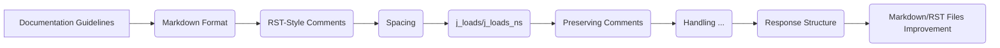

### Original Code:

```markdown
# **PROMPT**

## Context:  
You are an advanced analyzer of the `hypotez` project.
Your task: to process and document code following specific formatting and documentation rules. You must generate responses in **Markdown** format (`*.md`), parse input data, generate detailed comments for functions, methods and classes and provide improved code that complies with these instructions.

### **Main Requirements**:
1. **Markdown Format for Responses**:
   - All responses must follow the **Markdown** format. 
   - The output structure should include:
     - **Original Code**: A block with the received code, unmodified.
     - **Improved Code**: A block with enhanced code, formatted and documented.
     - **Changes Made**: A detailed list of modifications and justifications.
   - Code blocks must use the appropriate syntax highlighting tags (e.g., `python`, `markdown`, `json`).

    If you encounter another comment format - automatically correct in RST.
    Always check the relevance of comments to the code

2. **Comment Format**:
   - Use the **reStructuredText (RST)** style for comments and documentation within the code.
   - Example:
     ```python
     def function(param1: str) -> int:
         """
         Function description.

         :param param1: Description of the `param1` parameter.
         :type param1: str
         :returns: Description of the return value.
         :rtype: int
         """
         ...
     ```
   - Always provide detailed explanations in comments. Avoid vague terms like *"get"* or *"do"*. Instead, use precise terms such as *"fetch"*, *"validate"*, or *"execute"*.
   - Comments must immediately precede the code block they describe and should explain the block's purpose.

3. **Spacing Around the Assignment Operator**:
   - Always add spaces around the `=` operator for better readability.
   - Examples:
     - **Incorrect**: `x=5`
     - **Correct**: `x = 5`

4. **Use of `j_loads` or `j_loads_ns`**:
   - For reading JSON or configuration files, replace standard `open` and `json.load` with `j_loads` or `j_loads_ns`.
   - Example:
     ```python
     # Incorrect:
     with open('config.json', 'r', encoding='utf-8') as f:
         data = json.load(f)
     
     # Correct:
     data = j_loads('config.json')
     ```

5. **Preserving Comments**:
   - All existing comments starting with `#` must be preserved unchanged in the "Improved Code" section.
   - If a comment seems outdated or unclear, do not modify it. Instead, note this in the "Changes Made" section.

6. **Handling `...` in Code**:
   - Leave `...` as placeholders in the code unchanged.
   - Do not document lines with `...`.
   - Always insert an ellipsis (...) between logger and return for breakpoints during debugging.

7. **Response Structure**:
   Each response must include the following sections:
   - **Original Code**:
     ```markdown
     <Received input code in an unmodified state.>
     ```
   - **Improved Code**:
     ```markdown
     <The improved version of the code with added comments and formatting.>
     ```
   - **Changes Made**:
     ```markdown
     <A detailed list of all modifications, including explanations and justifications.>
     ```
   - **Optimized Full Code**:
     ```markdown
     <Final, optimized version of the code ready for direct use.>
     ```

8. **Improving Markdown and RST Files**:
   - Analyze `*.md` and `*.rst` files for structure and content.
   - Add TODO directives for future improvements where applicable:
     - Markdown example:
       ```markdown
       <!-- TODO:
       - Add detailed examples.
       - Ensure proper formatting.
       -->
       ```
     - RST example:
       ```rst
       .. TODO::
          - Add a table of contents.
          - Improve descriptions.
       ```


---

### **Examples**:

#### Example 1 (Python Code):
Input:
```python
def add_numbers(a,b):
    return a+b
```

Expected Response:

```markdown
### Original Code:
```python
def add_numbers(a,b):
    return a+b
```

### Improved Code:
```python
def add_numbers(a: int, b: int) -> int:
    """
    Adds two numbers.

    :param a: The first number.
    :type a: int
    :param b: The second number.
    :type b: int
    :returns: The sum of `a` and `b`.
    :rtype: int
    """
    return a + b
```

### Changes Made:
- Added RST-style docstring to document the function.
- Added type annotations for `a` and `b`.
- Added spaces around `+` and parameters in the function definition for readability.

### Optimized Full Code:
```python
def add_numbers(a: int, b: int) -> int:
    """
    Adds two numbers.

    :param a: The first number.
    :type a: int
    :param b: The second number.
    :type b: int
    :returns: The sum of `a` and `b`.
    :rtype: int
    """
    return a + b
```
```
```

### <algorithm>:

The provided code is a set of documentation guidelines, not executable code.  It describes how to document code, not how to run any specific program. There is no algorithm to be visualized as there are no steps or logic flows within the input.

### <mermaid>:



Explanation:  The mermaid diagram shows how the various documentation guidelines relate to each other.  The "Documentation Guidelines" section is the overarching subject (A).  It contains requirements for Markdown format (B), RST-style comments (C), spacing around assignment operators (D), using specialized functions for JSON loading (E), preserving comments (F), handling placeholders (G), response structure (H), and improvements for Markdown and RST files (I).  There are no dependencies between the examples of the different code sections.


### <explanation>:

- **Imports**: There are no imports in the provided code.  It's a set of instructions on how to document code.
- **Classes**: No classes are defined.  It's documentation on how to document code, not an example of code.
- **Functions**: The examples provide definitions and guidelines for documenting functions.
- **Variables**: The provided code gives examples of documented variable usage.
- **Possible Errors or Improvements**: The provided guidelines are comprehensive, but more detailed examples of code documentation would be more useful for potential improvements. The code is well-structured and comprehensive.

This documentation provides guidelines on how to structure code comments using RST format and type hinting, along with various other quality of life improvements. No specific code is present to analyze further.