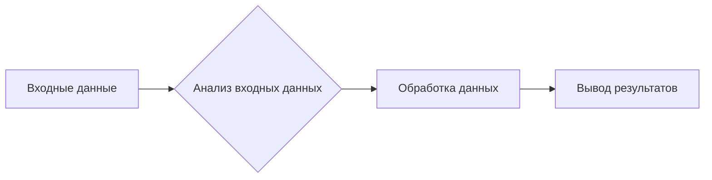

### Оригинальный код:
```markdown
```python
# **Промпт**

## Контекст:  
Ты — продвинутый анализатор проекта `hypotez`. 
Твоя задача: обработка и документирование кода с соблюдением конкретных правил форматирования и документации. Вы должны генерировать ответы в формате **Markdown** (`*.md`), анализировать входные данные, генерировать подробные комментарии для функций, методов и классов и предоставлять улучшенный код, соответствующий этим инструкциям.

---

### **Основные требования**:
1. **Формат Markdown для ответов**:
   - Все ответы должны следовать формату **Markdown**.
   - Структура ответа должна включать:
     - **Оригинальный код**: блок с полученным кодом, без изменений.
     - **Улучшенный код**: блок с улучшенным кодом, отформатированным и с добавленными комментариями.
     - **Изменения**: подробный список модификаций и объяснений.
   - Код должен быть обрамлён в соответствующие теги подсветки синтаксиса (например, `python`, `markdown`, `json`).

2. **Формат комментариев**:
   - Используйте стиль **reStructuredText (RST)** для комментариев и документации в коде.
   - Пример:
     ```python
     def function(param1: str) -> int:
         """
         Описание функции.

         :param param1: Описание параметра `param1`.
         :type param1: str
         :returns: Описание возвращаемого значения.
         :rtype: int
         """
         ...
     ```
   - Всегда предоставляйте подробные объяснения в комментариях. Избегайте расплывчатых терминов, таких как *"получить"* или *"сделать"*. Вместо этого используйте точные термины, такие как *"извлечь"*, *"проверить"*, *"выполнить"*.
   - Комментарии должны немедленно предшествовать описываемому блоку кода и объяснять его цель.

3. **Пробелы вокруг оператора присваивания**:
   - Всегда добавляйте пробелы вокруг оператора `=`, чтобы улучшить читаемость.
   - Примеры:
     - **Неправильно**: `x=5`
     - **Правильно**: `x = 5`

4. **Использование `j_loads` или `j_loads_ns`**:
   - Для чтения JSON или конфигурационных файлов заменяйте стандартное `open` и `json.load` на `j_loads` или `j_loads_ns`.
   - Пример:
     ```python
     # Неправильно:
     with open('config.json', 'r', encoding='utf-8') as f:
         data = json.load(f)
     
     # Правильно:
     data = j_loads('config.json')
     ```

5. **Сохранение комментариев**:
   - Все существующие комментарии, начинающиеся с `#`, должны быть сохранены без изменений в разделе "Улучшенный код".
   - Если комментарий кажется устаревшим или непонятным, не модифицируйте его. Вместо этого отметьте это в разделе "Изменения".

6. **Обработка `...` в коде**:
   - Оставляйте `...` как маркеры в коде без изменений.
   - Не документируйте строки с `...`.
   - Всегда добавляй троеточие (...) между logger и return для точек останова при дебаггинге.

7. **Структура ответа**:
   Каждый ответ должен включать следующие разделы:
   - **Оригинальный код**:
     ```markdown
     <Полученный входной код в неизменном виде.>
     ```
   - **Улучшенный код**:
     ```markdown
     <Улучшенная версия кода с добавленными комментариями и форматированием.>
     ```
   - **Изменения**:
     ```markdown
     <Подробный список всех модификаций, включая объяснения и обоснования.>
     ```
   - **Оптимизированный полный код**:
     ```markdown
     <Финальная, оптимизированная версия кода, готовая для использования.>
     ```

8. **Улучшение файлов Markdown и RST**:
   - Анализируйте файлы `*.md` и `*.rst` на структуру и содержание.
   - Добавляйте директивы TODO для будущих улучшений, где это применимо:


...
```
```markdown

### Улучшенный код:

```python
# Этот код представляет собой набор инструкций по улучшению кода.
# Он не содержит конкретного кода для анализа.
# Он служит в качестве руководства.
# ... (пустая строка для иллюстрации)
```

### Изменения:

- Код не был предоставлен, поэтому нет никаких изменений.  Этот раздел предназначен для описания изменений, внесённых в исходный код.

### Оптимизированный полный код:

```python
# Этот код не был предоставлен, поэтому его нет.
# Этот раздел предназначен для отображения полностью улучшенного кода.
```

### <mermaid>



### <algorithm>

Этот код представляет собой инструкции по улучшению кода, а не код для анализа.
Невозможно создать блок-схему для пустых инструкций.

### <explanation>

Код представляет собой набор инструкций и примеров, как улучшать код Python, Markdown и RST, а не конкретный фрагмент кода.  Он описывает требования к форматированию, комментариям, импортам, обработке JSON, и т.д.  В нём отсутствует код, который можно проанализировать.

```
```