## <input code>
```html
<input code>
<algorithm>
<explanation>
```

## <algorithm>
1.  **Начало**: Принимается HTML код как входные данные.
2.  **Разбор HTML**: Разбирается HTML код на три части: `input code`, `algorithm`, `explanation`.
3.  **Обработка <input code>**:
    - Извлекается и сохраняется блок кода `<input code>`.
    - **Пример**: Код Python:
        ```python
        from src.utils.calculator import calculate_sum

        def add_numbers(a, b):
            result = calculate_sum(a, b)
            return result
        ```
4.  **Обработка <algorithm>**:
    - Извлекается и сохраняется блок алгоритма `<algorithm>`.
    - **Пример**: 
       ```html
       1. The function `calculate_sum` is imported from the `src.utils.calculator` module.
       2. A function `add_numbers` is defined, which takes two arguments `a` and `b`.
       3. The function `calculate_sum(a, b)` is called to add `a` and `b`.
       4. The result is returned to the calling code.
       
       Example:  
       - Input data: `a = 3`, `b = 5`.  
       - Algorithm: `calculate_sum(3, 5)`.  
       - Result: `8`. 
       ```
5.  **Обработка <explanation>**:
    - Извлекается и сохраняется блок объяснения `<explanation>`.
     - **Пример**:
     ```html
      **Imports**:  
      - `from src.utils.calculator import calculate_sum`: Imports the function `calculate_sum`, which is used to calculate the sum. This module is located in the `src.utils` folder.
      
      **Function `add_numbers`**:  
      - Purpose: simplifies adding two numbers via the call to the `calculate_sum` function.  
      - Arguments:  
        - `a` (number): The first addend.  
        - `b` (number): The second addend.  
      - Return value: the result of adding `a` and `b`.
      
      **Relationship with other packages**:  
      - The `src.utils.calculator` module might be part of a library for mathematical calculations.  
      - If `calculate_sum` uses additional modules, this can be clarified in its documentation.
      
      **Potential improvements**:  
      - Add type checks for arguments `a` and `b` to prevent errors.  
      - Localize the `calculate_sum` call within the module if it is not used elsewhere.
     ```
6.  **Вывод**: Выводится результат обработки кода в HTML формате.

```mermaid
flowchart TD
    Start --> ParseHTML[Parse HTML Code]
    ParseHTML --> ExtractInputCode[Extract <input code>]
    ParseHTML --> ExtractAlgorithm[Extract <algorithm>]
    ParseHTML --> ExtractExplanation[Extract <explanation>]
    ExtractInputCode --> ProcessInputCode[Process <input code>]
    ExtractAlgorithm --> ProcessAlgorithm[Process <algorithm>]
    ExtractExplanation --> ProcessExplanation[Process <explanation>]
    ProcessInputCode --> OutputHTML[Output HTML]
    ProcessAlgorithm --> OutputHTML
    ProcessExplanation --> OutputHTML
    OutputHTML --> End
```

## <mermaid>

**Описание диаграммы:**

-   **Start**: Начало процесса разбора HTML кода.
-   **ParseHTML**: Разбирает входной HTML код на три основные части: `<input code>`, `<algorithm>` и `<explanation>`.
-   **ExtractInputCode**: Извлекает блок `<input code>` из HTML кода.
-   **ExtractAlgorithm**: Извлекает блок `<algorithm>` из HTML кода.
-   **ExtractExplanation**: Извлекает блок `<explanation>` из HTML кода.
-   **ProcessInputCode**: Обрабатывает извлеченный блок `<input code>`.
-   **ProcessAlgorithm**: Обрабатывает извлеченный блок `<algorithm>`.
-   **ProcessExplanation**: Обрабатывает извлеченный блок `<explanation>`.
-   **OutputHTML**: Собирает и выводит обработанный код в HTML формате.
-   **End**: Конец процесса.

## <объяснение>
**Импорты**:

-   В данном случае импорты не используются, так как это описание процесса разбора и форматирования HTML кода, а не выполнение Python-кода.

**Классы**:

-   Классы не используются, так как это процедурный анализ, а не объектно-ориентированный.

**Функции**:

-   Основные функции:
    -   `ParseHTML`: Разбирает HTML код на составляющие.
    -   `ExtractInputCode`, `ExtractAlgorithm`, `ExtractExplanation`: Извлекают соответствующие блоки из HTML.
    -   `ProcessInputCode`, `ProcessAlgorithm`, `ProcessExplanation`: Обрабатывают извлеченные блоки (в примерах вложенных алгоритмов).
    -   `OutputHTML`: Формирует и выводит HTML.
-   Аргументы:
    -   `ParseHTML` принимает HTML код в виде строки.
    -   `ExtractInputCode`, `ExtractAlgorithm`, `ExtractExplanation` принимают разобранный HTML и возвращают соответствующий блок.
-   Возвращаемые значения:
    -   `ParseHTML` возвращает разобранный HTML (возможно, в виде словаря или объекта).
    -   `ExtractInputCode`, `ExtractAlgorithm`, `ExtractExplanation` возвращают строки с соответствующим кодом.
    -   `OutputHTML` возвращает отформатированную строку HTML.

**Переменные**:

-   Переменные представляют собой входные данные (HTML код), извлеченные блоки кода, алгоритма и пояснений, а также выходную HTML строку.

**Потенциальные ошибки и улучшения**:

-   **Ошибка**: Некорректная структура HTML может вызвать сбой при парсинге.
-   **Улучшение**: Можно добавить валидацию структуры HTML, чтобы избежать ошибок.
-   **Улучшение**: Добавить обработку ошибок для неверных данных в HTML блоках.

**Взаимосвязи с другими частями проекта**:

-   Этот код работает независимо, так как занимается разбором и форматированием HTML, но может являться частью более крупной системы для анализа и обработки кода.
-   Этот компонент может взаимодействовать с модулями, которые генерируют или предоставляют HTML код для анализа.

**Дополнительные заметки:**

-   Этот код предназначен для обработки и структурирования HTML, содержащего код, алгоритм и пояснение, а не для выполнения кода.
-   Используется для структурированного ответа на запрос анализа кода.