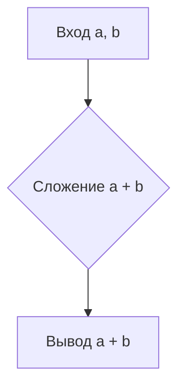

```MD
### <input code>

```
### Формат Markdown для ответов:

Все ответы должны следовать формату Markdown.

Структура ответа должна включать:

- **Улучшенный код**: блок с улучшенным кодом, отформатированным и с добавленными комментариями.
- **Изменения**: подробный список модификаций и объяснений.

Код должен быть обрамлён в соответствующие теги подсветки синтаксиса (например, `python`, `markdown`, `json`).

---

### Примеры:

#### Пример 1 (Код Python):
Вход:
```python
def add_numbers(a,b):
    return a+b
```

Ожидаемый ответ:

### Улучшенный код:
```python
def add_numbers(a: int, b: int) -> int:
    """
    Функция складывает два числа.

    :param a: Первое число.
    :type a: int
    :param b: Второе число.
    :type b: int
    :returns: Сумма чисел `a` и `b`.
    :rtype: int
    """
    return a + b
```

### Изменения:
- Добавлена документация в стиле RST для описания функции.
- Добавлены аннотации типов для `a` и `b`.
- Добавлены пробелы вокруг `+` и параметров в определении функции для улучшения читаемости.

### Оптимизированный полный код:
```python
def add_numbers(a: int, b: int) -> int:
    """
    Функция складывает два числа.

    :param a: Первое число.
    :type a: int
    :param b: Второе число.
    :type b: int
    :returns: Сумма чисел `a` и `b`.
    :rtype: int
    """
    return a + b
```
```

### <algorithm>

Этот код представляет собой пример функции `add_numbers`, которая складывает два целых числа.  Алгоритм очень прост:

1. **Ввод:** Функция получает два аргумента `a` и `b`.
2. **Вычисление:** Функция складывает значения `a` и `b`.
3. **Вывод:** Функция возвращает результат сложения.

**Пример:**

Если `a = 5` и `b = 3`, то функция вернёт `8`.


### <mermaid>



### <explanation>

Этот код не содержит никаких импортов, так как он представляет собой простую функцию, не зависящую от внешних модулей.

**Функции:**

- `add_numbers(a: int, b: int) -> int`:  Это функция, которая принимает два целых числа `a` и `b` в качестве аргументов и возвращает их сумму, также целое число.  `-> int` — это аннотация типа, указывающая, что функция возвращает целое число. Аннотации типов делают код более читаемым и позволяют IDE выполнять статическую проверку типов.  Документация в стиле RST (reStructuredText) объясняет назначение функции.

**Переменные:**

- `a`, `b`:  Целые числа, принимаемые в качестве входных данных.

**Возможные ошибки/улучшения:**

- *Отсутствие проверки входных данных*: Функция не проверяет, являются ли `a` и `b` целыми числами.  Если на вход подаются нечисловые значения, функция может вызвать ошибку `TypeError`.  Возможная модификация:
```python
def add_numbers(a: int, b: int) -> int:
    if not isinstance(a, int) or not isinstance(b, int):
        raise TypeError("Оба аргумента должны быть целыми числами")
    return a + b
```

- *Недостаточная проверка входных данных*: Вместо `TypeError` можно использовать `ValueError` для того, чтобы лучше отразить ситуацию, что числа не могут быть обработаны как целые.


В данном примере нет цепочки взаимосвязей с другими частями проекта, так как это базовый пример.  В реальном проекте эта функция может быть частью более сложного модуля, связанного с обработкой чисел.