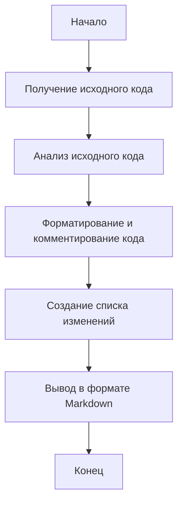

## Анализ и объяснение кода

### 1. <алгоритм>

Код представляет собой шаблон для ответов, генерируемых AI. Он определяет формат, в котором должны быть представлены ответы, а именно в Markdown. 

Процесс можно представить следующим образом:

1.  **Ввод:** Получение исходного кода.
2.  **Обработка:**
    *   Анализ исходного кода.
    *   Форматирование улучшенного кода и добавление комментариев.
    *   Создание списка модификаций и их объяснений.
3.  **Вывод:** Выдача результата в формате Markdown, включающего улучшенный код и список изменений.

**Пример:**

*   **Ввод:**
    ```python
    def add_numbers(a,b):
        return a+b
    ```
*   **Обработка:**
    1.  Анализ: Определено, что код Python является функцией, выполняющей сложение двух чисел.
    2.  Форматирование: Добавлены аннотации типов, docstring, пробелы для улучшения читаемости.
    3.  Создание списка изменений: Описаны добавленные аннотации типов, docstring и форматирование.
*   **Вывод:**
    ```markdown
    ### Улучшенный код:
    ```python
    def add_numbers(a: int, b: int) -> int:
        """
        Функция складывает два числа.

        :param a: Первое число.
        :type a: int
        :param b: Второе число.
        :type b: int
        :returns: Сумма чисел `a` и `b`.
        :rtype: int
        """
        return a + b
    ```

    ### Изменения:
    - Добавлена документация в стиле RST для описания функции.
    - Добавлены аннотации типов для `a` и `b`.
    - Добавлены пробелы вокруг `+` и параметров в определении функции для улучшения читаемости.

    ### Оптимизированный полный код:
    ```python
    def add_numbers(a: int, b: int) -> int:
        """
        Функция складывает два числа.

        :param a: Первое число.
        :type a: int
        :param b: Второе число.
        :type b: int
        :returns: Сумма чисел `a` и `b`.
        :rtype: int
        """
        return a + b
    ```
    ```

### 2. <mermaid>



**Анализ диаграммы `mermaid`:**

*   **Start**: Обозначает начало процесса обработки кода.
*   **Input**: Представляет этап получения исходного кода для анализа.
*   **Analyze**: Этап, на котором происходит анализ полученного кода.
*   **Format**: Этап, где код форматируется и добавляются комментарии.
*   **Changes**: Этап, где формируется список изменений, внесенных в код.
*   **Output**: Этап вывода результата в формате Markdown.
*  **End**: Обозначает конец процесса.

Все переменные имеют осмысленные имена, описывающие этапы процесса.

### 3. <объяснение>

**Объяснение:**

-   **Формат Markdown:**
    -   Этот раздел задает формат представления ответов, который должен быть в Markdown. Это позволяет структурировать ответы и делает их читабельными.
    -   Использование блоков кода с подсветкой синтаксиса (`python`, `markdown`, `json`) обеспечивает правильное отображение кода.
-   **Структура ответа:**
    -   Ответ должен включать три ключевых блока:
        -   **Улучшенный код**: Блок с форматированным и прокомментированным кодом.
        -   **Изменения**: Детальный список модификаций и их объяснения.
    -   Это обеспечивает четкость и понятность ответа, облегчая восприятие изменений.
-   **Примеры:**
    -   **Пример 1 (Код Python):**
        -   Приведен пример простого кода Python (функция сложения) и демонстрируется, как должен выглядеть ответ.
        -   Показано, как код должен быть улучшен (добавлены аннотации типов, docstring) и объяснено каждое изменение.
        -   Предоставлен оптимизированный полный код, который можно скопировать и использовать.

-   **Импорты:** В данном коде нет импортов, так как он описывает формат ответов, а не выполняет какую-либо функциональность.
-   **Классы:** В коде отсутствуют классы. Он описывает формат, а не определяет объекты.
-   **Функции:**
    -   В примере показана функция `add_numbers`.
    -   Аннотации типов используются для `a` и `b` (аргументы) и для возвращаемого значения, что обеспечивает проверку типов.
    -   Документация в стиле RST добавляет описание функции, ее параметров и возвращаемого значения.
-   **Переменные:**
    -   В примере `add_numbers` используются переменные `a` и `b` для хранения чисел.
    -   У них тип `int`.
-  **Потенциальные ошибки и улучшения**
    -   Данный код не содержит ошибок.
    -   Этот шаблон можно расширить для других языков программирования.

**Взаимосвязи с другими частями проекта:**

Этот файл (`comments_improver_en.md`) является частью AI-системы, используемой для генерации ответов на запросы пользователя. Он устанавливает правила, как должен быть структурирован и представлен результат анализа кода, что обеспечивает единообразность и качество ответов. Этот файл не взаимодействует напрямую с другими частями проекта, но служит для формирования выходных данных AI-системы.