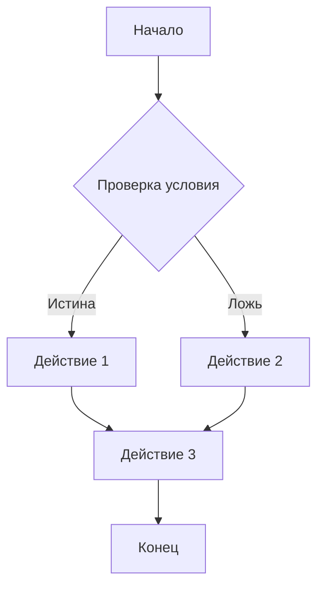
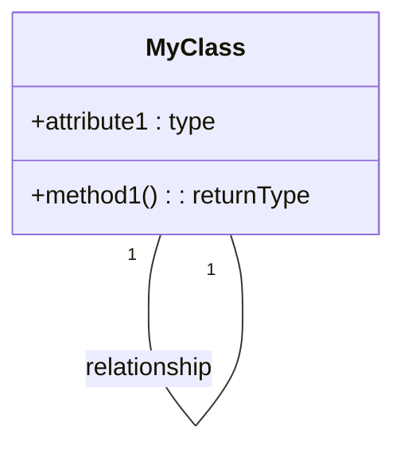

# Анализ кода

К сожалению, предоставлен пустой код.  Для анализа и объяснения функциональности необходимо предоставить сам код.  Без кода невозможно выполнить запрошенные шаги 1-3 и 4.

**Возможная структура ответа при наличии кода:**

**1. <input code>**:

```
(Вставить здесь предоставленный код)
```

**2. <algorithm>**:

(Здесь должна быть блок-схема алгоритма, описывающая пошаговую логику работы кода.  Пример:



Примеры должны иллюстрировать, как данные обрабатываются, передаются между функциями и классами.  )

**3. <mermaid>**:

(Здесь будет код диаграммы Mermaid, описывающей взаимодействие компонентов. Примеры:



)

**4. <explanation>**:

(Здесь должен быть подробный анализ кода, отвечающий на следующие вопросы:

* **Импорты**: Их назначение и связь с другими пакетами, начиная с `src.`. Пример:
    ```
    import src.utils.some_module as sm; // Импортирует модуль some_module из папки utils, используя псевдоним sm.
    ```
* **Классы**: Их роль, атрибуты, методы и взаимодействие с другими компонентами проекта. Пример:
    ```
    class MyClass {
        // Атрибуты
        +attribute1: type;
        // Методы
        +method1(arg1: type): returnType {
          // Тело метода
        }
    }

    // Пример взаимодействия:
    MyClass mc = new MyClass(); // Создание экземпляра класса.
    mc.method1(value); // Вызов метода mc.method1.
    ```
* **Функции**: Их аргументы, возвращаемые значения, назначение и примеры.
* **Переменные**: Их типы и использование.
* **Возможные ошибки или области для улучшений**:  Потенциальные проблемы в коде и способы их решения.
* **Взаимосвязи с другими частями проекта**:  Описание того, как этот код используется или взаимодействует с другими частями приложения. )


В ожидании предоставления кода.