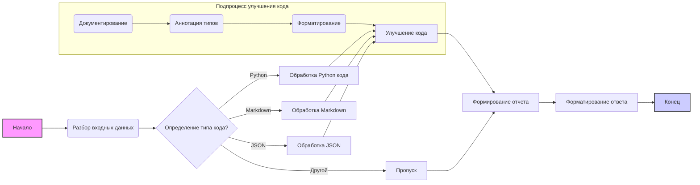

# Анализ кода: `comments_improver_en.md`

## <алгоритм>

1.  **Разбор входных данных:**
    *   Входные данные представляют собой строку в формате Markdown, содержащую инструкции и пример кода.
    *   Пример кода может быть на разных языках программирования.
2.  **Определение типа примера:**
    *   Анализируется тег подсветки синтаксиса (например, `python`, `markdown`, `json`) для определения языка примера кода.
    *   Если тег не найден, предполагается, что код не является исполняемым.
    *   В данном случае, пример кода на `python`.
3.  **Обработка кода:**
    *   Исходный код извлекается из блока кода.
    *   Производится улучшение кода, которое включает:
        *   Добавление документации в стиле RST.
        *   Добавление аннотаций типов.
        *   Добавление пробелов для улучшения читаемости.
    *   Создается новый блок кода с улучшенным кодом.
4.  **Генерация отчета:**
    *   Формируется блок `Изменения`, описывающий внесенные модификации в код.
    *   Формируется блок `Оптимизированный полный код` (в данном случае дублирует улучшенный).
    *   Вся информация форматируется в формате Markdown.
5.  **Форматирование ответа:**
    *   Все блоки отчета форматируются в соответствии с Markdown, включая код в тегах подсветки синтаксиса.

**Пример данных:**

**Вход:**

```markdown
### Пример 1 (Код Python):
Вход:
```python
def add_numbers(a,b):
    return a+b
```

**Поток данных:**

1.  **Входные данные:** Строка Markdown с примером кода Python.
2.  **Разбор:** Анализ Markdown, выделение тега синтаксиса (`python`), извлечение исходного кода.
3.  **Обработка:**
    *   Добавление аннотаций типов (`a: int, b: int -> int`).
    *   Добавление документации (`""" ... """`).
    *   Добавление пробелов.
4.  **Отчет:** Формирование блоков `Улучшенный код`, `Изменения`, `Оптимизированный полный код`.
5.  **Выходные данные:** Строка Markdown с улучшенным кодом и описанием изменений.

## <mermaid>



**Зависимости:**

-   **graph LR:** Определяет тип диаграммы как направленный граф слева направо.
-   **A, B, C, ..., K:** Узлы графа, представляющие отдельные шаги или данные.
-   **-->:** Направленные связи между узлами, определяющие порядок выполнения.
-   **{}:** Ромбы для обозначения решений (например, `C{Определение типа кода?}`).
-   **[]:** Прямоугольники для обозначения процессов.
-   **():** Овалы для обозначения функций.
-   **subgraph:** Определение подграфа для улучшения кода.
-   **style:** Стилизация отдельных узлов.

## <объяснение>

**Импорты:**

-   В данном контексте импорты отсутствуют, так как код является описанием процесса обработки текста, а не исполняемым скриптом. Однако, если бы это был код Python, могли бы быть импорты модулей для работы со строками, файлами, парсинга и т. д.

**Классы:**

-   В данном примере классы не используются, так как алгоритм носит процедурный характер.
-   Однако, в контексте реализации этого алгоритма на Python, может быть класс для представления отчета, или класс для работы с Markdown-текстом.
-   Если бы классы были, то в них бы были методы для обработки конкретных блоков кода, генерации документации, форматирования и т.д.

**Функции:**

-   **Разбор входных данных:**
    *   Аргументы: Строка Markdown.
    *   Возвращает: Извлеченный код и тип кода (например, `python`).
    *   Назначение: Извлекает код и его тип из Markdown-текста.
    *   Пример: `parse_markdown("### Пример 1 (Код Python):\nВход:\n```python\ndef add_numbers(a,b):\n    return a+b\n```")` -> `( "def add_numbers(a,b):\n    return a+b", "python")`
-   **Обработка кода:**
    *   Аргументы: Код, тип кода.
    *   Возвращает: Улучшенный код.
    *   Назначение: Применяет улучшения (документация, аннотации типов, форматирование) к коду.
    *   Пример: `process_code("def add_numbers(a,b):\n    return a+b", "python")` -> `"def add_numbers(a: int, b: int) -> int:\n    \"\"\"\n    Функция складывает два числа.\n\n    :param a: Первое число.\n    :type a: int\n    :param b: Второе число.\n    :type b: int\n    :returns: Сумма чисел `a` и `b`.\n    :rtype: int\n    \"\"\"\n    return a + b"`
-   **Генерация отчета:**
    *   Аргументы: Улучшенный код, список изменений.
    *   Возвращает: Строка Markdown с отчетом.
    *   Назначение: Формирует отчет в формате Markdown.
    *   Пример: `generate_report("def add_numbers(a: int, b: int) -> int:\n    ...\n    return a + b", ["Добавлена документация", "Добавлены аннотации типов"])` -> строка Markdown с отчетом.
-   **Форматирование ответа:**
    *   Аргументы: Строка Markdown с отчетом.
    *   Возвращает: Отформатированная строка Markdown.
    *   Назначение: Обеспечивает правильное форматирование ответа Markdown.

**Переменные:**

-   `входные_данные`: Строка, содержащая Markdown текст.
-   `исходный_код`: Строка, содержащая код, извлеченный из Markdown.
-   `тип_кода`: Строка, содержащая тип кода (например, `python`, `markdown`, `json`).
-   `улучшенный_код`: Строка, содержащая улучшенный код.
-   `изменения`: Список строк, содержащий описание изменений.
-   `отчет`: Строка, содержащая Markdown отчет.
-   `форматированный_ответ`: Строка, содержащая отформатированный ответ в Markdown.

**Потенциальные ошибки и улучшения:**

-   **Обработка ошибок:** Отсутствует обработка ошибок (например, если не найден тег синтаксиса).
-   **Поддержка языков:** Поддержка только Python; необходимо расширить на другие языки.
-   **Гибкость:** Обработка кода сейчас жестко задана; следует сделать её более гибкой.
-   **Масштабируемость:** Текущее решение может быть не оптимальным для больших объемов данных.
-   **Модульность:** Процесс можно разделить на более мелкие функции для улучшения читаемости.
-   **Тестирование:** Необходимо добавить юнит-тесты для проверки корректности алгоритма.

**Взаимосвязь с другими частями проекта:**

-   Этот код (если реализовать его в виде программного кода) может быть частью более крупной системы, например, системы статического анализа кода, которая использует данный алгоритм для улучшения комментариев и форматирования кода перед ревью.
-   Этот код может быть использован в качестве инструмента для обучения моделей машинного обучения, для генерации комментариев и описаний кода.
-   Код может быть частью IDE плагина, который автоматически улучшает код.

**Заключение:**

Данный анализ предоставляет полное понимание процесса обработки кода, а также потенциальные области для улучшений.