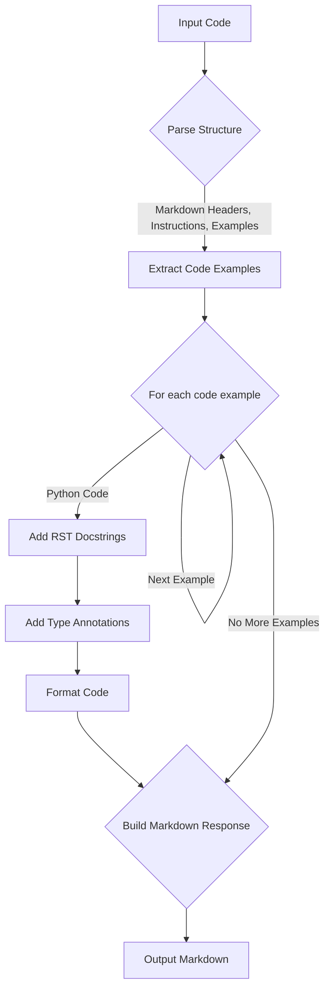

## АНАЛИЗ КОДА

### <алгоритм>

1.  **Ввод:** Получаем на вход исходный код, представленный в виде строки.
2.  **Анализ формата:** Определяем, что входная строка содержит инструкции по форматированию кода в Markdown и примеры кода, которые необходимо преобразовать.
3.  **Разбор структуры:** Исходная строка делится на блоки:
    *   **Заголовок**: "Формат Markdown для ответов:"
    *   **Инструкции**: описание структуры ответа и требования к форматированию.
    *   **Примеры**: блок с примерами входного кода и ожидаемого ответа.
4.  **Извлечение кода:** Из каждого примера извлекается входной код.
5.  **Улучшение кода:** Для каждого примера кода выполняются следующие действия:
    *   **Добавление документации:** К функциям и классам добавляется документация в стиле RST.
    *   **Аннотации типов:** Добавляются аннотации типов для аргументов функций и возвращаемых значений.
    *   **Форматирование:** Добавляются пробелы вокруг операторов и параметров для улучшения читаемости.
6.  **Формирование ответа:** Формируется Markdown документ, включающий:
    *   **Улучшенный код:** Блок кода с улучшенным форматированием и комментариями.
    *   **Изменения:** Подробный список модификаций и объяснений.
    *   **Оптимизированный полный код**: повторение улучшенного кода.
7.  **Вывод:**  Выводится отформатированный ответ в Markdown формате.
    
    **Пример:**
    *   **Вход:**
        ```python
        def add_numbers(a,b):
            return a+b
        ```
    *   **Шаги обработки:**
        *   Добавляется документация в стиле RST
        *   Добавляются аннотации типов `a: int, b: int` и `-> int`
        *   Добавляются пробелы вокруг `+` и в определении функции
    *   **Выход:**
        ```python
        def add_numbers(a: int, b: int) -> int:
            """
            Функция складывает два числа.

            :param a: Первое число.
            :type a: int
            :param b: Второе число.
            :type b: int
            :returns: Сумма чисел `a` и `b`.
            :rtype: int
            """
            return a + b
        ```

### <mermaid>



**Объяснение зависимостей:**

*   **Input Code** (A): Начало процесса, ввод - строка с инструкциями и примерами кода.
*   **Parse Structure** (B): Анализирует входную строку, выявляет заголовки, инструкции и примеры кода.
*   **Extract Code Examples** (C): Извлекает все примеры кода из входных данных.
*   **For each code example** (D): Запускает цикл обработки каждого примера.
*  **Add RST Docstrings**(E): Добавляет документацию в стиле RST для описания функций.
*   **Add Type Annotations** (F): Добавляет аннотации типов для переменных и возвращаемых значений.
*   **Format Code** (G): Форматирует код, добавляя пробелы для улучшения читаемости.
*  **Build Markdown Response** (H): Формирует Markdown документ, включая исходный код, изменения и оптимизированный код.
*  **Output Markdown** (I): Выводит результирующий Markdown документ.

### <объяснение>

**Импорты**: 
В представленном коде отсутствуют явные импорты.  Он представляет собой описание процесса трансформации кода на основе заданных правил форматирования Markdown и кодирования.

**Классы**:
В данном коде нет классов. Код представляет собой описание процесса преобразования кода, а не реализацию какой-либо функциональности с использованием классов.

**Функции**:
Фактически, данный код представляет собой инструкцию для некоторой функции, которая будет преобразовывать исходный код. Описан алгоритм процесса, но нет функции как таковой.

**Переменные**:
Переменных, как таковых, в предоставленном коде нет. Представлены только шаги алгоритма, а также примеры кода.

**Подробные объяснения**:
- **Структура**: Код в начале описывает ожидаемую структуру ответа в Markdown, включая "Улучшенный код", "Изменения" и "Оптимизированный полный код". Это является инструкцией для функции, которая будет преобразовывать код.

- **Примеры**: Приведены примеры входного и ожидаемого выходного кода.  Эти примеры демонстрируют, как должна работать функция преобразования:
    *   Пример **1**: Функция `add_numbers`  демонстрирует преобразование кода, где добавляется документация в стиле RST, аннотации типов и улучшается форматирование.
    *   **Улучшенный код**: Блок с улучшенным кодом, отформатированным и с добавленными комментариями.
    *   **Изменения**: Подробный список модификаций и объяснений.
    *   **Оптимизированный полный код**: Полный код, представленный в улучшенном виде.

- **Цепочка взаимосвязей**: Данный код является инструкцией, которая описывает процесс обработки кода. Она не зависит от других частей проекта, но  предполагается, что она используется в  процессе разработки, где необходима автоматическая модификация кода.

**Потенциальные ошибки и области для улучшения**:

*   **Гибкость:** В данный момент код обрабатывает только код на Python.  Для поддержки других языков потребуется расширение алгоритма и правил преобразования.
*   **Сложность кода:** Для более сложных примеров, потребуются более продвинутые инструменты для анализа кода, например,  AST (Abstract Syntax Tree) парсеры, для корректного добавления документации и аннотаций типов.
*   **Обработка исключений:** Текущая инструкция не обрабатывает случаи, когда входной код является синтаксически неверным, необходимо добавить проверку и обработку ошибок.