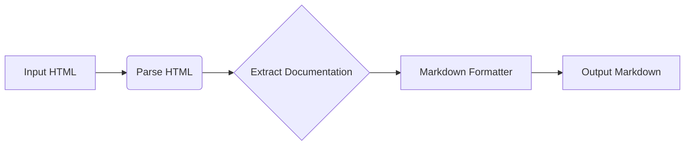

```MD
# <input code>

```html
<!-- INSTRUCTION -->

<p>You must document code in the following style. All comments in the code, including module, class, and function descriptions, should be written in <code>Markdown (.md)</code> format. For each module, class, and function, follow this template:</p>

<ol>
  <li>
    <strong>Module</strong>:
    <ul>
      <li>The module description should be written at the top, indicating its purpose.</li>
      <li>Provide examples of using the module, if possible. Code examples should be enclosed in a fenced code block with the <code>python</code> language identifier.</li>
      <li>Specify the platforms and synopsis of the module.</li>
      <li>Use headers to describe attributes and methods of the module where necessary.</li>
    </ul>
    <p>Example of module documentation:</p>
    <pre><code>markdown
# Module: Programming Assistant

This module contains the `CodeAssistant` class, which is used to interact with various AI models, such as Google Gemini and OpenAI, for code processing tasks.

## Example Usage

Example of using the `CodeAssistant` class:

```python
assistant = CodeAssistant(role='code_checker', lang='ru', model=['gemini'])
assistant.process_files()
```
</code></pre>
  </li>

  <li>
    <strong>Classes</strong>:
    <ul>
      <li>Each class should be described according to its purpose. Include the class description, its attributes, and methods.</li>
      <li>In the class section, list all methods, their purpose, and examples of usage.</li>
      <li>For each method, include descriptions of its parameters and return values, as well as examples.</li>
    </ul>
    <p>Example of class documentation:</p>
    <pre><code>markdown
# Class: CodeAssistant

The `CodeAssistant` class is used to interact with various AI models such as Google Gemini and provides methods for analyzing and generating documentation for code.

## Attributes
- `role`: The role of the assistant (e.g., 'code_checker').
- `lang`: The language the assistant will use (e.g., 'ru').
- `model`: List of AI models used (e.g., `['gemini']`).

## Methods
### `process_files`

Method for processing code files.

## Example Usage

```python
assistant = CodeAssistant(role='code_checker', lang='ru', model=['gemini'])
assistant.process_files()
```
</code></pre>
  </li>

  <!-- ... (rest of the HTML) ... -->
</ol>

<p>Follow these instructions for documenting your code. All comments should be clear, informative, and compliant with the Markdown standard.</p>
<h1>## Response text format: `UTF-8`
<!-- END OF INSTRUCTION -->
```



```
# <algorithm>

No executable code is present. The HTML snippet provides instructions for documenting code in Markdown format, not executable code for analysis.  Therefore, an algorithm and flowchart cannot be created.


# <mermaid>


# <explanation>

The provided code is HTML, not Python code. It describes a documentation style guide, not a program. It outlines a structure for documenting modules, classes, functions, and methods using Markdown.  The example demonstrates how to write documentation for modules, classes, and methods in a consistent style.

* **Import Statements:** There are no import statements in this HTML code snippet. This is documentation, not code.
* **Classes:**  The HTML describes `CodeAssistant` as an example class that would likely be used in a programming language (like Python), to interact with AI models and process code. It outlines the attributes (`role`, `lang`, `model`) and a method (`process_files`) that the class should have.
* **Functions:** No functions are directly defined within the HTML; it outlines expected elements for functions and methods in a documented codebase.
* **Variables:** The HTML doesn't describe variables; instead, it defines the expected structure of attributes in classes.
* **Possible Errors/Improvements:** The documentation lacks a formal code example (like Python code) to demonstrate its usage.  Also, exceptions that these parts of the code might throw aren't documented.


**Relationships to other parts of the project (if applicable):**

This documentation style is a prerequisite for writing code in a project that should be maintainable.  The next step would be to implement the Python code or other language, with the documentation as a guide.