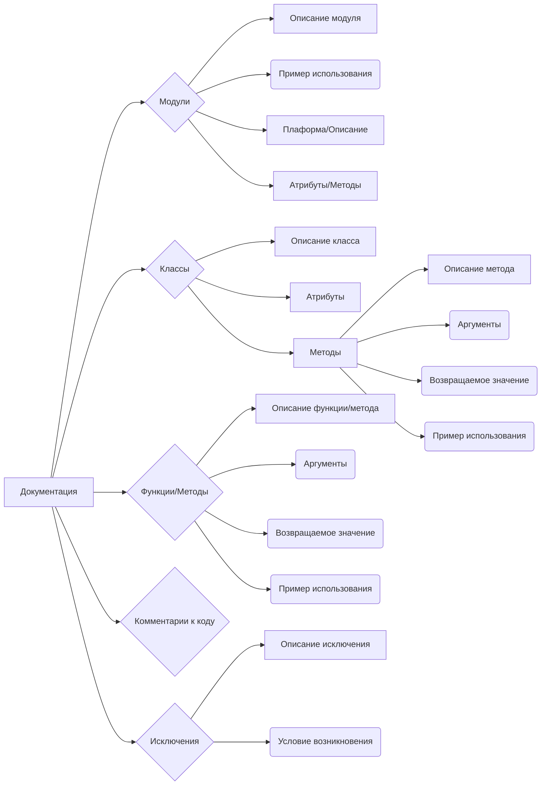

```MD
# <algorithm>

Алгоритм работы предоставленного кода заключается в генерации документации для кода в формате Markdown.  Код не содержит конкретного кода на Python, а представляет собой шаблон документации,  поэтому алгоритма в виде блок-схемы описать не представляется возможным.  Вместо блок-схемы мы можем описать процесс написания документации:


1. **Инициализация:** Определяются разделы для документации (Модули, Классы, Функции, Код комментарии, Исключения).


2. **Форматирование модулей:**
    * Описание модуля.
    * Пример использования (Python код).
    * Плаформа(ы) и описание.
    * Атрибуты и методы (если применимо).

3. **Форматирование классов:**
    * Описание класса.
    * Список атрибутов.
    * Описание методов.
    * Подробное описание каждого метода, включая аргументы, возвращаемые значения и примеры.

4. **Форматирование функций и методов:**
    * Описание функции или метода.
    * Описание аргументов.
    * Описание возвращаемого значения.
    * Пример использования (Python код).

5. **Комментарии к коду:**
    * Вставляются пояснения к каждой части кода, используя Markdown.

6. **Документация исключений:**
    * Описание каждого типа исключения.
    * Условия возникновения.


# <mermaid>



# <explanation>

**1. Импорты:**

Код не содержит импортов, так как он представляет собой шаблон документации, а не выполняемый код.

**2. Классы:**

Документированный код описывает *CodeAssistant* класс. Но сам класс не представлен в коде.

**3. Функции:**

Код описывает процесс документирования функций и методов, но не предоставляет сами функции/методы.  Например, описана функция `process_files`.

**4. Переменные:**

В шаблоне документации присутствуют переменные, которые представляют элементы документации (например, `files`, `options`).

**5. Возможные ошибки/улучшения:**

* Шаблон не указывает, как именно обрабатывается код, чтобы сгенерировать документацию. Необходима интеграция с реальным кодом и алгоритмом обработки.
* Шаблон предполагает, что Markdown документация должна быть создана вручную, а не автоматически.

**Цепочка взаимосвязей:**

Шаблон документации призван помочь в создании хорошо структурированной документации к коду на Python, который вероятно, будет храниться в других файлах проекта.  Связь устанавливается через описания.  Отсутствие actual Python кода не позволяет проанализировать взаимосвязи в пределах проекта.