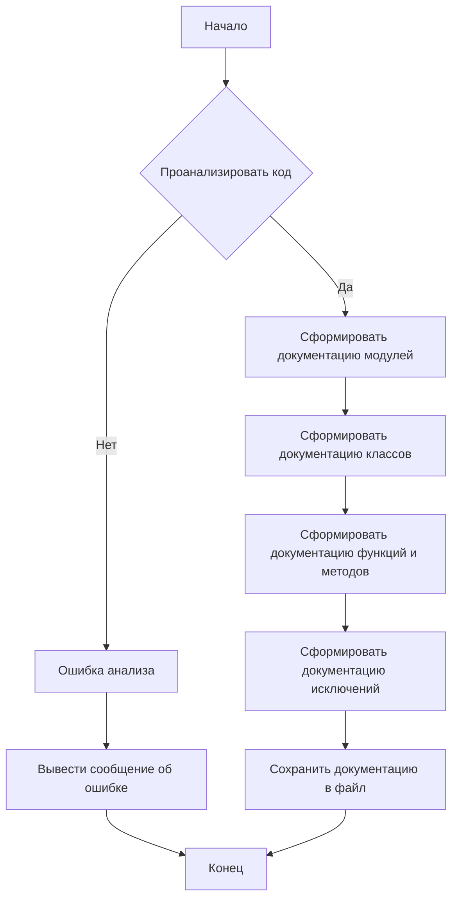
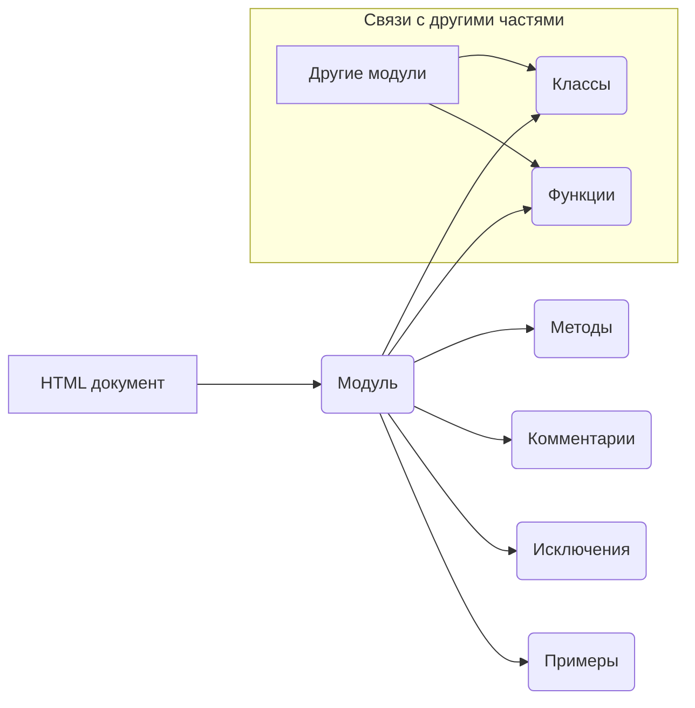

# <algorithm>

**Блок-схема алгоритма документации кода:**

**Пример:**

Рассмотрим функцию `process_files`.  Входные данные – список файлов (`files`) и опции (`options`). Алгоритм будет:
1. Проверить список файлов на пустоту.
2. Для каждого файла в списке:
    a) Попытка открыть файл.
    b) Обработка файла.
    c) Обработка исключений (например, `FileNotFoundError`).
3. Возвращение результата.

**Перемещение данных:**

Данные передаются между функциями и методами через аргументы и возвращаемые значения. Например, функция `process_files` принимает список файлов и опции, а возвращает результат обработки.

# <mermaid>

**Подключаемые зависимости:**

В данном случае нет явных внешних зависимостей.  Код представляет собой шаблон, инструкция для написания документации для других модулей.

# <explanation>

**1. Импорты:**

Нет импортов.  Этот код представляет собой инструкцию, а не исполняемый код. Он описывает шаблон документации.

**2. Классы:**

Код определяет шаблон, согласно которому необходимо документировать модули, классы, функции и методы.  Он не реализует какие-либо классы или функции.

**3. Функции:**

Нет функций.  Код описывает структуру документации.

**4. Переменные:**

Код описывает структуру документации и  не использует переменные в смысле программного кода.

**5. Возможные ошибки и улучшения:**

Улучшить можно за счёт приведения более конкретных примеров, в рамках шаблона, который описан.  Можно добавить пояснения, как в документации описывать разные типы ошибок (например,  `ValueError`).

**Цепочка взаимосвязей:**

Данный код является руководством для разработчиков, как составлять документацию для кода.  Документация, в свою очередь, поможет другим разработчикам легче понять и использовать код из других модулей проекта.