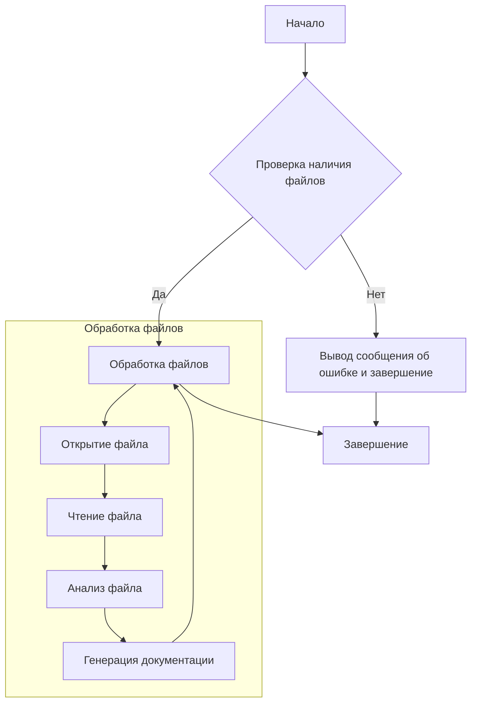

# <algorithm>



**Описание алгоритма:**

1. **Проверка наличия файлов:** На вход подается список файлов. Алгоритм проверяет, существуют ли эти файлы.
2. **Обработка файлов:** Если файлы существуют, алгоритм начинает их обработку.
3. **Открытие файла:** Открыть каждый из файлов в списке.
4. **Чтение файла:** Прочитать содержимое каждого файла.
5. **Анализ файла:** Проанализировать содержимое файла, выполнить необходимые действия (например, определить тип кода, синтаксические ошибки).
6. **Генерация документации:** Сгенерировать документацию для файла.
7. **Вывод сообщения об ошибке и завершение:** Если файлы не найдены, вывести соответствующее сообщение и завершить программу.
8. **Завершение:** Если все файлы были обработаны успешно, программа завершается.

**Примеры:**

- Если в списке файлов `['file1.py', 'file2.py']`, и оба файла существуют, алгоритм откроет и обработает каждый из них.
- Если в списке `['file1.py', 'nonexistent_file.txt']`, алгоритм обнаружит, что `nonexistent_file.txt` не существует и выведет сообщение об ошибке.

```
```

# <explanation>

**Импорты:**

В данном коде отсутствуют импорты.  Это шаблон, который описывает, как нужно документировать код, а не сам код программы.

**Классы:**

Код содержит описание структуры документации для класса `CodeAssistant`, но сам класс не определен.  Он описывает ожидаемую структуру документации для класса `CodeAssistant` и его методов, таких как `process_files`.

**Функции:**

Описание функции `process_files` ожидается, но отсутствует в коде.  Ожидается, что эта функция будет принимать список файлов и параметры обработки, и возвращать результат анализа.

**Переменные:**

В коде нет конкретных переменных, он содержит только инструкции по оформлению документации.

**Возможные ошибки или области для улучшений:**

* Отсутствует реализация класса `CodeAssistant` и его методов, описанных в документе.
* Не указаны типы данных входных параметров и возвращаемых значений.
* Не описаны возможные исключения и обработка ошибок.
* Не указано, какие ИИ модели используются (`Google Gemini`, `OpenAI`).
* Не указано, как происходит взаимодействие с этими моделями.
* Не указаны детали обработки файлов (например, форматы файлов, кодировки).


**Взаимосвязи с другими частями проекта:**

Для того, чтобы описать взаимосвязи, требуется код самого `CodeAssistant`.  Без него трудно понять, какие другие части проекта используются.