## АНАЛИЗ КОДА:

### 1. **<алгоритм>**

Код представляет собой HTML-инструкцию, предназначенную для разработчиков, и описывает стандарты документирования кода с использованием Markdown. Инструкция структурирована в виде списка, где каждый элемент описывает различные аспекты документирования: модули, классы, функции/методы, комментарии в коде и исключения.

**Блок-схема процесса документирования:**

1.  **Начало:** Разработчик получает HTML-инструкцию.
2.  **Модули:** 
    *   Описание модуля: Добавить общее описание модуля, его назначение.
    *   Примеры использования: Предоставить примеры использования модуля.
    *   Платформа и синопсис: Описать платформу и общий синопсис.
    *   Атрибуты и методы: Задокументировать атрибуты и методы.
        
    *Пример*:
    ```markdown
    # Модуль: Ассистент Программирования
    
    Этот модуль содержит класс `CodeAssistant`, который используется для взаимодействия с различными ИИ моделями, такими как Google Gemini и OpenAI, для задач обработки кода.
    ```
3.  **Классы:**
    *   Описание класса: Описать назначение класса.
    *   Атрибуты класса: Указать атрибуты класса.
    *   Методы класса: Задокументировать все методы класса.
    *   Описание методов: Дать подробное описание каждого метода, включая параметры и возвращаемые значения.
    *   Примеры использования: Предоставить примеры использования класса и его методов.
    
        *Пример*:
    ```markdown
    # Класс: CodeAssistant
    
    Класс `CodeAssistant` используется для взаимодействия с различными ИИ моделями, такими как Google Gemini, и предоставляет методы для анализа и генерации документации для кода.
    
    ## Атрибуты
    - `role`: Роль ассистента (например, 'code_checker').
    - `lang`: Язык, на котором будет работать ассистент (например, 'ru').
    - `model`: Список используемых ИИ моделей (например, `['gemini']`).
    
    ## Методы
    ### `process_files`
    
    Метод для обработки файлов с кодом.
    ```
4.  **Функции и Методы:**
    *   Описание: Задокументировать назначение функции или метода.
    *   Параметры: Указать параметры функции или метода.
    *   Возвращаемое значение: Указать возвращаемое значение.
    *   Примеры: Предоставить примеры использования в блоках кода `python`.
    
    *Пример*:
    ```markdown
    # Метод: process_files
    
    Этот метод используется для анализа и обработки файлов с кодом.
    
    ## Параметры
    - `files`: Список файлов для обработки.
    - `options`: Дополнительные параметры для настройки обработки.
    
    ## Возвращаемое значение
    - Возвращает результат обработки в виде списка проанализированных данных.
    
    ## Пример использования
    
    ```python
    assistant = CodeAssistant(role='code_checker', lang='ru', model=['gemini'])
    result = assistant.process_files(files=['file1.py', 'file2.py'], options={})
    ```
5.  **Комментарии в коде:**
    *   Формат: Использовать Markdown в комментариях.
    *   Содержание: Объяснять логику, решения или временные решения в коде.
    
        *Пример*:
        ```markdown
        # Здесь обрабатывается исключение для продолжения выполнения, если файл не найден
        try:
            process_file(file)
        except FileNotFoundError as ex:
            handle_exception(ex)
        ```
6.  **Исключения:**
    *   Описание исключения: Описать исключение.
    *   Параметры: Указать параметры исключения.
    *   Обстоятельства: Указать, при каких условиях возникает исключение.
    
    *Пример*:
        ```markdown
        # Исключение: Файл не найден
        
        Это исключение возникает, когда файл не найден во время обработки.
        
        ## Параметры
        - `file`: Путь к файлу, который не был найден.
        ```
7. **Завершение**: Разработчик применяет инструкцию для документирования кода.

```mermaid
flowchart TD
    Start --> Instruction[HTML Instruction for Documentation]
    Instruction --> Module[Document Modules]
    Module --> ModuleDescription[Module Description]
    Module --> ModuleExamples[Module Examples]
    Module --> ModulePlatform[Module Platform and Synopsis]
    Module --> ModuleAttributesMethods[Module Attributes and Methods]

    Instruction --> Class[Document Classes]
    Class --> ClassDescription[Class Description]
    Class --> ClassAttributes[Class Attributes]
    Class --> ClassMethods[Class Methods]
     ClassMethods --> MethodDescription[Method Description, params, return]
      ClassMethods --> MethodExample[Method example]
    

    Instruction --> FunctionMethod[Document Functions and Methods]
    FunctionMethod --> FuncMethodDesc[Function/Method Description]
    FunctionMethod --> FuncMethodParams[Function/Method Parameters]
    FunctionMethod --> FuncMethodReturn[Function/Method Return Value]
    FunctionMethod --> FuncMethodExamples[Function/Method Examples]

    Instruction --> CodeComments[Document Code Comments]
    CodeComments --> CommentFormat[Markdown format for comments]
    CodeComments --> CommentContent[Comments explaining logic, decisions]

    Instruction --> Exceptions[Document Exceptions]
    Exceptions --> ExceptionDescription[Exception Description]
    Exceptions --> ExceptionParams[Exception Parameters]
    Exceptions --> ExceptionConditions[Exception Conditions for raising]


    Instruction --> End[End of documentation process]
    Module --> End
    Class --> End
    FunctionMethod --> End
    CodeComments --> End
    Exceptions --> End
```

### 2. **<mermaid>**


**Анализ `mermaid` диаграммы:**

-   **Start:** Начало процесса - это получение HTML инструкции.
-   **Instruction:** Представляет собой HTML-инструкцию для документации кода. Она выступает в качестве основного руководства для всего процесса документирования.
-   **Module:** Описывает процесс документирования модулей, который включает описание модуля, примеры использования, платформу и синопсис, а также атрибуты и методы модуля.
-   **Class:** Описывает процесс документирования классов. Включает описание класса, его атрибуты, методы и примеры их использования.
-   **FunctionMethod:** Представляет процесс документирования функций и методов. Включает описания, параметры, возвращаемые значения и примеры.
-   **CodeComments:** Описывает правила документирования комментариев в коде в формате Markdown.
-   **Exceptions:** Описывает процесс документирования исключений, который включает описание исключения, его параметры и условия возникновения.
-   **End:** Завершение процесса документирования кода.

Диаграмма показывает поток действий и взаимосвязь между различными частями процесса документирования.

### 3. **<объяснение>**

Данный HTML-код представляет собой инструкцию для разработчиков по документированию кода в стиле Markdown. Инструкция нацелена на обеспечение единообразного подхода к документированию, который делает код более понятным и удобным для сопровождения.

**Детализированное объяснение:**

1.  **Общая структура:**
    *   Инструкция организована в виде нумерованного списка (`<ol>`), где каждый пункт представляет отдельную часть процесса документирования.
    *   Каждая часть подробно объясняет, как документировать модули, классы, функции/методы, комментарии в коде и исключения.
    *   Используются HTML-элементы `<p>`, `<ul>`, `<li>`, `<strong>`, `<code>`, `<pre>` для структурирования информации и форматирования текста.

2.  **Модули:**
    *   Указывается, что описание модуля должно находиться вверху файла и содержать общую информацию о его назначении.
    *   Приводятся требования к форматированию примеров использования в блоках кода с идентификатором языка `python`.
    *   Указывается необходимость описания платформы и синопсиса модуля.

3.  **Классы:**
    *   Требуется описание каждого класса, включая его назначение, атрибуты и методы.
    *   Детализируется, что методы должны быть описаны с указанием параметров, возвращаемых значений и примеров использования.

4.  **Функции и Методы:**
    *   Требуется документирование параметров и возвращаемых значений каждой функции или метода.
    *   Указывается, что нужно добавлять описание назначения и примеры использования в кодовых блоках Python.

5.  **Комментарии в коде:**
    *   Комментарии должны быть написаны в формате Markdown и должны объяснять логику, решения или временные решения.
    *   Комментарии нужно писать в блоках, а не в строках.

6.  **Исключения:**
    *   Нужно документировать исключения для классов, методов и функций, указывая, какие исключения могут быть вызваны и при каких обстоятельствах.

**Взаимосвязь с другими частями проекта:**

Эта инструкция является частью процесса разработки программного обеспечения, где важную роль играет документирование кода. Она может быть связана с другими частями проекта через общие стандарты кодирования и требования к качеству кода. Она гарантирует, что весь код будет задокументирован единообразно и понятно, что облегчает сопровождение и разработку.

**Потенциальные ошибки и области для улучшения:**

*   **Отсутствие конкретных примеров для всех случаев:**
    Инструкция предоставляет примеры, но для более полного понимания разработчиками нужно привести примеры для каждого типа документации.
*   **Недостаток информации о тестировании документации:**
    В инструкции не упоминается необходимость тестирования документации для проверки ее актуальности и точности.
*   **Возможная неоднозначность:**
    Некоторые формулировки могут быть интерпретированы по-разному, что может привести к различиям в стиле документирования. Стоит конкретизировать и уточнить некоторые положения.
*   **Нет требований к инструментам для проверки документации:**
    Может быть полезно указать конкретные инструменты или плагины для проверки корректности Markdown-документации.

**Заключение:**

Этот HTML-код представляет собой важную инструкцию для стандартизации процесса документирования кода. Она обеспечивает структуру, руководство и требования для разработчиков, что в итоге приводит к улучшению качества и понятности кода. Для улучшения этой инструкции можно добавить больше примеров, указать требования к тестированию документации и конкретизировать некоторые положения.