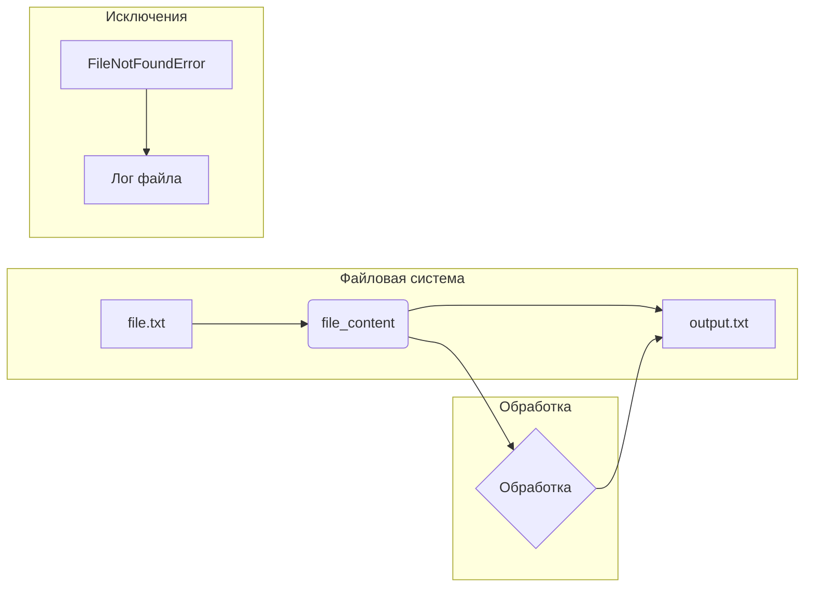

# <algorithm>

**Блок-схема алгоритма:**

```mermaid
graph TD
    A[Начало] --> B{Проверка наличия файла};
    B -- Да --> C[Открыть файл];
    B -- Нет --> D[Обработка исключения (FileNotFoundError)];
    C --> E[Прочитать содержимое файла];
    E --> F[Обработать содержимое файла];
    F --> G[Записать обработанное содержимое в выходной файл];
    G --> H[Выходной файл создан];
    D --> I[Лог ошибки];
    I --> H;
    H --> J[Конец];
```

**Примеры:**

* **B (Проверка наличия файла):**  Проверка существования файла `file.txt` на диске.  Если файл найден (да), выполняется шаг C. Если файла нет (нет), выполняется шаг D.
* **C (Открыть файл):**  Открытие файла `file.txt` в режиме чтения (`'r'`).
* **E (Прочитать содержимое файла):**  Чтение всех строк из файла `file.txt` и сохранение их в переменной `file_content`.
* **F (Обработать содержимое файла):**  Замена всех слов "код" на "программа".
* **G (Записать обработанное содержимое в выходной файл):** Запись модифицированного содержимого в файл `output.txt`.
* **D (Обработка исключения (FileNotFoundError)):**  Выводим сообщение об ошибке (`FileNotFoundError`) и записываем его в лог файл.
* **I (Лог ошибки):** Запись сообщения об ошибке в лог-файл или вывод в консоль.
* **H (Выходной файл создан):** Индикация успеха в консоли или в логе.

**Перемещение данных:**

Данные перемещаются между шагами в виде:

* **Файл (file.txt):**  Ввод данных.
* **Переменная `file_content`:**  Временное хранение данных.
* **Файл (output.txt):** Вывод данных.
* **Объект исключения (FileNotFoundError):** Передача данных об ошибке.
* **Лог-файл:** Запись сообщений об ошибках или результатах.




# <explanation>

Этот код предоставляет шаблон для написания документации в формате Markdown для кода на Python.  Он описывает, как структурировать комментарии, чтобы документировать модули, классы, функции и методы, включая примеры использования и обработки ошибок.

**Импорты:**

Код не содержит импортов, это скорее шаблон для написания документации, а не фрагмент работающего кода.


**Классы:**

Нет явных определений классов. Документация описывает, как должны быть описаны классы в Markdown.


**Функции и методы:**

Документация предоставляет шаблон для описания функций и методов.  В комментариях должны быть указаны параметры, возвращаемые значения, описание назначения и примеры.


**Переменные:**

В предоставленном фрагменте кода нет объявления переменных. Шаблон описывает, как документация должна быть построена вокруг переменных в коде.


**Возможные ошибки и улучшения:**

* **Недостаток практического кода:**  Документированный код отсутствует.  Необходимо написать сам код, который нужно документировать.
* **Слишком общий шаблон:**  В предоставленной документации отсутствуют конкретные примеры для работы с исключениями и обработкой файлов, что делает шаблон слишком общим.
* **Отсутствие примеров реального использования:**  Примеры использования документации слишком простые, и не отражают реальной сложности кода, который нужно будет документировать.

**Взаимосвязи с другими частями проекта:**

Данный шаблон документирования является общим и может быть использован для различных проектов, поэтому нет явной взаимосвязи с другими частями проекта.  Он устанавливает стандарты документирования.