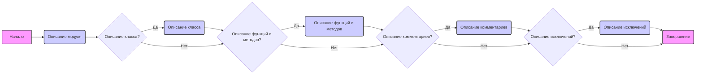

## <алгоритм>

1.  **Начало**: HTML-код представляет собой инструкцию по документированию кода в формате Markdown.
2.  **Описание модуля**:
    *   Инструкция начинается с описания того, как документировать модуль.
    *   Требуется указать назначение модуля, примеры его использования (с кодом Python в fenced code блоках), платформы и синопсис.
    *   Пример: `# Модуль: Ассистент Программирования`.
3.  **Описание класса**:
    *   Инструкция определяет, как описывать классы, включая их назначение, атрибуты и методы.
    *   Пример: `# Класс: CodeAssistant`, с последующим описанием атрибутов и методов.
4.  **Описание функций и методов**:
    *   Инструкция объясняет, как документировать функции и методы.
    *   Необходимо указать параметры, возвращаемые значения, назначение и примеры использования в fenced code блоках.
    *   Пример: `# Метод: process_files`, с описанием параметров и возвращаемых значений.
5.  **Описание комментариев в коде**:
    *   Инструкция подчеркивает, что все комментарии в коде должны быть в формате Markdown.
    *   Комментарии должны объяснять, что делает код, и использовать блочные комментарии для описания логики.
    *   Пример: `# Здесь обрабатывается исключение...`.
6.  **Описание исключений**:
    *   Инструкция требует документирования исключений, их параметров и ситуаций, когда они могут быть вызваны.
    *   Пример: `# Исключение: Файл не найден`, с описанием параметров и примером.
7.  **Завершение**: Инструкция призывает следовать указанным правилам для создания четкой и информативной документации в формате Markdown.

## <mermaid>



**Объяснение зависимостей:**

*   **Начало** (A):  Начальная точка, представляющая начало процесса документирования.
*   **Описание модуля** (B):  Первый шаг в процессе, где описывается модуль в целом.
*   **Описание класса?** (C):  Условная проверка, есть ли в коде классы, требующие документирования.
*   **Описание класса** (D): Если классы есть, происходит их документирование.
*   **Описание функций и методов?** (E):  Условная проверка, есть ли функции и методы, требующие документирования.
*   **Описание функций и методов** (F): Если функции и методы есть, происходит их документирование.
*   **Описание комментариев?** (G): Условная проверка, нужно ли документировать комментарии в коде.
*  **Описание комментариев** (H): Если требуется, описываются комментарии в коде.
* **Описание исключений?** (I): Условная проверка, нужно ли документировать исключения.
* **Описание исключений** (J): Если исключения есть, происходит их документирование.
*   **Завершение** (K): Конечная точка, завершающая процесс документирования.

Диаграмма показывает поток выполнения инструкций по документированию, начиная с модуля и заканчивая исключениями.

## <объяснение>

**Описание:**

Этот HTML-код представляет собой подробную инструкцию по документированию кода в формате Markdown (.md). Инструкция предназначена для того, чтобы обеспечить единообразный подход к описанию модулей, классов, функций/методов, комментариев и исключений в коде.

**Импорты:**

В данном контексте, HTML-код не имеет импортов, так как он является самодостаточной инструкцией.

**Классы:**

В данном HTML-коде нет классов, так как это инструкция, а не программный код. Инструкция описывает, как должны быть документированы классы, но сама не содержит их.

**Функции:**

В данном HTML-коде нет функций, так как это инструкция, а не программный код. Инструкция описывает, как должны быть документированы функции/методы, но сама не содержит их.

**Переменные:**

В данном HTML-коде нет переменных, так как это инструкция, а не программный код. Все значения представлены в виде HTML-тегов и текста.

**Подробное объяснение:**

1.  **Структура документа:**
    *   Инструкция структурирована в виде HTML-списка (ordered list), каждый пункт которого описывает, как документировать определенный элемент кода (модуль, класс, функция/метод, комментарий, исключение).
    *   Используются теги `<p>`, `<ol>`, `<li>`, `<ul>`, `<strong>`, `<code>`, `<pre>`, `<h1>` для оформления.

2.  **Общие правила документации:**
    *   Все комментарии и описания должны быть написаны в формате Markdown (.md).
    *   Для описания кода используются fenced code блоки с идентификатором языка `python` (например, ` ```python ... ````).

3.  **Модуль:**
    *   Описание модуля должно содержать его назначение, примеры использования (если есть), платформы и синопсис.
    *   Примеры: `# Модуль: Ассистент Программирования`

4.  **Классы:**
    *   Описание класса должно включать его назначение, атрибуты и методы.
    *   Для каждого метода должно быть указано его назначение, параметры, возвращаемое значение и примеры.
    *   Примеры: `# Класс: CodeAssistant`, `# Метод: process_files`

5.  **Функции и методы:**
    *   Каждая функция и метод должны быть описаны с указанием параметров, возвращаемых значений, назначения и примеров.

6.  **Комментарии в коде:**
    *   Комментарии должны быть в формате Markdown и объяснять логику кода, решения и временные решения.
    *   Комментарии должны быть блочными (а не однострочными).

7.  **Исключения:**
    *   Исключения должны быть описаны, включая ситуации, когда они могут быть вызваны, и их параметры.
    *   Пример: `# Исключение: Файл не найден`

8.  **Цепочка взаимосвязей:**
    *   Этот HTML-код предназначен для генерации документации и не взаимодействует напрямую с другими частями проекта, он задает правила.
    *   Он может использоваться как шаблон для автоматизированной генерации документации.

**Потенциальные ошибки и области для улучшения:**

*   **Отсутствие автоматической проверки:**  Инструкция полагается на человеческий фактор, что может привести к непоследовательному документированию. Для улучшения можно внедрить инструменты, автоматически проверяющие соответствие документации правилам.
*   **Отсутствие конкретных инструментов:** Инструкция не указывает, какими инструментами пользоваться для написания документации в формате Markdown. Рекомендуется указать конкретные редакторы, плагины или генераторы документации.
*   **Необходимость ручной работы:**  Процесс, описанный в инструкции, требует ручного ввода комментариев и документации. Для больших проектов можно автоматизировать этот процесс, используя аннотации или docstring.

**Заключение:**

Этот HTML-код представляет собой детальную инструкцию по документированию кода в формате Markdown, которая помогает стандартизировать процесс создания документации, повышая её качество и понятность. Несмотря на отсутствие прямой связи с другими частями проекта, эта инструкция является важным элементом в обеспечении качественной и поддерживаемой кодовой базы.