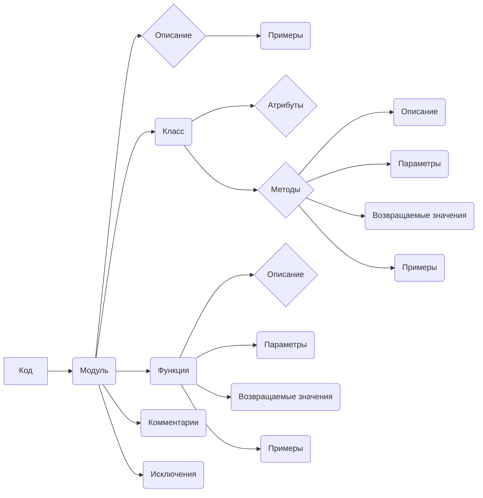
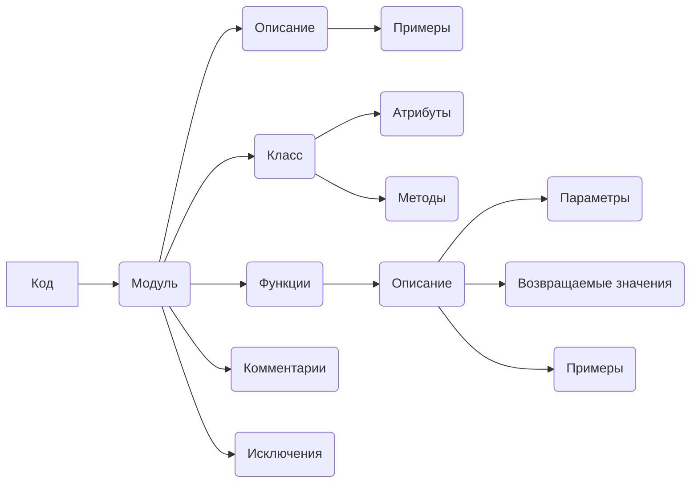

```MD
# <algorithm>

**Описание алгоритма:**

Этот текст описывает желаемый формат документации кода.  Он не содержит собственно исполняемого кода, а лишь предоставляет шаблон для комментариев.  Алгоритм заключается в написании Markdown-документации для различных элементов кода (модулей, классов, функций, методов).  Каждая секция документации должна соответствовать определенному шаблону:

1. **Модуль:** Описание модуля, примеры использования, платформы и краткое описание.
2. **Класс:** Описание класса, его атрибуты и методы.
3. **Функции и методы:** Описание функций/методов, их параметры, возвращаемые значения и примеры.
4. **Комментарии:** Объяснение кода в Markdown-формате.
5. **Исключения:** Описание возможных исключений.


**Пример данных:**

Входные данные — это указанный шаблон документации в формате Markdown.  Выходные данные — это созданные Markdown-файлы документации для кода.

**Пошаговая блок-схема:**


```mermaid
graph TD
    A[Начальное состояние] --> B{Прочитать код};
    B -- Соответствует шаблону -- > C[Сгенерировать Markdown-документацию];
    C --  Сохранить -- > D[Результат];
    D --> E[Конец];
```



# <mermaid>



# <explanation>

**Импорты:**

В данном случае нет импортов, так как это текстовое описание формата документации кода, а не сам код.  Поэтому анализ импортов не требуется.

**Классы:**

Описание предполагает создание классов (например, `CodeAssistant`), функций (например, `process_files`), а также документацию модулей.  Формат документации предполагает описание структуры и поведения кода.


**Функции:**

Пример: `process_files` — это метод, который предполагается в классе.  Он описывается в формате, который включает параметры, возвращаемые значения, и примеры.

**Переменные:**

Нет переменных.  Документация фокусируется на структуре кода и способах его документирования, а не на содержании конкретного кода.


**Возможные ошибки или улучшения:**

- Необходимо более четко описать, как данные передаются между модулями, классами и функциями в блок-схеме.

- В идеальном случае, блок-схема должна быть дополнена  типами данных, которые передаются между функциями/классами.  


**Связь с другими частями проекта:**

Этот код служит руководством по написанию документации.  Он не сам по себе часть кодовой базы.  Его применение связано с последующей генерацией документации для любого кода на Python.