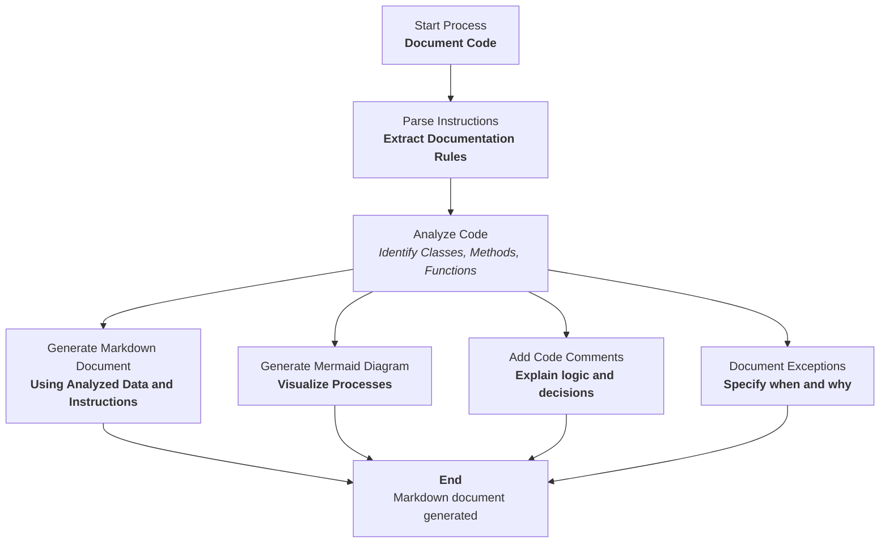

## ИНСТРУКЦИЯ:

Анализируй предоставленный код подробно и объясни его функциональность. Ответ должен включать три раздела:

1. **<алгоритм>**: Опиши рабочий процесс в виде пошаговой блок-схемы, включая примеры для каждого логического блока, и проиллюстрируй поток данных между функциями, классами или методами.
2. **<mermaid>**: Напиши код для диаграммы в формате `mermaid`, проанализируй и объясни все зависимости,
    которые импортируются при создании диаграммы.
    **ВАЖНО!** Убедитесь, что все имена переменных, используемые в диаграмме `mermaid`,
    имеют осмысленные и описательные имена. Имена переменных вроде `A`, `B`, `C`, и т.д., не допускаются!

    **Дополнительно**: Если в коде есть импорт `import header`, добавьте блок `mermaid` flowchart, объясняющий `header.py`:
    ```mermaid
    flowchart TD
        Start --> Header[<code>header.py</code><br> Determine Project Root]

        Header --> import[Import Global Settings: <br><code>from src import gs</code>]
    ```

3. **<объяснение>**: Предоставьте подробные объяснения:
   - **Импорты**: Их назначение и взаимосвязь с другими пакетами `src.`.
   - **Классы**: Их роль, атрибуты, методы и взаимодействие с другими компонентами проекта.
   - **Функции**: Их аргументы, возвращаемые значения, назначение и примеры.
   - **Переменные**: Их типы и использование.
   - Выделите потенциальные ошибки или области для улучшения.

Дополнительно, постройте цепочку взаимосвязей с другими частями проекта (если применимо).

Это обеспечивает всесторонний и структурированный анализ кода.
## Формат ответа: `.md` (markdown)
**КОНЕЦ ИНСТРУКЦИИ**
```

## <алгоритм>

**1. Начало работы:**
   - Задача начинается с получения запроса на документирование кода.
   - В качестве входных данных предоставляется код для анализа и документирования.
     *Пример:* Входной код представляет собой текст в markdown формате, который содержит инструкции по стилю документации, примерах использования и правилах написания mermaid диаграмм.

**2. Обработка инструкций:**
   - Парсинг инструкций из входного запроса.
   - Определение требуемых действий: анализ кода, генерация markdown-документации, создание mermaid-диаграммы, написание комментариев в коде, описание классов, методов, функций и исключений.
     *Пример:* Разбор запроса на генерацию документации, который содержит требования к формату вывода (`.md`), подробным комментариям и описаниям, включая примеры и mermaid-диаграммы.

**3. Анализ кода:**
   - Код анализируется с целью определения классов, методов, функций, переменных, импортов и исключений.
   - Извлекаются описания, параметры и возвращаемые значения.
     *Пример:* Анализ Python кода, извлечение информации о классах `CodeAssistant`, его атрибутах `role`, `lang`, `model`, методах `process_files`, их параметров и возвращаемых значений.

**4. Генерация Markdown-документации:**
   - Используя проанализированные данные и инструкции, создается markdown-документ.
   - Документ содержит:
     - Описание модулей, классов, методов и функций.
     - Примеры использования (в кодовых блоках).
     - Спецификации платформ и синопсисов.
     - Описания исключений и комментарии.
     - Mermaid-диаграммы для визуализации процессов.
     *Пример:* Генерация markdown-файла, который содержит заголовок "Module: Programming Assistant", описание класса `CodeAssistant`, атрибуты и методы с примерами использования, а также блок кода mermaid для диаграммы потока.

**5. Генерация Mermaid-диаграммы:**
    - На основе анализа кода и инструкций, генерируется код для mermaid-диаграммы.
    - Диаграмма должна отражать поток данных, зависимости и связи между компонентами.
    - Используются HTML-теги для стилизации текста в узлах.
      *Пример:* Создание кода `mermaid` для отображения процесса `CodeAssistant`, включающего такие узлы как `Start`, `InitSupplier`, `Validate`, `Success` и `Error` с использованием html-тегов для форматирования текста и стилизации.

**6. Добавление комментариев в код:**
    - Вставляются комментарии в код, соответствующие правилам и формату markdown.
    - Комментарии поясняют логику, решения и временные решения в коде.
     *Пример:* Добавление markdown комментариев в Python код, объясняющих блоки кода, обрабатывающие исключения, например `try/except` блоки.

**7. Документирование исключений:**
   - Исключения документируются для классов, методов и функций.
   - Указываются типы исключений, условия их возникновения и параметры.
    *Пример:* Описание исключения `FileNotFoundError`, его параметров (`file`) и примеров использования (`try/except` блок).

**8. Завершение:**
   - Результат (сгенерированный markdown-документ) выводится как ответ.
   - Задача считается завершенной.

## <mermaid>



**Описание диаграммы `mermaid`:**

-   **flowchart TD**: Определяет тип диаграммы как направленный граф сверху вниз.
-   **Start**: Начало процесса, представлен в виде узла с HTML форматированием.
-   **ParseInstructions**: Разбор инструкций и извлечение правил для документации.
-   **AnalyzeCode**: Анализ кода для определения классов, методов и функций.
-   **GenerateMarkdown**: Генерация markdown документа на основе анализа.
-   **GenerateMermaid**: Генерация кода для mermaid-диаграммы.
-   **AddCodeComments**: Добавление комментариев в код.
-   **DocumentExceptions**: Документирование исключений.
-  **End**: Конец процесса с генерацией Markdown документа.

**Зависимости:**

-   Нет явных импортов, так как это описание процесса обработки текста, а не конкретный программный код. Но для работы этого процесса необходимы:
    -   Парсер текста: Для анализа инструкций и извлечения правил документации.
    -   Анализатор кода: Для определения классов, методов, функций, переменных, импортов и исключений.
    -   Генератор Markdown: Для создания документа в формате Markdown.
    -   Генератор Mermaid: Для создания кода для диаграмм Mermaid.

## <объяснение>

**Импорты:**

В предоставленном тексте нет импортов, так как это инструкция для обработки текста, а не конкретный код. Однако, в контексте проекта `hypotez` для реализации этого процесса могут потребоваться библиотеки для парсинга текста, анализа кода, генерации markdown и mermaid, например:

-   `re`: Для работы с регулярными выражениями при парсинге.
-   `ast`: Для анализа синтаксического дерева Python кода.
-   `markdown`: Для генерации markdown документов.
-   Сторонние библиотеки для генерации `mermaid` кода (например, собственная реализация).

**Классы:**

Представленный код не содержит классов. Однако, в контексте проекта `hypotez` могли бы быть классы, подобные `CodeAssistant`, который упоминается в примере использования в инструкциях.

Пример:

```python
# Class: CodeAssistant
class CodeAssistant:
    """
    Класс `CodeAssistant` используется для взаимодействия с различными моделями AI, такими как Google Gemini,
    предоставляя методы для анализа и генерации документации для кода.

    Attributes:
        role (str): Роль помощника (например, 'code_checker').
        lang (str): Язык, который будет использовать помощник (например, 'ru').
        model (list): Список используемых моделей AI (например, ['gemini']).

    Methods:
        process_files(files, options): Метод для обработки файлов кода.
    """
    def __init__(self, role: str, lang: str, model: list):
        """
        Конструктор класса `CodeAssistant`.
        """
        self.role = role
        self.lang = lang
        self.model = model

    def process_files(self, files: list, options: dict) -> list:
        """
        Метод для анализа и обработки файлов кода.

        Parameters:
            files (list): Список файлов для обработки.
            options (dict): Дополнительные параметры для настройки обработки.

        Returns:
             list: Результат обработки в виде списка проанализированных данных.

        Example:
            assistant = CodeAssistant(role='code_checker', lang='ru', model=['gemini'])
            result = assistant.process_files(files=['file1.py', 'file2.py'], options={})
        """
        # Здесь должна быть логика обработки файлов
        return []
```

**Функции:**

В предоставленном тексте нет функций, но в процессе реализации могли бы быть функции для каждой из стадий алгоритма:

-   `parse_instructions(input_text)`: Парсит входной текст и извлекает инструкции.
-   `analyze_code(code)`: Анализирует код, определяя классы, методы и функции.
-   `generate_markdown(data, instructions)`: Генерирует markdown-документ на основе данных и инструкций.
-   `generate_mermaid(data)`: Генерирует mermaid-диаграмму.
-   `add_code_comments(code, data)`: Добавляет markdown-комментарии в код.
-   `document_exceptions(data)`: Документирует исключения.

Пример функции `generate_markdown`:

```python
def generate_markdown(data: dict, instructions: dict) -> str:
    """
    Генерирует markdown-документ на основе проанализированных данных и инструкций.

    Parameters:
        data (dict): Проанализированные данные о коде.
        instructions (dict): Инструкции по форматированию документа.

    Returns:
        str: Строка с markdown-документом.

    Example:
        data = {'module': {'name': 'test_module', 'description': 'Test module description'}}
        instructions = {'format': 'md'}
        markdown_doc = generate_markdown(data, instructions)
        print(markdown_doc)
    """
    # Здесь должна быть логика для генерации markdown-документа
    markdown_doc = f"# Module: {data['module']['name']}\n\n"
    markdown_doc += f"{data['module']['description']}\n"

    return markdown_doc
```

**Переменные:**

-   `input_code`: Содержит входной код для обработки. Тип: строка.
-   `output_markdown`: Содержит сгенерированный markdown-документ. Тип: строка.
-  `instructions`: Содержит инструкции по формату и стилю документации. Тип: словарь или объект.

**Потенциальные ошибки и области для улучшения:**

-   **Парсинг текста**: Сложность точного извлечения информации из произвольного кода может привести к ошибкам.
-   **Генерация markdown**: Необходимо гарантировать правильность markdown-синтаксиса.
-   **Генерация mermaid**: Стилизация и корректность кода mermaid могут быть сложными для автоматической генерации.
-   **Обработка исключений**: Документирование исключений требует точного анализа кода.
-   **Сложность кода**: Обработка очень сложного или невалидного кода может привести к ошибкам.

**Взаимосвязь с другими частями проекта:**

Модуль является частью системы документации проекта `hypotez`. Он может взаимодействовать с другими модулями:

-   Модулями для взаимодействия с AI-моделями для анализа кода.
-   Модулями для работы с файловой системой для чтения/записи файлов.
-   Модулями для управления конфигурацией и настройками проекта.

Этот анализ предоставляет подробное описание процесса, используемого для создания документации на основе предоставленных инструкций.