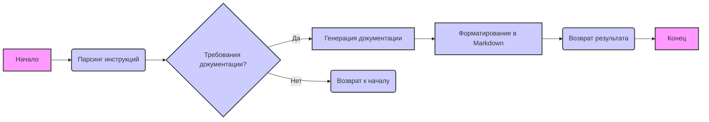

# Анализ кода

## 1. <алгоритм>

**Блок-схема:**

1.  **Начало**: Получение входных данных: строка с инструкциями для документации кода.
2.  **Обработка**: Парсинг инструкций и выделение ключевых требований (формат вывода `*.md`, детальные комментарии, примеры).
3.  **Генерация документации**:
    *   Создание описания модуля, классов, функций и методов.
    *   Формирование примеров использования в виде кода.
    *   Описание параметров и возвращаемых значений функций.
    *   Генерация комментариев к коду в Markdown формате, описывающих логику кода.
    *   Документирование возможных исключений и ситуаций, в которых они возникают.
4.  **Форматирование**: Приведение сгенерированной документации к формату `Markdown`.
5.  **Вывод**: Возврат отформатированной строки с документацией.
6.  **Конец**.

**Пример логических блоков:**

*   **Блок 2 (Обработка)**: Разбор строки "You must document code in the following style. All comments in the code..." для выделения требования документирования в стиле Markdown.
*   **Блок 3 (Генерация документации)**: Создание раздела "Module: Programming Assistant" с описанием, примером использования, платформой и заголовками атрибутов и методов. Создание раздела "Class: CodeAssistant", описание его атрибутов и методов. Создание раздела "Method: process_files" с описанием параметров, возвращаемых значений и примеров использования.
*   **Блок 4 (Форматирование)**: Размещение сгенерированного текста в формате Markdown, включая заголовки, жирный текст, отступы, примеры кода с использованием ` ```python` и т.д.

## 2. <mermaid>



**Анализ зависимостей:**

*   **Начало** (`A`): Начальная точка процесса, не зависит от внешних модулей.
*   **Парсинг инструкций** (`B`): Анализирует входные данные и выделяет требования. Не зависит от внешних модулей, использует только входные данные.
*   **Требования документации?** (`C`): Проверяет, есть ли инструкции по документированию. Не зависит от внешних модулей.
*   **Генерация документации** (`D`): Генерирует описание модуля, классов, функций, методов и комментарии. Не зависит от внешних модулей, использует только результат парсинга инструкций.
*   **Форматирование в Markdown** (`F`): Преобразует сгенерированную документацию в формат Markdown. Не зависит от внешних модулей, использует только сгенерированную документацию.
*   **Возврат результата** (`G`): Возвращает отформатированный результат. Не зависит от внешних модулей, использует отформатированный вывод.
*   **Конец** (`H`): Конечная точка процесса, не зависит от внешних модулей.
*   **Возврат к началу** (`E`): Если нет требований к документации, процесс возвращается к началу. Не зависит от внешних модулей.

## 3. <объяснение>

**Импорты:**
В данном коде нет явных импортов, поскольку это описание процесса генерации документации, а не исполняемый код. Зависимости от других частей проекта `src.` не описаны в данном фрагменте.

**Классы:**
В данном коде отсутствуют классы. Описан только концептуальный процесс создания документации.

**Функции:**
В данном коде отсутствуют функции. Это описание процесса, который можно реализовать с помощью функций и методов классов.

**Переменные:**
Здесь не используются переменные как таковые, но подразумевается обработка входной строки с инструкциями (текст prompt). Тип этой переменной - строка (`str`). В процессе обработки могут возникнуть и другие переменные для хранения промежуточных данных, но в данном примере они не определены.

**Объяснения:**
*   Данный текст представляет собой шаблон для генерации документации кода. Он описывает, как следует документировать модули, классы, функции, методы и исключения.
*   **Модуль** (Module): Определяет, как описывается модуль, его использование, платформа и содержимое.
*   **Классы** (Classes): Описывает, как документировать классы, их атрибуты, методы и примеры использования.
*   **Функции и методы** (Functions and Methods): Описывает, как документировать функции и методы, их параметры, возвращаемые значения и примеры использования.
*   **Комментарии к коду** (Code Comments): Описывает, как добавлять комментарии в код в формате Markdown, объясняющие логику и временные решения.
*   **Исключения** (Exceptions): Описывает, как документировать исключения, их параметры и примеры использования.

**Потенциальные ошибки и области для улучшения:**
*   **Недостаточно подробные инструкции**: Инструкции не описывают, как обрабатывать сложные случаи, например, вложенные классы или функции с множественными возвращаемыми значениями.
*   **Отсутствие конкретики по генерации**: Требуется добавить информацию о том, как именно преобразовывать информацию о коде в Markdown. Например, какой API или библиотека будет использоваться для парсинга кода.
*   **Недостаточная формализация процесса**: Нет четких шагов, которые определяют, как будет создаваться Markdown.

**Цепочка взаимосвязей с другими частями проекта:**
Данный код является частью процесса генерации документации для проекта `hypotez`. Он служит шаблоном для генератора документации и, вероятно, будет использоваться в связке с другими модулями проекта, такими как:
*   **Модуль парсинга кода:**  Для анализа структуры кода и получения необходимой информации для документации.
*   **Модуль генерации Markdown:**  Для форматирования данных в формат Markdown, согласно инструкциям.
*   **Модуль управления документацией:** Для управления процессами генерации, обновления и хранения документации.