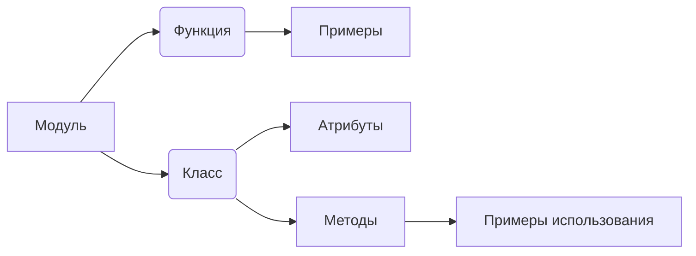

# Документация модуля `hypotez/src/ai/prompts/developer`

Этот модуль содержит инструкции по написанию документации для кода проекта `hypotez` в формате RST.  Документация описывает структуру, примеры и рекомендации для создания документации к модулям, классам, функциям и методам.

## Пример использования

Этот модуль предоставляет примеры создания документации, которые можно использовать при документировании кода:

```python
# Пример документации функции
def my_function(param1, param2):
    """
    Функция для обработки двух параметров.

    :param param1: Первый параметр.
    :type param1: int
    :param param2: Второй параметр.
    :type param2: str
    :raises TypeError: Если типы параметров не соответствуют ожиданиям.
    :return: Результат обработки.
    :rtype: str
    """
    if not isinstance(param1, int) or not isinstance(param2, str):
        raise TypeError("Неверные типы параметров.")
    return f"Результат: {param1} {param2}"

# Пример использования функции
result = my_function(5, "hello")
print(result)
```


## Инструкции по написанию документации

Документация должна содержать следующие разделы:

- **Модуль:** Описание назначения модуля, примеры использования, платформы и краткое описание.
- **Классы:** Описание класса, его атрибутов и методов (с описанием параметров, возвращаемых значений, примерами использования).
- **Функции и методы:** Описание параметров, возвращаемых значений, назначения и примеры использования.
- **Комментарии в коде:** Блочные комментарии, объясняющие логику, решения и временные решения.
- **Исключения:** Документирование исключений, возникающих в классах, методах и функциях, с указанием условий возникновения.


## Важные замечания

* Все комментарии в коде должны быть написаны в формате RST.
* Используйте заголовки для описания атрибутов и методов.
* Используйте `:param`, `:type`, `:raises`, `:return`, `:rtype` для описания параметров, типов, исключений, возвращаемых значений.
* Примеры кода оформляйте в ограждённые блоки кода с указанием языка `python`.
* Убедитесь, что документация точная, полная и понятная.
* Документируйте все необходимые части кода.




```
<explanation>
- **Импорты**:  В данном фрагменте кода нет импортируемых модулей. Все импортируемые файлы должны быть помечены в самом верху каждого файла.
- **Классы**: В примере кода отсутствуют классы. Примеры классов и их использование будут содержать методы, атрибуты и описание поведения.
- **Функции**:  В примере присутствует функция `my_function` с описанием параметров, возвращаемых значений и возможного исключения.
- **Переменные**:  В примере используется переменная `result`, содержащая результат вызова функции.
- **Возможные ошибки или области для улучшений**:  В примере недостаёт детальной информации, например, о платформах, где может использоваться код, и о его предназначении. Также не хватает примеров использования с другими частями проекта. Примеры кода должны соответствовать реальному использованию.


```