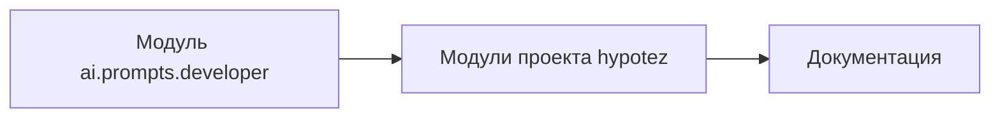
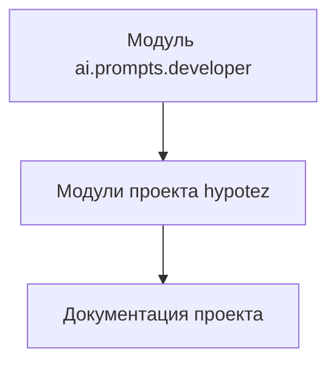

# Документация для модуля ai.prompts.developer

Этот модуль содержит руководство по написанию документации для кода проекта `hypotez`. Он предоставляет шаблон для структурирования документации, включая модули, классы, функции, методы и комментарии.  Документация написана в формате RST (reStructuredText).

## Примеры использования

Примеры кода, иллюстрирующие использование данного руководства:

```python
# Пример документации функции
def my_function(param1, param2):
    """
    Описание функции my_function.

    :param param1: Параметр 1.
    :param param2: Параметр 2.
    :return: Возвращаемое значение.
    """
    result = param1 + param2
    return result

# Пример использования функции
result = my_function(5, 3)
print(result)  # Output: 8
```

```python
# Пример документации класса
class MyClass:
    """
    Описание класса MyClass.
    """
    def __init__(self, value):
        """
        Инициализация класса MyClass.

        :param value: Значение для атрибута.
        """
        self.value = value

    def get_value(self):
        """
        Возвращает значение атрибута.

        :return: Значение атрибута.
        """
        return self.value

# Пример использования класса
obj = MyClass(10)
print(obj.get_value())  # Output: 10
```


## Подробное описание шаблона документации


### 1. Модуль

- Описание модуля в начале, включая назначение и примеры.
- Примеры использования модуля в блоках кода.
- Указание платформ и краткое описание.
- Заголовки для атрибутов и методов.

### 2. Классы

- Описание класса, его атрибутов и методов.
- Перечисление методов, назначение, примеры использования.
- Подробное описание параметров и возвращаемых значений каждого метода.

### 3. Функции и методы

- Описание параметров и возвращаемых значений.
- Описание назначения и примеры использования в блоках кода.

### 4. Комментарии в коде

- Комментарии в Markdown-формате, описывающие логику кода.
- Блочные комментарии для сложных логических участков, объяснения решений.

### 5. Исключения

- Документирование исключений, возникающих в методах и функциях.
- Описание условий, при которых исключение может произойти.


## Цепочка взаимосвязей

Этот модуль (ai.prompts.developer)  не зависит напрямую от других модулей, но определяет формат и требования к документированию кода в проекте `hypotez`.  Он служит руководством для остальных модулей, определяя структуру и стиль документации.




**<algorithm>**

```mermaid
graph TD
    A[Начальная точка] --> B{Чтение инструкции};
    B -- Правильно -- C[Создание документации];
    C --> D{Проверка комментариев};
    D -- Правильно -- E[Готовая документация];
    D -- Неправильно -- F[Ошибка в комментариях];
    F --> G[Повтор шага B]
    E --> H[Конец]
```

**<mermaid>**



**<explanation>**

Этот файл (`doc_writer_md_ru.md`) представляет собой руководство по написанию документации в проекте `hypotez`. Он определяет шаблон для структурирования и оформления документации к коду на языке Python, используя RST форматирование.  Он не содержит исполняемого кода, а только описывает как писать документацию.  Он описывает требования к комментариям, примеры написания документации к модулям, классам, функциям, методам, исключениям.  Этот файл не является кодом, а является инструментом для написания качественной документации к коду проекта.

Возможные ошибки:

* Недостаточная или некорректная документация функций, методов, классов.
* Отсутствие примеров использования.
* Несоответствие стандартам RST.
* Неясность и неконкретность описаний.

Области для улучшения:

* Добавление примеров более сложных сценариев использования.
* Подробное объяснение работы конкретных алгоритмов в коде, если таковые имеются.
* Более строгие требования к структуре документации и стилю.

Связь с другими частями проекта:

Этот файл является инструментом для написания документации для других файлов и модулей проекта.  Он устанавливает стандарты для всей документации проекта, обеспечивая её консистентность и понятность.