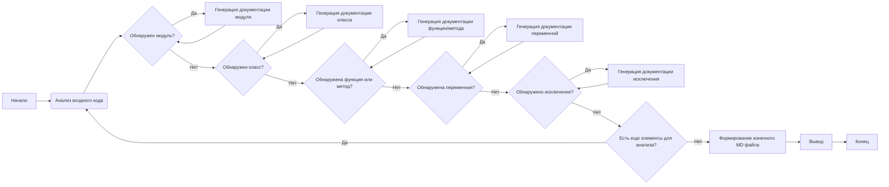

# Модуль: Генерация документации в формате Markdown

Этот модуль отвечает за создание документации в формате Markdown на основе анализа предоставленного кода. Он использует различные шаблоны для генерации подробной документации для модулей, классов, методов, функций и переменных.

## Алгоритм

1.  **Анализ входного кода**:
    -   Получение входного кода в виде строки.
    -   Разбор кода для выявления модулей, классов, методов, функций и переменных.

    *Пример: входная строка кода `class MyClass: def __init__(self, a): self.a = a` будет проанализирована для выделения класса `MyClass` и метода `__init__`.*
2.  **Генерация документации для модуля**:
    -   Создание заголовка для модуля.
    -   Добавление описания модуля, примеры использования, информацию о платформах.

    *Пример: для модуля `my_module.py` будет создан заголовок `# Модуль: my_module` и описание.*
3.  **Генерация документации для классов**:
    -   Создание заголовка для класса.
    -   Добавление описания класса, его атрибутов и методов.
    -   Генерация документации для каждого метода внутри класса.
        *Пример: для класса `MyClass` будет создан заголовок `# Класс: MyClass`, описание, атрибуты и список методов.*
4.  **Генерация документации для функций и методов**:
    -   Создание заголовка для функции/метода.
    -   Добавление описания параметров, возвращаемых значений, назначения и примеров использования.

    *Пример: для метода `__init__` будет создан заголовок `# Метод: __init__`, описание параметров, возвращаемых значений и пример использования.*
5.  **Генерация документации для переменных**:
    -   Определение имени, типа и значения переменной.
    -   Добавление описания использования переменной.
        *Пример: для переменной `a` будет определен её тип и добавлено описание её использования.*
6.  **Добавление комментариев в формате Markdown**:
    -   Анализ комментариев в коде.
    -   Форматирование комментариев в виде блоков Markdown.
        *Пример: комментарий `# This is a comment` будет отображен как `# This is a comment`.*
7.  **Документация исключений**:
    -   Анализ исключений в коде.
    -   Добавление описания исключений, их параметров и примеров.
         *Пример: исключение `FileNotFoundError` будет задокументировано с параметрами и примерами.*
8.  **Формирование конечного Markdown файла**:
    -   Объединение всей сгенерированной документации в один файл.
    -   Обеспечение соответствия формату Markdown.

    *Пример: все разделы будут объединены в один Markdown файл с заголовками, списками и блоками кода.*
9.  **Вывод**:
    -   Возвращение сгенерированного файла в формате `.md`.

## mermaid

### Объяснение зависимостей `mermaid`:

Диаграмма `mermaid` описывает процесс генерации документации. Основные узлы и их зависимости:

- **`A[Начало]`**: Начальный узел процесса.
- **`B(Анализ входного кода)`**: Узел, отвечающий за анализ предоставленного кода.
- **`C{Обнаружен модуль?}`**: Условный узел, проверяющий, был ли обнаружен модуль.
- **`D[Генерация документации модуля]`**: Узел для генерации документации модуля.
- **`E{Обнаружен класс?}`**: Условный узел, проверяющий, был ли обнаружен класс.
- **`F[Генерация документации класса]`**: Узел для генерации документации класса.
- **`G{Обнаружена функция или метод?}`**: Условный узел, проверяющий, была ли обнаружена функция или метод.
- **`H[Генерация документации функции/метода]`**: Узел для генерации документации функции или метода.
- **`I{Обнаружена переменная?}`**: Условный узел, проверяющий, была ли обнаружена переменная.
- **`J[Генерация документации переменной]`**: Узел для генерации документации переменной.
- **`K{Обнаружено исключение?}`**: Условный узел, проверяющий, было ли обнаружено исключение.
- **`L[Генерация документации исключения]`**: Узел для генерации документации исключения.
- **`M{Есть еще элементы для анализа?}`**: Условный узел, проверяющий, остались ли еще элементы для анализа.
- **`N[Формирование конечного MD файла]`**: Узел для формирования итогового Markdown файла.
- **`O[Вывод]`**: Узел, представляющий вывод сгенерированной документации.
- **`P[Конец]`**: Конечный узел процесса.

Диаграмма показывает, как процесс анализа кода проходит через различные этапы, в зависимости от типов найденных элементов (модули, классы, методы, переменные, исключения). Цикл повторяется, пока не будут обработаны все элементы.

## Объяснение

### Импорты
В предоставленном коде не показаны импорты, но в контексте задачи можно предположить, что потребуются следующие импорты:
*   `ast` - для анализа кода.
*   `re` - для работы с регулярными выражениями, например, для поиска комментариев.
*   `typing` - для аннотации типов.
*   `os` - для работы с файловой системой (если потребуется).

### Классы
В данном контексте не определены классы, но могут использоваться дополнительные классы для более удобной обработки (например, класс для представления модуля, класса или метода с соответствующими атрибутами).

### Функции
В контексте задачи необходимо реализовать несколько функций:
    *   `analyze_code(code: str) -> dict`: Функция для анализа кода и извлечения информации о модулях, классах, методах, функциях, переменных, комментариях и исключениях. Возвращает словарь с извлеченной информацией.
    *   `generate_module_documentation(module_data: dict) -> str`: Функция для генерации документации в формате Markdown для модуля. Принимает словарь с информацией о модуле и возвращает строку с Markdown.
    *   `generate_class_documentation(class_data: dict) -> str`: Функция для генерации документации в формате Markdown для класса. Принимает словарь с информацией о классе и возвращает строку с Markdown.
    *   `generate_method_documentation(method_data: dict) -> str`: Функция для генерации документации в формате Markdown для метода или функции. Принимает словарь с информацией о методе/функции и возвращает строку с Markdown.
    *   `generate_variable_documentation(variable_data: dict) -> str`: Функция для генерации документации в формате Markdown для переменной. Принимает словарь с информацией о переменной и возвращает строку с Markdown.
    *   `generate_exception_documentation(exception_data: dict) -> str`: Функция для генерации документации в формате Markdown для исключения. Принимает словарь с информацией об исключении и возвращает строку с Markdown.
    *   `format_comments(comments: list) -> str`: Функция для форматирования комментариев в формате Markdown. Принимает список строк с комментариями и возвращает строку с отформатированными комментариями.
    *    `generate_markdown(code: str) -> str`: Главная функция для генерации документации в формате Markdown. Принимает код и возвращает строку с документацией в формате Markdown.

### Переменные
В ходе работы будут использоваться переменные для хранения:
*   `code`: Строка с исходным кодом.
*   `module_data`, `class_data`, `method_data`, `variable_data`, `exception_data`: Словари с данными о различных элементах кода.
*   `markdown_output`: Строка с итоговой документацией в формате Markdown.
*   `comments`: Список строк с комментариями.

### Потенциальные ошибки и области для улучшения:

*   **Обработка сложных случаев**: Необходима обработка более сложных случаев, таких как вложенные классы и функции.
*   **Динамический анализ кода**: В данном контексте проводится только статический анализ кода. Необходимо предусмотреть возможность динамического анализа для более точной документации.
*   **Поддержка различных языков**: Необходимо расширить поддержку для разных языков программирования.
*   **Ошибки разбора кода**: В процессе анализа могут возникать ошибки разбора кода, которые нужно отлавливать и обрабатывать.
*   **Более гибкие шаблоны документации**: Можно сделать шаблоны более гибкими и настраиваемыми.

### Цепочка взаимосвязей:

Данный модуль является частью системы документации проекта `hypotez`. Он может взаимодействовать с другими частями проекта, такими как:

1.  **Модули анализа кода**: Для получения структурных данных кода.
2.  **Модули управления конфигурацией**: Для определения форматов вывода и правил документирования.
3.  **Модули генерации отчетов**: Для интеграции сгенерированной документации в общую систему отчетов.
4.  **Модули пользовательского интерфейса**: Для взаимодействия с пользователем при настройке документации.