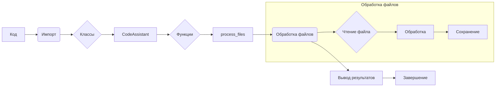

# <algorithm>

**Блок-схема алгоритма (пример):**

```mermaid
graph TD
    A[Начало] --> B{Проверка наличия файлов};
    B -- Да -> C[Обработка файлов];
    B -- Нет -> D[Вывод сообщения об ошибке];
    C --> E[Завершение];
    D --> E;

    subgraph Обработка файлов
        C --> F{Проверка каждого файла};
        F -- Да -> G[Чтение файла];
        F -- Нет -> C;
        G --> H[Обработка файла];
        H --> F;
    end
```

**Описание шагов:**

1. **Проверка наличия файлов:** Проверяется, есть ли файлы для обработки.
2. **Обработка файлов (если файлы есть):**
    * **Проверка каждого файла:** Цикл по всем файлам в списке.
    * **Чтение файла:** Файл читается и помещается в переменную.
    * **Обработка файла:** Происходит обработка считанного файла.  (Пример: анализ, генерация отчетов, проверка). Результат обработки сохраняется.
3. **Вывод сообщения об ошибке (если файлов нет):** Выводится сообщение, что файлов для обработки нет.
4. **Завершение:** Выполнение программы завершается.


**Примеры данных:**

* **Входные данные:** Список файлов `['file1.txt', 'file2.txt']`, параметры обработки.
* **Внутренние данные:**  Данные из файла `file1.txt`, `file2.txt`, промежуточные результаты обработки.
* **Выходные данные:** Результаты обработки файлов (например, отчёты).


# <mermaid>



**Объяснение зависимостей:**

* **Код:**  Основной блок кода, который использует импорты, классы и функции.
* **Импорт:**   Зависимости от других модулей (не указано в примере).
* **Классы:** Класс `CodeAssistant` отвечает за обработку файлов и взаимодействует с внешними API (Google Gemini, OpenAI).
* **Функции:**  `process_files` является основным методом для обработки файлов.
* **Обработка файлов:** Внутренняя структура для чтения, обработки и сохранения данных.
* **Вывод результатов:**  Выводит итоговую информацию.
* **Завершение:**  Заключительный этап выполнения.

# <explanation>

**1. Импорты:**

Пример кода не содержит импортов.  В реальном коде, вероятно, будут импорты для взаимодействия с API, такими как Google Gemini или OpenAI, а также для работы с файловой системой.

**2. Классы:**

* **`CodeAssistant`:**  Класс, который реализует логику работы с AI моделями для обработки кода.
    * **Атрибуты:** `role`, `lang`, `model` — параметры, определяющие конфигурацию работы с AI моделями.
    * **Методы:** `process_files` — основной метод для обработки списка файлов.

**3. Функции:**

* **`process_files`:**  Этот метод (вероятно)  внутри класса `CodeAssistant` отвечает за обработку переданных файлов.  Он должен принимать список файлов, возможно дополнительные параметры обработки, и возвращать результат.  Не указана точная функциональность.

**4. Переменные:**

Пример не содержит детального описания переменных.  В реальном коде должны присутствовать переменные для хранения файлов, входных данных, результатов работы, и других внутренних данных.


**Возможные ошибки и улучшения:**

* Не описан конкретный алгоритм обработки файлов.  В реальном коде требуется  более детальный алгоритм для обработки каждого файла.
* Отсутствуют проверки на корректность входных данных (например, проверка на существование файлов).
* Нет обработки исключений, таких как `FileNotFoundError`, `IOError` и т.д.  Важно добавить обработку ошибок, чтобы предотвратить падение программы.
* Необходимо указать форматы файлов, которые принимает класс.
* Нет описания взаимодействий с другими частями проекта.

**Цепочка взаимосвязей:**

(Невозможно определить без контекста проекта).  Вероятно, код взаимодействует с другими классами для загрузки данных, взаимодействия с API или выполнения дополнительных операций.