## <алгоритм>

1. **Анализ инструкции:**
   - Инструкция описывает формат документирования кода на языке Python с использованием reStructuredText (RST).
   - Документация должна включать описания модулей, классов, функций и методов, а также обработку ошибок и комментарии в коде.

2. **Структура документации:**
   - **Модули:**
     - Заголовок модуля с описанием его назначения.
     - Примеры использования модуля в блоке кода `.. code-block:: python`.
     - Указание платформ и синопсиса модуля.
     - Заголовки для свойств и методов модуля.
   - **Классы:**
     - Заголовок класса с описанием его назначения.
     - Описание свойств класса.
     - Описание методов класса, их параметров, возвращаемых значений и примеров использования.
   - **Функции и методы:**
     - Заголовок функции/метода с описанием его назначения.
     - Описание параметров и возвращаемых значений.
     - Примеры использования в блоке кода `.. code-block:: python`.
   - **Комментарии в коде:**
     - Комментарии должны быть в RST формате, поясняющие логику кода и решения.
     - Использование блочных комментариев, а не строчных.
   - **Ошибки (Exceptions):**
     - Документирование ошибок, которые могут возникнуть в классах, методах и функциях.
     - Указание причин и обстоятельств возникновения ошибок.

3. **Примеры:**
    - В инструкции приведены примеры документирования модуля, класса, метода и ошибки, а также примеры комментариев в коде.
    - Все примеры оформлены в RST формате с использованием `.. code-block:: python` для кода.

4. **Применение:**
   - Эта инструкция является шаблоном для создания документации к коду на языке Python.
   - Документация создается в формате RST, что позволяет генерировать документацию с помощью Sphinx.

```mermaid
flowchart TD
    subgraph Module [Модуль]
        StartModule[Начало документации модуля]
        ModuleDescription[Описание модуля: цель]
        ModuleExample[Примеры использования модуля в блоке `.. code-block:: python`]
        ModulePlatform[Платформы и синопсис]
        ModuleProperties[Заголовки для свойств модуля]
        ModuleMethods[Заголовки для методов модуля]
        EndModule[Конец документации модуля]
    end

    subgraph Class [Класс]
        StartClass[Начало документации класса]
        ClassDescription[Описание класса: цель]
        ClassProperties[Описание свойств класса]
        ClassMethods[Описание методов класса]
        MethodDocumentation[Документация каждого метода: параметры, возвращаемые значения, примеры]
        EndClass[Конец документации класса]
    end

    subgraph FunctionMethod [Функции/Методы]
        StartFunctionMethod[Начало документации функции/метода]
        FunctionMethodDescription[Описание функции/метода: цель]
        FunctionMethodParameters[Описание параметров]
        FunctionMethodReturnValue[Описание возвращаемых значений]
        FunctionMethodExample[Примеры использования в блоке `.. code-block:: python`]
        EndFunctionMethod[Конец документации функции/метода]
    end

    subgraph CodeComments [Комментарии в коде]
        StartComments[Начало документирования комментариев]
        CommentRST[Комментарии в формате RST]
        CommentLogicExplanation[Пояснение логики и решений]
        CommentBlock[Использование блочных комментариев]
        EndComments[Конец документирования комментариев]
    end

    subgraph Exceptions [Ошибки]
        StartExceptions[Начало документирования ошибок]
        ExceptionDescription[Описание ошибок]
        ExceptionCircumstances[Условия возникновения ошибок]
        ExceptionParameters[Параметры ошибки]
        ExceptionExample[Пример кода возникновения ошибки]
        EndExceptions[Конец документирования ошибок]
    end

    StartModule --> ModuleDescription
    ModuleDescription --> ModuleExample
    ModuleExample --> ModulePlatform
    ModulePlatform --> ModuleProperties
    ModuleProperties --> ModuleMethods
    ModuleMethods --> EndModule

    StartClass --> ClassDescription
    ClassDescription --> ClassProperties
    ClassProperties --> ClassMethods
    ClassMethods --> MethodDocumentation
    MethodDocumentation --> EndClass

    StartFunctionMethod --> FunctionMethodDescription
    FunctionMethodDescription --> FunctionMethodParameters
    FunctionMethodParameters --> FunctionMethodReturnValue
    FunctionMethodReturnValue --> FunctionMethodExample
    FunctionMethodExample --> EndFunctionMethod

    StartComments --> CommentRST
    CommentRST --> CommentLogicExplanation
    CommentLogicExplanation --> CommentBlock
    CommentBlock --> EndComments
    
     StartExceptions --> ExceptionDescription
    ExceptionDescription --> ExceptionCircumstances
    ExceptionCircumstances --> ExceptionParameters
    ExceptionParameters --> ExceptionExample
    ExceptionExample --> EndExceptions
```

## <mermaid>

**Объяснение `mermaid` диаграммы:**

- **Module (Модуль):**
  - `StartModule`: Начало процесса документирования модуля.
  - `ModuleDescription`: Описание цели модуля.
  - `ModuleExample`: Примеры использования модуля.
  - `ModulePlatform`: Платформы и синопсис модуля.
  - `ModuleProperties`: Заголовки свойств модуля.
  - `ModuleMethods`: Заголовки методов модуля.
  - `EndModule`: Конец документирования модуля.

- **Class (Класс):**
  - `StartClass`: Начало процесса документирования класса.
  - `ClassDescription`: Описание цели класса.
  - `ClassProperties`: Описание свойств класса.
  - `ClassMethods`: Описание методов класса.
  - `MethodDocumentation`: Документация каждого метода.
  - `EndClass`: Конец документирования класса.

- **FunctionMethod (Функции/Методы):**
  - `StartFunctionMethod`: Начало документирования функции/метода.
  - `FunctionMethodDescription`: Описание цели функции/метода.
  - `FunctionMethodParameters`: Описание параметров.
  - `FunctionMethodReturnValue`: Описание возвращаемых значений.
  - `FunctionMethodExample`: Примеры использования.
  - `EndFunctionMethod`: Конец документирования функции/метода.

- **CodeComments (Комментарии в коде):**
  - `StartComments`: Начало документирования комментариев в коде.
  - `CommentRST`: Комментарии в формате RST.
  - `CommentLogicExplanation`: Пояснения логики и решений.
  - `CommentBlock`: Использование блочных комментариев.
  - `EndComments`: Конец документирования комментариев.

- **Exceptions (Ошибки):**
  - `StartExceptions`: Начало документирования ошибок.
  - `ExceptionDescription`: Описание ошибок.
  - `ExceptionCircumstances`: Условия возникновения ошибок.
  - `ExceptionParameters`: Параметры ошибки.
  - `ExceptionExample`: Пример кода возникновения ошибки.
  - `EndExceptions`: Конец документирования ошибок.

**Зависимости:**
Диаграмма не показывает импорты. Зависимости здесь подразумеваются как логическая последовательность процессов документирования различных частей кода. Диаграмма показывает порядок, в котором нужно документировать разные части кода согласно инструкции.

## <объяснение>

**Инструкция:**

- Инструкция предоставляет подробное руководство по документированию кода на Python с использованием reStructuredText (RST). Цель - создать читаемую и информативную документацию, которая может быть сгенерирована в различных форматах с помощью инструментов, таких как Sphinx.
-  **Формат RST**:  RST - текстовый формат разметки, используемый для создания технической документации. Он позволяет включать заголовки, списки, таблицы и блоки кода.
-   **Цель документации**:  Обеспечить полное понимание кода для разработчиков, позволяя им быстро разобраться в функциональности модулей, классов, методов и функций, а также понимать возникающие ошибки.

**Модули:**

-   **Назначение**: Модуль должен быть описан с указанием его основной функции.
-   **Примеры**: Примеры использования демонстрируют, как применять модуль в реальных ситуациях.
-   **Платформы и синопсис**: Указываются платформы, на которых модуль работает, и краткий синопсис его функций.
-   **Свойства и методы**: Должны быть описаны с использованием заголовков для ясности.

**Классы:**

-   **Назначение**: Описание роли класса и его места в общей структуре проекта.
-   **Свойства**: Список атрибутов класса и их назначение.
-   **Методы**: Описание каждого метода с параметрами, возвращаемыми значениями и примерами использования.

**Функции и методы:**

-   **Назначение**: Описание выполняемой функции или метода.
-   **Параметры и возвращаемые значения**: Описание типов и назначения входных и выходных данных.
-   **Примеры**: Примеры показывают, как вызывать функции и методы и как интерпретировать результаты.

**Комментарии в коде:**

-   **Формат RST**:  Комментарии должны быть в формате RST для единообразия.
-   **Блочные комментарии**: Использование блоков для более подробного описания логики и решений.

**Ошибки (Exceptions):**

-   **Описание ошибок**: Каждая ошибка должна быть описана с указанием ее причины и обстоятельств возникновения.
-   **Параметры ошибки**: Описание передаваемых параметров в случае возникновения ошибки.
-   **Пример использования**: Демонстрирует, как и когда может возникнуть ошибка.

**Использование инструкций:**
Инструкция является шаблоном, который нужно применять при документировании кода. 

**Потенциальные области улучшения:**

-   **Автоматизация**:  Можно добавить автоматизацию процесса генерации RST из комментариев в коде.
-   **Валидация**: Создание скриптов для валидации RST и соответствия документации инструкции.
-   **Интеграция с IDE**: Разработка плагинов для IDE, которые помогут разработчикам следовать инструкции при написании кода.

**Цепочка взаимосвязей с другими частями проекта:**
Эта инструкция является частью процесса создания документации, которая, в свою очередь, является неотъемлемой частью процесса разработки программного обеспечения. Документация связывает различные части проекта, делая их понятными и доступными для всех разработчиков. Она используется для создания технической документации, которая является необходимым ресурсом для поддержки и дальнейшего развития проекта.