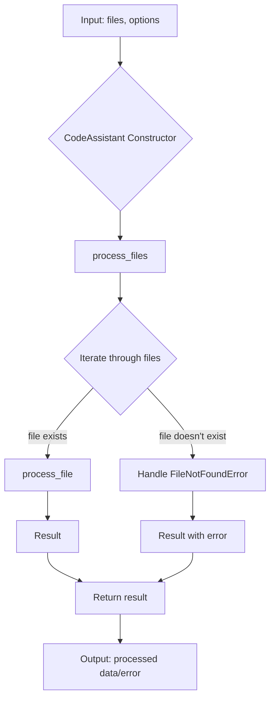
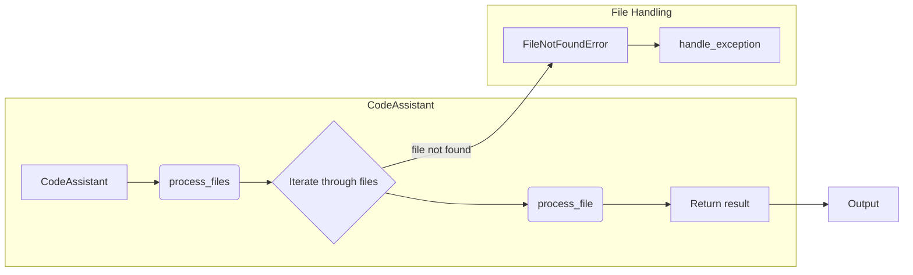

# <algorithm>

**Описание алгоритма:**

1. **Входные данные:** Функция `process_files` получает список файлов (`files`) и опции (`options`) для обработки.

2. **Инициализация:** Создается экземпляр класса `CodeAssistant` с необходимыми параметрами (например, `role`, `lang`, `model`).

3. **Обработка файлов:** Цикл `for` проходит по каждому файлу в списке `files`.

4. **Проверка существования файла:** Внутри цикла выполняется проверка, существует ли файл.

5. **Обработка файла:** Если файл существует, вызывается функция `process_file` для обработки конкретного файла. Результат обработки добавляется в список результатов.

6. **Обработка ошибки (FileNotFoundError):** Если файл не найден, генерируется исключение `FileNotFoundError`, которое обрабатывается блоком `except` и передаётся в функцию `handle_exception` для обработки ошибки.

7. **Возврат результатов:** После обработки всех файлов функция `process_files` возвращает список обработанных данных или сообщение об ошибке.

# <mermaid>

**Подключаемые зависимости:**

Диаграмма изображает взаимодействие `CodeAssistant` и `process_file`. Неясно, что это за функция `process_file`, и от каких библиотек она зависит. Возможно, она использует внешние библиотеки для обработки файлов или работы с моделями AI (Gemini, OpenAI).

# <explanation>

**1. Импорты:**

Код не содержит импортов.  Предполагается, что необходимые для работы модули (например, для работы с файлами, для доступа к моделям AI) импортируются в других частях проекта.  Описание их функционала (например, как взаимодействовать с API моделей AI) должно быть в документации этих модулей.

**2. Классы:**

**`CodeAssistant`:**

* **Роль:** Класс для работы с помощником по коду (code assistant), используя различные модели AI (например, Google Gemini, OpenAI).
* **Атрибуты:** `role`, `lang`, `model` -  определяют настройки помощника (роль, язык, модель).
* **Методы:**
    * `process_files`:  Метод для обработки списка файлов.  Он итеративно обрабатывает каждый файл и возвращает результаты.
* **Взаимодействие:** Класс `CodeAssistant` предполагается, что использует (прямо или косвенно) внешние библиотеки, чтобы взаимодействовать с API моделей AI и с файлами.

**3. Функции:**

**`process_file`:**

* **Цель:**  Обрабатывает один файл.
* **Аргументы:** файл (или путь к файлу).
* **Возвращаемое значение:** Результат обработки файла.
* **Взаимодействие:**   Эта функция  зависит от моделей AI.

**`handle_exception`:**

* **Цель:** Обрабатывает исключения.
* **Аргументы:** исключение (`exception`).
* **Возвращаемое значение:** Модифицированный результат (например, чтобы добавить ошибку в выходные данные).

**4. Переменные:**

Переменные `files`, `options` представляют входные данные для метода `process_files`. `role`, `lang`, `model` являются атрибутами класса `CodeAssistant`.

**Возможные ошибки или улучшения:**

* **Не хватает описания `process_file`:** Необходимо подробное описание, как `process_file` обрабатывает файл, учитывая различные типы файлов.
* **Не хватает описания `handle_exception`:** Необходимо более детальное описание, как обрабатывать различные исключения.
* **Отсутствие проверки входных данных:** Не указано, что делать, если входные данные некорректны (например, список файлов пуст).
* **Недостаточно подробное описание зависимостей:** Нужно более точно указывать, от каких библиотек зависят методы (например, для работы с файловой системой, API моделей AI).
* **Глобальное описание проекта:**  Необходимо контекст проекта. Какую задачу он выполняет, и где `CodeAssistant` интегрируется.

**Цепочка взаимосвязей:**

`CodeAssistant` использует другие модули для работы с файлами (входные данные) и с моделями AI (выполнение задач). Необходимые зависимости должны быть указаны в импортах или в документации зависимостей.

**Вывод:**

Предоставленный код описывает структуру и порядок работы с `CodeAssistant` для обработки файлов, но требует дополнительного контекста и детального описания для понимания полного взаимодействия.