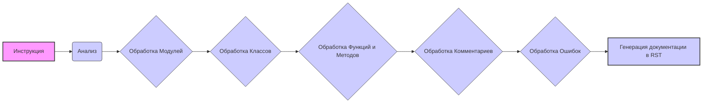

## <алгоритм>
1. **Анализ входных данных**: Инструкция представляет собой шаблон для документирования кода на иврите, используя формат reStructuredText (RST). Она описывает, как должны быть структурированы комментарии в коде, включая модули, классы, функции, методы, переменные и ошибки.

2. **Обработка модулей**:
    -   Описание модуля должно начинаться с заголовка, указывающего его назначение.
    -   Приводятся примеры использования модуля в блоке `.. code-block:: python`.
    -   Указываются платформы и синопсис.
    -   Для свойств и методов используются отдельные заголовки.
        -   **Пример:** Модуль `CodeAssistant` для работы с AI моделями.

3. **Обработка классов**:
    -   Описание класса должно включать его назначение.
    -   Описываются атрибуты и методы класса.
    -   Для методов указываются параметры, возвращаемые значения и примеры использования.
        -   **Пример:** Класс `CodeAssistant` с атрибутами `role`, `lang`, `model` и методом `process_files`.

4. **Обработка функций и методов**:
    -   Для функций и методов описываются параметры и возвращаемые значения.
    -   Приводится описание назначения и примеры использования в блоке `.. code-block:: python`.
        -   **Пример:** Метод `process_files` класса `CodeAssistant` с параметрами `files` и `options` и возвращаемым значением в виде обработанных данных.

5. **Обработка комментариев**:
    -   Комментарии в коде должны быть написаны в формате RST и описывать логику кода.
    -   Комментарии должны быть в блоках, а не в отдельных строках.
        -   **Пример:** Комментарий `здесь выполняется обработка ошибок`, сопровождаемый блоком `try-except`.

6. **Обработка ошибок**:
    -   Документируются исключения, которые могут возникнуть в классах, методах и функциях.
    -   Указываются типы ошибок и условия их возникновения.
        -   **Пример:** Исключение `FileNotFoundError` и описание его параметров.

7. **Генерация документации**: Все описания преобразуются в формат RST.

## <mermaid>

**Описание диаграммы:**

- **A [Инструкция]**:  Начальная точка, представляющая входные данные в виде инструкций по документированию кода.
- **B (Анализ)**: Первый шаг алгоритма, анализ входных инструкций для понимания требований к документированию.
- **C {Обработка Модулей}**:  Этап, на котором обрабатывается информация о модулях, включая их описание, использование, синопсис, свойства и методы.
- **D {Обработка Классов}**: Этап, на котором обрабатывается информация о классах, включая их описание, атрибуты и методы.
- **E {Обработка Функций и Методов}**:  Этап, на котором обрабатывается информация о функциях и методах, включая их параметры, возвращаемые значения и примеры использования.
- **F {Обработка Комментариев}**: Этап, на котором обрабатываются комментарии в коде, форматируя их в RST и описывая логику кода.
- **G {Обработка Ошибок}**: Этап, на котором обрабатываются исключения, документируя их типы и условия возникновения.
- **H [Генерация документации в RST]**:  Финальный этап, где вся собранная информация преобразуется в формат reStructuredText (RST) для документирования кода.

**Зависимости:**
- Диаграмма показывает последовательный поток данных, где каждый этап зависит от результатов предыдущего.
- Нет импорта внешних библиотек или модулей. Диаграмма иллюстрирует внутренний процесс документации.

## <объяснение>
**Импорты**:
- В данном коде импортов нет, так как это описание процесса, а не исполняемый код.

**Классы**:
-  В предоставленном коде описана концепция документации классов, а не конкретные классы.
   -  *Роль*: Описывать структуру классов, включая атрибуты и методы.
   -  *Атрибуты*: Описание атрибутов класса с их назначением (пример: `role`, `lang`, `model` класса `CodeAssistant`).
   -  *Методы*: Описание методов класса с их параметрами, возвращаемыми значениями и примерами использования (пример: метод `process_files` класса `CodeAssistant`).
   -  *Взаимодействие*: Взаимодействие классов не рассматривается, так как это шаблон.

**Функции**:
- В предоставленном коде описана концепция документирования функций и методов, а не конкретные функции.
   -  *Аргументы*: Описание аргументов функций и методов.
   -  *Возвращаемые значения*: Описание возвращаемых значений функций и методов.
   -  *Назначение*: Описание назначения функций и методов.
   -  *Примеры*: Примеры использования функций и методов в блоке `.. code-block:: python`.

**Переменные**:
- Переменные не рассматриваются, так как это описание шаблона.

**Потенциальные ошибки и области для улучшения**:
1.  **Недостаточная гибкость:** Инструкция очень специфична для языка иврит и reStructuredText. Для других языков и форматов может потребоваться модификация.
2.  **Отсутствие обработки сложных случаев:**  В инструкции нет явного указания на обработку сложных случаев, таких как генераторы, декораторы или метаклассы.
3. **Нечеткость примеров:** Примеры использования в инструкции должны быть более разнообразными и учитывать различные сценарии использования.
4. **Отсутствие проверок валидации**: Инструкция не включает валидацию правильности RST синтаксиса.

**Цепочка взаимосвязей с другими частями проекта**:
- Этот код предназначен для использования как часть процесса документирования кода, особенно для AI-проектов. Он может быть интегрирован с другими частями проекта, которые отвечают за анализ кода и генерацию документации.
- Может быть использован в модуле для документирования кода, чтобы автоматизировать процесс генерации документации в формате RST.

**Заключение:**
Данный шаблон представляет собой структурированное руководство для документирования кода с использованием reStructuredText. Он охватывает все основные аспекты документирования, включая модули, классы, функции, методы, комментарии и ошибки. Тем не менее, для более широкого применения требуется его гибкость и расширение, особенно в части обработки сложных случаев и разных языков программирования.