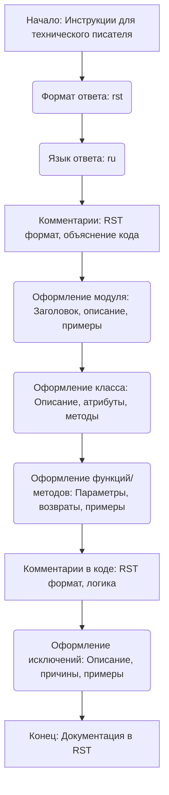

## АНАЛИЗ КОДА: `hypotez/src/ai/prompts/developer/doc_writer_rst_ru.md`

### 1. <алгоритм>

Этот файл содержит инструкции по созданию документации для проекта `hypotez`. Инструкции предназначены для технического писателя и описывают, как оформлять документацию в формате `reStructuredText`.

**Блок-схема:**

1.  **Начало**: Получение инструкций для технического писателя.
2.  **Формат ответа**: Задание формата ответа как `rst` (Restructured Text).
3.  **Язык ответа**: Определение языка ответа как Русский (`ru`).
4.  **Комментарии в коде**:  
    *   Все комментарии должны быть в `RST` формате.
    *   Комментарии должны объяснять назначение модулей, классов, функций.
5.  **Оформление модулей**:
    *   Описание модуля оформляется в заголовке, с указанием его назначения.
    *   Примеры использования модуля, если это возможно, в блоке `code-block:: python`.
    *   Платформы и синопсис модуля.
    *   Заголовки для атрибутов и методов.
6.  **Оформление классов**:
    *   Описание класса, атрибутов и методов.
    *   Описание методов и их назначение.
    *   Примеры использования класса и методов в `code-block:: python`.
    *   Описание параметров и возвращаемых значений методов.
7.  **Оформление функций и методов**:
    *   Описание параметров и возвращаемых значений.
    *   Описание назначения функции и примеры использования в `code-block:: python`.
8.  **Комментарии в коде**:
    *   Комментарии должны быть в формате `RST`.
    *   Комментарии должны объяснять логику кода.
9.  **Оформление исключений**:
    *   Описание исключений для классов, методов и функций.
    *   Описание причин, по которым возникают исключения.
    *   Примеры использования исключений в `code-block:: python`.
10. **Конец**: Документация создана в формате `RST`.

**Примеры:**
*   **Блок 4:** Комментарии в коде, пример:
    ```python
    # Здесь происходит обработка исключений, чтобы продолжить выполнение, если файл не найден
    try:
        process_file(file)
    except FileNotFoundError as ex:
        handle_exception(ex)
    ```
*   **Блок 5:** Пример использования модуля.
    ```python
        assistant = CodeAssistant(role='code_checker', lang='ru', model=['gemini'])
        assistant.process_files()
    ```
*   **Блок 6:** Пример использования класса.
    ```python
        assistant = CodeAssistant(role='code_checker', lang='ru', model=['gemini'])
        assistant.process_files()
    ```
*   **Блок 7:** Пример оформления для метода.
    ```python
    result = assistant.process_files(files=['file1.py', 'file2.py'], options={})
    ```

### 2. <mermaid>


**Объяснение `mermaid`:**

*   `flowchart TD`: Определение типа диаграммы как "flowchart" (блок-схема) и направления "Top to Down" (сверху вниз).
*   `A[Начало: Инструкции для технического писателя]`: Начальный блок, представляющий получение инструкций для технического писателя.
*   `B(Формат ответа: rst)`: Блок, обозначающий задание формата ответа как `rst` (Restructured Text).
*   `C(Язык ответа: ru)`: Блок, определяющий язык ответа как русский (`ru`).
*    `D[Комментарии: RST формат, объяснение кода]`: Блок, описывающий требование оформления комментариев в `RST` и их назначение.
*   `E(Оформление модуля: Заголовок, описание, примеры)`: Блок, описывающий требования к оформлению модулей.
*   `F(Оформление класса: Описание, атрибуты, методы)`: Блок, описывающий требования к оформлению классов.
*   `G(Оформление функций/методов: Параметры, возвраты, примеры)`: Блок, описывающий требования к оформлению функций и методов.
*    `H[Комментарии в коде: RST формат, логика]`: Блок, описывающий требования к комментариям в коде, их формату и назначению.
*   `I(Оформление исключений: Описание, причины, примеры)`: Блок, описывающий требования к оформлению исключений.
*   `J[Конец: Документация в RST]`: Конечный блок, представляющий завершение документации в формате `RST`.
*   `-->`: Стрелки, показывающие поток управления от одного этапа к другому.

Диаграмма `mermaid` показывает последовательность шагов, необходимых для создания документации по коду согласно заданным инструкциям. Каждый шаг представляет собой отдельный блок, описывающий действие или требование к документации.

### 3. <объяснение>

Этот файл представляет собой инструкцию для технического писателя по созданию документации для проекта `hypotez`. Инструкция подробно описывает, как документировать код, используя `reStructuredText` (`rst`).

**Основные положения:**

*   **Формат документации**: Все документы должны быть в формате `rst`. Это стандартный формат для документации Python.
*   **Язык документации**: Документация должна быть на русском языке (`ru`).
*   **Комментарии в коде**: Все комментарии должны соответствовать стандарту `RST`.
*   **Оформление модулей**:
    *   Заголовок с указанием назначения модуля.
    *   Примеры использования модуля (если есть) в блоке `code-block:: python`.
    *   Платформы и синопсис модуля.
    *   Заголовки для атрибутов и методов.
*   **Оформление классов**:
    *   Описание класса, его атрибутов и методов.
    *   Примеры использования класса в блоке `code-block:: python`.
*   **Оформление функций и методов**:
    *   Описание параметров и возвращаемых значений.
    *   Примеры использования в блоке `code-block:: python`.
*   **Комментарии в коде**:
    *   Комментарии должны быть в формате `RST` и должны объяснять логику кода.
*   **Оформление исключений**:
    *   Описание исключений, которые могут быть подняты, и при каких условиях.
    *   Примеры использования в блоке `code-block:: python`.

**Цепочка взаимосвязей:**

Этот файл является частью проекта `hypotez`. Его задача - стандартизация и обеспечение единообразия документации. Инструкции предназначены для технического писателя, который будет использовать их при документировании кода. Это обеспечивает согласованность и понятность документации для всех участников проекта.

**Потенциальные области для улучшения:**

*   **Автоматизация**: Можно рассмотреть автоматизацию процесса генерации документации, чтобы уменьшить ручную работу и вероятность ошибок.
*   **Подробные примеры**: Добавление более конкретных и разнообразных примеров использования каждого элемента (модулей, классов, функций и методов) могло бы повысить ценность документации.
*   **Интеграция с CI/CD**: Интеграция с CI/CD могла бы обеспечить автоматическую генерацию и обновление документации при изменениях в коде.

**Дополнительные пояснения:**

Данный файл является "руководством" для технического писателя, а не частью кода, который будет исполнятся. Его цель - установить стандарты и требования к документации, чтобы она была согласованной и информативной.