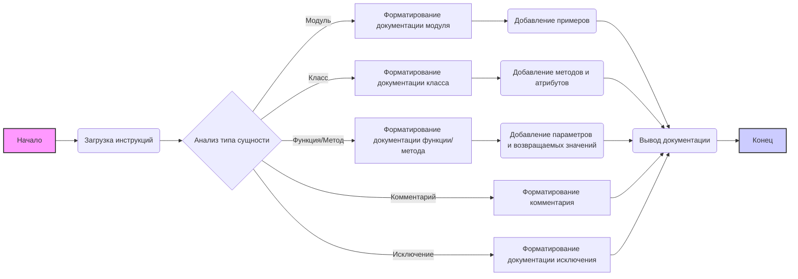

# Документация для модуля `doc_writer_rst_ru.md`

## <алгоритм>

1. **Инициализация**: 
   - Загрузка инструкций из файла `doc_writer_rst_ru.md`.
   - Установка формата вывода в `rst` (ReStructured Text).
   - Установка языка вывода в `ru` (Русский).
   - Установка роли "технический писатель".

2. **Анализ кода**: 
   - Принимается на вход код для анализа.
   - Код анализируется на наличие модулей, классов, функций/методов, переменных, комментариев и исключений.

3. **Форматирование документации**:
   - Для каждого модуля, класса, функции/метода и т.д. генерируется документация в формате `rst`.
     - Модуль:
       - Заголовок с названием модуля.
       - Описание модуля, его назначения, примеры использования.
       - Синопсис и платформы (если есть).
     - Класс:
       - Заголовок с названием класса.
       - Описание класса, его атрибуты и методы.
       - Описание каждого метода, его параметров, возвращаемых значений и примеров использования.
     - Функция/Метод:
       - Заголовок с названием функции/метода.
       - Описание функции/метода, его параметров и возвращаемых значений.
       - Примеры использования.
     - Комментарии:
        - Комментарии из кода форматируются в виде блоков `rst`.
     - Исключения:
       - Описание исключений, их причин и параметров.
   - Все примеры кода оформляются в блоках `.. code-block:: python`.
    
4. **Вывод результата**:
    - Сформированная документация в формате `rst` выводится как результат.
    
## <mermaid>

**Анализ зависимостей `mermaid`:**

-   **A** (Начало): Начальная точка процесса.
-   **B** (Загрузка инструкций): Этап, на котором загружаются инструкции из файла `doc_writer_rst_ru.md`.
-  **C** (Анализ типа сущности): Этап принятия решения, какой тип сущности (модуль, класс, функция, комментарий, исключение) необходимо форматировать.
-   **D** (Форматирование документации модуля): Этап, на котором создается документация для модуля, следуя определенным инструкциям (заголовок, описание, примеры использования).
-   **E** (Форматирование документации класса): Этап, на котором создается документация для класса, включая описание, атрибуты и методы.
-   **F** (Форматирование документации функции/метода): Этап, на котором создается документация для функции/метода, включая параметры, возвращаемые значения и примеры использования.
-   **G** (Форматирование комментария): Этап, на котором создаются блоки `rst` для комментариев из кода.
-  **H** (Форматирование документации исключения): Этап, на котором форматируется документация исключений.
-  **I** (Добавление примеров): Этап, на котором добавляются примеры использования модуля.
-   **J** (Добавление методов и атрибутов): Этап, на котором добавляются методы и атрибуты класса.
-   **K** (Добавление параметров и возвращаемых значений): Этап, на котором добавляются параметры и возвращаемые значения функции/метода.
-   **L** (Вывод документации): Этап, на котором готовая документация выводится в формате `rst`.
-   **M** (Конец): Конечная точка процесса.

## <объяснение>

**Импорты:**

-   Данный код не содержит импортов, так как это описание шаблона, а не исполняемый код.

**Классы:**

-   В данном файле нет определения классов, поскольку это описание шаблона для документации.

**Функции:**

-   В данном файле нет определения функций, поскольку это описание шаблона для документации.

**Переменные:**

-   `role`: Строковая переменная, устанавливает роль ассистента (например, "технический писатель").
-   `output_language`: Строковая переменная, задает язык вывода (например, "ru" для русского).
-   `Расположение файла`: Строковая переменная, содержащая путь к файлу с инструкциями.
-   `instruction`: Строковая переменная, содержащая подробные инструкции по формированию документации.
-   `input_code`: Строковая переменная, содержит код, который нужно проанализировать и задокументировать.

**Детальное объяснение:**

Файл `doc_writer_rst_ru.md` представляет собой шаблон для генерации документации в формате Restructured Text (RST) на русском языке. Инструкции в файле описывают, как следует анализировать и документировать код, включая модули, классы, функции, комментарии и исключения.

-   **Структура документа:**  Инструкция определяет структуру документации, включая заголовки, описания, списки атрибутов и методов, примеры использования и формат блоков кода.
-   **Комментарии:**  Все комментарии должны быть оформлены в формате RST и объяснять логику кода. Комментарии оформляются в блоках, а не в строках.
-   **Исключения:**  Описание исключений включает в себя их тип, причину возникновения и параметры.
-   **Примеры кода:** Примеры кода должны быть вставлены в блоках `.. code-block:: python`, что обеспечивает корректное отображение синтаксиса в RST.

**Возможные ошибки и улучшения:**

-   **Отсутствие обработки ошибок**: Инструкции не содержат указаний о том, как обрабатывать некорректный или неполный код.
-   **Сложность инструкции**: Инструкция достаточно подробная, но может быть разбита на более мелкие подзадачи для упрощения реализации.
-  **Абстракция**: В текущей инструкции описывается процесс форматирования, а не реализация анализа и обработки кода, что может привести к неоднозначности при реализации.

**Связь с другими частями проекта:**

Этот шаблон используется в проекте `hypotez` для автоматической генерации документации, что является важной частью процесса разработки. Он может быть связан с другими модулями, которые анализируют код и формируют его структуру для дальнейшего документирования.

В заключении, данный файл является подробной инструкцией для создания документации в формате RST на русском языке, что является важной частью обеспечения понятности и удобства использования кода.