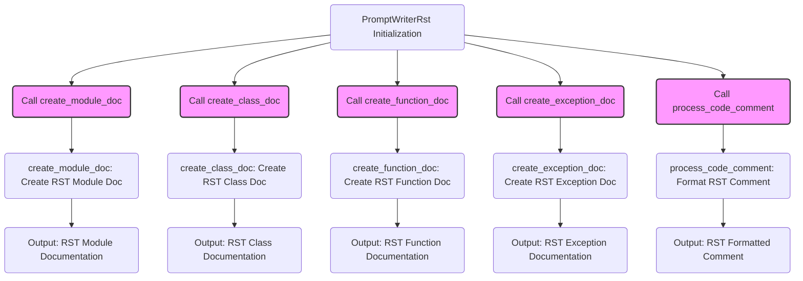

## ИНСТРУКЦИЯ:

Анализируй предоставленный код подробно и объясни его функциональность. Ответ должен включать три раздела:  

1. **<алгоритм>**: Опиши рабочий процесс в виде пошаговой блок-схемы, включая примеры для каждого логического блока, и проиллюстрируй поток данных между функциями, классами или методами.  
2. **<mermaid>**: Напиши код для диаграммы в формате `mermaid`, проанализируй и объясни все зависимости, 
    которые импортируются при создании диаграммы. 
    **ВАЖНО!** Убедитесь, что все имена переменных, используемые в диаграмме `mermaid`, 
    имеют осмысленные и описательные имена. Имена переменных вроде `A`, `B`, `C`, и т.д., не допускаются!  
    
    **Дополнительно**: Если в коде есть импорт `import header`, добавьте блок `mermaid` flowchart, объясняющий `header.py`:\
    ```mermaid
    flowchart TD
        Start --> Header[<code>header.py</code><br> Determine Project Root]
    
        Header --> import[Import Global Settings: <br><code>from src import gs</code>] 
    ```

3. **<объяснение>**: Предоставьте подробные объяснения:  
   - **Импорты**: Их назначение и взаимосвязь с другими пакетами `src.`.  
   - **Классы**: Их роль, атрибуты, методы и взаимодействие с другими компонентами проекта.  
   - **Функции**: Их аргументы, возвращаемые значения, назначение и примеры.  
   - **Переменные**: Их типы и использование.  
   - Выделите потенциальные ошибки или области для улучшения.  

Дополнительно, постройте цепочку взаимосвязей с другими частями проекта (если применимо).  

Это обеспечивает всесторонний и структурированный анализ кода.
## Формат ответа: `.md` (markdown)
**КОНЕЦ ИНСТРУКЦИИ**

## <алгоритм>

1. **Инициализация:**
    - Создается экземпляр класса `PromptWriterRst`.
    - При инициализации передаются параметры: `role` (роль, например, 'technical_writer'), `lang` (язык, например, 'ru'), `model` (модель ИИ, например, ['gemini']).

2. **Метод `create_module_doc`**:
   -  Принимает на вход имя модуля `module_name` и описание `module_description`.
   - Формирует RST документ для модуля:
        - Создает заголовок модуля с именем модуля.
        - Добавляет описание модуля.
        - Добавляет пример использования с использованием `.. code-block:: python`.
        - Добавляет заголовки разделов "Платформы" и "Синопсис" (не реализовано в текущем коде).

3. **Метод `create_class_doc`**:
   - Принимает на вход имя класса `class_name`, описание `class_description`, атрибуты `attributes` и методы `methods`.
   - Формирует RST документ для класса:
        - Создает заголовок класса с именем класса.
        - Добавляет описание класса.
        - Добавляет секцию "Атрибуты", перечисляя их.
        - Добавляет секцию "Методы", перечисляя их.
        - Добавляет пример использования с использованием `.. code-block:: python`.

4. **Метод `create_function_doc`**:
    - Принимает на вход имя функции `function_name`, описание `function_description`, параметры `parameters` и возвращаемое значение `return_value`.
    - Формирует RST документ для функции:
         - Создает заголовок функции с именем функции.
         - Добавляет описание функции.
         - Добавляет секцию "Параметры", перечисляя их.
         - Добавляет секцию "Возвращаемое значение" и описывает его.
         - Добавляет пример использования с использованием `.. code-block:: python`.

5. **Метод `create_exception_doc`**:
   - Принимает на вход имя исключения `exception_name`, описание `exception_description` и параметры `parameters`.
   - Формирует RST документ для исключения:
        - Создает заголовок исключения с именем исключения.
        - Добавляет описание исключения.
        - Добавляет секцию "Параметры", перечисляя их.
        - Добавляет пример использования с использованием `.. code-block:: python`.

6. **Метод `process_code_comment`**:
    - Принимает на вход комментарий `comment`.
    - Оформляет комментарий в формате RST (преобразует в многострочный комментарий).

**Пример потока данных:**

```
PromptWriterRst Instance -> create_module_doc(module_name, module_description) -> RST document for module
PromptWriterRst Instance -> create_class_doc(class_name, class_description, attributes, methods) -> RST document for class
PromptWriterRst Instance -> create_function_doc(function_name, function_description, parameters, return_value) -> RST document for function
PromptWriterRst Instance -> create_exception_doc(exception_name, exception_description, parameters) -> RST document for exception
PromptWriterRst Instance -> process_code_comment(comment) -> RST formatted comment
```

## <mermaid>



**Зависимости:**

Диаграмма `mermaid` показывает, что класс `PromptWriterRst` имеет несколько методов, каждый из которых отвечает за создание определенной части документации в формате RST. 
    
- `PromptWriterRst_Initialization`: Представляет собой инициализацию экземпляра класса `PromptWriterRst`.
- `create_module_doc_call`, `create_class_doc_call`, `create_function_doc_call`, `create_exception_doc_call`, `process_code_comment_call`:  Это вызовы соответствующих методов класса.
- `create_module_doc_execution`, `create_class_doc_execution`, `create_function_doc_execution`, `create_exception_doc_execution`, `process_code_comment_execution`: Это шаги выполнения соответствующих методов, где происходит генерация RST документации.
- `module_doc_output`, `class_doc_output`, `function_doc_output`, `exception_doc_output`, `comment_output`: Это результаты работы методов, возвращающие готовую документацию в формате RST.

## <объяснение>

**Импорты:**
    
    - `from src.ai.prompts.developer.prompt_writer import PromptWriter`: Импортирует класс `PromptWriter` из модуля `src.ai.prompts.developer.prompt_writer`. Этот класс, вероятно, является базовым классом для `PromptWriterRst` и содержит общую логику для написания промптов.

**Классы:**

*   **`PromptWriterRst(PromptWriter)`**
    *   **Роль:** Класс `PromptWriterRst` предназначен для генерации документации в формате RST (reStructuredText). Он наследуется от класса `PromptWriter`, что подразумевает наличие унаследованной общей функциональности.
    *   **Атрибуты:**
        *   `role` (str): Роль, которую выполняет ассистент, например, 'technical_writer'.
        *   `lang` (str): Язык документации, например, 'ru'.
        *   `model` (list): Список моделей ИИ, которые могут быть использованы.
    *   **Методы:**
        *   `__init__(self, role, lang, model)`: Конструктор класса, инициализирует атрибуты `role`, `lang` и `model`, вызывая конструктор базового класса `PromptWriter`.
        *  `create_module_doc(self, module_name, module_description)`: Создает RST-документ для модуля.
        *  `create_class_doc(self, class_name, class_description, attributes, methods)`: Создает RST-документ для класса.
        * `create_function_doc(self, function_name, function_description, parameters, return_value)`: Создает RST-документ для функции.
        * `create_exception_doc(self, exception_name, exception_description, parameters)`: Создает RST-документ для исключения.
        * `process_code_comment(self, comment)`: Форматирует комментарий в стиле RST.

**Функции и методы:**

-   **`__init__(self, role, lang, model)`**:
    -   **Аргументы**:
        -   `role` (str): Роль ассистента.
        -   `lang` (str): Язык документации.
        -   `model` (list): Список моделей ИИ.
    -   **Возвращаемое значение**: Нет (конструктор).
    -   **Назначение**: Инициализирует объект класса `PromptWriterRst` с заданными параметрами. Вызывает конструктор базового класса `PromptWriter` для инициализации общих свойств.
-   **`create_module_doc(self, module_name, module_description)`**:
    -   **Аргументы**:
        -   `module_name` (str): Имя модуля.
        -   `module_description` (str): Описание модуля.
    -   **Возвращаемое значение**: `str`: RST-документ для модуля.
    -   **Назначение**: Формирует строку в формате RST, описывающую модуль, включая его имя и описание, а также пустые разделы "Платформы" и "Синопсис" (их нужно доработать).  Содержит пример использования модуля в коде, оформленный с помощью `.. code-block:: python`.
    - **Примеры**:
      - Использование:
      ```python
        writer = PromptWriterRst(role='technical_writer', lang='ru', model=['gemini'])
        module_doc = writer.create_module_doc(module_name='my_module', module_description='Мой тестовый модуль')
        print(module_doc)
      ```

-   **`create_class_doc(self, class_name, class_description, attributes, methods)`**:
    -   **Аргументы**:
        -   `class_name` (str): Имя класса.
        -   `class_description` (str): Описание класса.
        -   `attributes` (list): Список атрибутов класса.
        -   `methods` (list): Список методов класса.
    -   **Возвращаемое значение**: `str`: RST-документ для класса.
    -   **Назначение**: Формирует RST-документ, описывающий класс, включая его имя, описание, список атрибутов и методов. Включает в себя раздел с примером использования в коде.
    - **Примеры**:
      - Использование:
      ```python
        writer = PromptWriterRst(role='technical_writer', lang='ru', model=['gemini'])
        class_doc = writer.create_class_doc(class_name='MyClass', class_description='Мой тестовый класс', attributes=['attr1', 'attr2'], methods=['method1', 'method2'])
        print(class_doc)
      ```

-   **`create_function_doc(self, function_name, function_description, parameters, return_value)`**:
    -   **Аргументы**:
        -   `function_name` (str): Имя функции.
        -   `function_description` (str): Описание функции.
        -   `parameters` (list): Список параметров функции.
        -   `return_value` (str): Описание возвращаемого значения.
    -   **Возвращаемое значение**: `str`: RST-документ для функции.
    -   **Назначение**: Формирует RST-документ для функции, включая имя, описание, список параметров и описание возвращаемого значения.  Включает в себя раздел с примером использования в коде.
    - **Примеры**:
      - Использование:
      ```python
        writer = PromptWriterRst(role='technical_writer', lang='ru', model=['gemini'])
        function_doc = writer.create_function_doc(function_name='my_function', function_description='Моя тестовая функция', parameters=['param1', 'param2'], return_value='int')
        print(function_doc)
      ```
-   **`create_exception_doc(self, exception_name, exception_description, parameters)`**:
    -   **Аргументы**:
        -   `exception_name` (str): Имя исключения.
        -   `exception_description` (str): Описание исключения.
         -   `parameters` (list): Список параметров исключения.
    -   **Возвращаемое значение**: `str`: RST-документ для исключения.
    -   **Назначение**: Формирует RST-документ для исключения, включая имя, описание и список параметров исключения. Включает в себя раздел с примером использования в коде.
    - **Примеры**:
      - Использование:
      ```python
        writer = PromptWriterRst(role='technical_writer', lang='ru', model=['gemini'])
        exception_doc = writer.create_exception_doc(exception_name='MyException', exception_description='Мое тестовое исключение', parameters=['param1', 'param2'])
        print(exception_doc)
      ```

-   **`process_code_comment(self, comment)`**:
    -   **Аргументы**:
        -   `comment` (str): Комментарий для обработки.
    -   **Возвращаемое значение**: `str`: RST-форматированный комментарий.
    -   **Назначение**: Форматирует многострочный комментарий в стиле RST, добавляя отступ в 4 пробела.
    - **Примеры**:
      - Использование:
      ```python
         writer = PromptWriterRst(role='technical_writer', lang='ru', model=['gemini'])
         comment = "Это многострочный комментарий.\nОн должен быть отформатирован в RST."
         formatted_comment = writer.process_code_comment(comment)
         print(formatted_comment)
      ```

**Переменные:**
- `role`, `lang`, `model`:  Атрибуты класса `PromptWriterRst`, инициализируются при создании объекта и используются для определения контекста генерируемой документации.
- `module_name`, `module_description`, `class_name`, `class_description`, `attributes`, `methods`, `function_name`, `function_description`, `parameters`, `return_value`, `exception_name`, `exception_description`, `comment` : Локальные переменные методов, используемые для формирования RST-документов.

**Потенциальные ошибки и области для улучшения:**

1.  **Неполная реализация:** Методы `create_module_doc`, `create_class_doc`, `create_function_doc`, `create_exception_doc`  создают структуру RST, но не заполняют полностью все возможные поля, например, секции "Платформы" и "Синопсис" в `create_module_doc`. 
2. **Отсутствует обработка типов:**  В методах  `create_class_doc`, `create_function_doc`, `create_exception_doc`,  параметры `attributes`, `methods`, `parameters` передаются как списки строк. Требуется более детальная проработка с добавлением типов данных, описаний и примеров.
3.  **Жесткое форматирование:** Форматирование RST документа (отступы, заголовки) может быть вынесено в отдельную функцию для большей гибкости и повторного использования.
4. **Расширение возможностей:** Возможно расширение класса, например, добавить методы для создания документации для пакетов, а также разделы со схемами или диаграммами.
5. **Примеры кода:** Добавить больше вариантов примеров кода, для каждого из методов, классов и функций.
6.  **Исключения:** В коде не предусмотрена обработка ошибок.  Например, при некорректных входных данных, будет возникать ошибка. Необходимо добавить обработку исключений.

**Взаимосвязи с другими частями проекта:**

*   **`src.ai.prompts.developer.prompt_writer`:**  Класс `PromptWriterRst` наследуется от `PromptWriter`, что позволяет использовать общую функциональность для обработки промптов и документации.

Этот анализ предоставляет подробное представление о структуре и функциональности предоставленного кода.