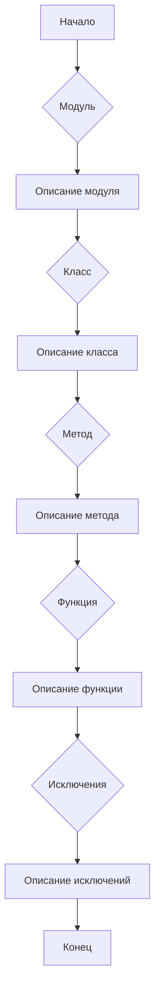

# <algorithm>

Этот код предоставляет шаблон для документирования кода с использованием reStructuredText (RST).  Он описывает, как структурировать документацию для модулей, классов, функций, методов и исключений.  Шаблон содержит примеры того, как использовать RST для описания различных элементов кода, включая описание целей, параметров, возвращаемых значений, примеров использования и исключений.


**Блок-схема (упрощенная):**

1. **Начало:** Получение шаблона RST для документирования кода.

2. **Описание модуля:**
   - Определение цели модуля.
   - Примеры использования модуля (в блоках `.. code-block:: python`).
   - Описание платформ и синопсиса модуля.

3. **Описание классов:**
   - Определение цели класса.
   - Описание атрибутов и методов класса.
   - Описание методов (включая параметры, возвращаемые значения, примеры).

4. **Описание функций/методов:**
   - Определение цели функции/метода.
   - Описание параметров и возвращаемых значений.
   - Примеры использования (в блоках `.. code-block:: python`).

5. **Описание исключений:**
   - Определение типов исключений, которые могут быть подняты.
   - Описание обстоятельств, при которых исключение может возникнуть.
   - Примеры использования обработки исключений.


**Примеры:**

* **Модуль:** Документация для модуля, отвечающего за работу с программирующим помощником.
* **Класс:** :class:`CodeAssistant` для взаимодействия с AI моделями.
* **Метод:** `process_files` для обработки файлов кода.


# <mermaid>



**Объяснение диаграммы:**

Диаграмма отображает последовательность документирования. Начало (A) ведет к описанию модуля (B), далее к описанию классов (D), методов (F), функций (H) и, наконец, к описанию исключений (J) и завершению (L).  Все элементы взаимосвязаны и образуют цепочку документирования кода.


# <explanation>

Этот код представляет собой **принцип, шаблон, инструкцию** для документирования кода в стиле RST.  Он не является исполняемым кодом, а скорее описанием, как должна выглядеть документация.

**Импорты:**

Нет импортов, так как это не исполняемый код.  Он представляет собой руководство.

**Классы:**

Нет определения классов в примере.

**Функции:**

Нет определений функций в примере.

**Переменные:**

Нет переменных в примере.

**Возможные ошибки/улучшения:**

- Не указаны конкретные примеры исключений, кроме общих (FileNotFoundError).  Для повышения качества документации нужно продемонстрировать более детальные примеры.
- Документация должна быть **автоматически генерируемой**.  Для этого используются инструменты, работающие с RST.
- В идеале, следует предоставить примеры, демонстрирующие использование методов и функций в контексте кода.


**Взаимосвязи с другими частями проекта:**

Документирование кода напрямую связано с самим кодом.  Документация предназначена для облегчения понимания кода и его использования другими разработчиками. Она будет использоваться для интеграции в систему документации проекта.

```