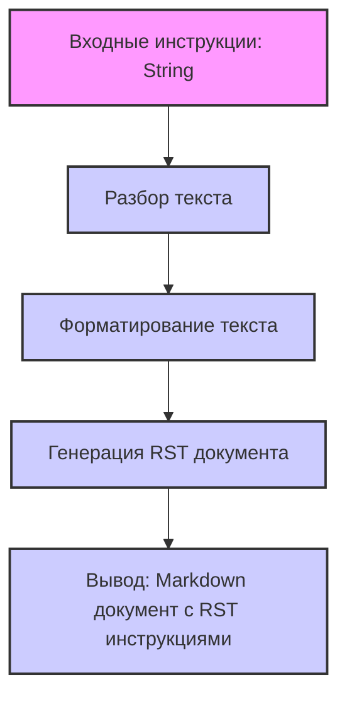

## АНАЛИЗ КОДА:

### <алгоритм>

1. **Ввод**: Принимает на вход строку с текстом, представляющую собой подсказку для модели искусственного интеллекта, которая должна быть использована для документации кода.
2. **Разбор текста**: Выделяются ключевые инструкции из входного текста, например, "Module", "Classes", "Functions and Methods", "Code Comments", "Exceptions", и их соответствующие требования и примеры.
3. **Форматирование**: Используются markdown элементы для форматирования инструкции, включая:
    - Заголовки `##`, `###`, для разделов.
    - Списки `1.`, `2.` для перечисления инструкций.
    - Блоки кода ` ``` ` для примеров кода.
    - Форматирование для выделения текста, например, `**текст**`.
    - Разметка `.. code-block:: python` для примеров кода.
4. **Генерация документации**: На основе разобранных инструкций, создаётся документ в формате RST (reStructuredText), включая разделы для модулей, классов, функций, комментариев и исключений.
5. **Вывод**: Готовый документ в формате markdown, содержащий инструкции по оформлению документации в RST.

**Пример логических блоков и потока данных:**

```
[Ввод] --> [Разбор текста] --> [Форматирование] --> [Генерация документации] --> [Вывод]
```

**Пример:**
 -   **Ввод:**
     ```text
     You are an advanced documentation writer for project `hypotez`.  
     Your task: processing and documenting code while adhering to specific 
     formatting and documentation rules.
     ...
     ```
-    **Разбор текста:**  
     Разбирается ввод, выделяются ключевые слова: `Module`, `Classes`, `Functions and Methods`, `Code Comments`, `Exceptions`, и их соответствующие описания.
-    **Форматирование:** 
     Применяется форматирование markdown, например, для разделов используются заголовки (`##`), для примеров используется `.. code-block:: python`.
-    **Генерация документации:** 
     Генерируется инструкция в формате RST с использованием структурирования markdown.
-    **Вывод:** 
     Возвращается  документ в формате markdown, содержащий структурированные инструкции для создания документации в RST.

### <mermaid>



**Объяснение:**

-   **`flowchart TD`**: Определяет тип диаграммы как блок-схему сверху вниз (Top-Down).
-   **`Input[Входные инструкции: String]`**: Представляет входные данные в виде строки. Узел имеет стиль заливки и границ.
-   **`ParseText[Разбор текста]`**: Узел, представляющий процесс разбора входных инструкций.
-   **`FormatText[Форматирование текста]`**: Узел, представляющий процесс форматирования текста в соответствии с инструкциями.
-   **`GenerateRSTDoc[Генерация RST документа]`**: Узел, представляющий процесс генерации документации в формате RST.
-   **`Output[Вывод: Markdown документ с RST инструкциями]`**: Узел, представляющий вывод сгенерированной документации в формате markdown. Узел имеет стиль заливки и границ.
-   **`-->`**: Указывает поток данных между процессами.
-   **`classDef process fill:#ccf,stroke:#333,stroke-width:2px`**: Определяет стиль для классов процессов.
-   **`class ParseText,FormatText,GenerateRSTDoc process`**: Применяет стиль `process` к узлам.

### <объяснение>

**Импорты:**

В данном коде нет импортов, так как это текстовое описание, а не исполняемый код Python.

**Классы:**

В предоставленном коде нет классов. Это инструкция для генерации документации в RST формате, поэтому здесь нет классов, которые можно было бы анализировать.

**Функции:**

В предоставленном коде нет функций. Это текстовое описание инструкций для документирования, а не исполняемый код, поэтому здесь нет функций для анализа.

**Переменные:**

В данном коде отсутствуют явно определенные переменные. Вся информация содержится в виде текста, который описывает процесс создания документации.

**Подробное объяснение:**

Данный текст представляет собой детальную инструкцию для автоматизированного процесса документирования кода в проекте `hypotez`. Основная цель - обеспечить единообразное и подробное описание кода с использованием формата Restructured Text (RST).

**Структура инструкции:**
  -   **Раздел "Prompt"**: Описывает основную задачу: написание расширенной документации для проекта `hypotez` с соблюдением правил форматирования и документирования.
  -   **Раздел "Module"**: Инструктирует о том, как оформлять описание модуля, включая его назначение, примеры использования, платформы и краткое описание.
  -   **Раздел "Classes"**: Предоставляет подробную инструкцию по документированию классов, включая их описание, атрибуты, методы и примеры использования.
  -   **Раздел "Functions and Methods"**: Объясняет, как документировать функции и методы, включая их параметры, возвращаемые значения, назначение и примеры использования.
  -   **Раздел "Code Comments"**: Указывает, как писать комментарии к коду, с акцентом на использование RST формата и пояснение логики кода.
  -   **Раздел "Exceptions"**: Инструктирует о том, как документировать исключения, включая их описание, параметры и примеры использования.

**Ключевые моменты:**

-   **RST (reStructuredText)**: Используется для форматирования документации, что является стандартом для Python проектов.
-   **`.. code-block:: python`**: Инструктирует о том, как оформлять примеры кода в блоках.
-   **Форматирование**: Используются заголовки, списки, и форматирование текста для структурирования документации.
-   **Полнота**: Требуется полное описание всех аспектов кода (модулей, классов, методов, функций, комментариев и исключений).

**Потенциальные ошибки и области для улучшения:**

-   **Отсутствие проверки**: Инструкция не содержит механизма проверки соответствия сгенерированной документации правилам RST.
-   **Зависимость от человеческого фактора**: Процесс генерации документации опирается на понимание инструкций и их правильное применение.
-   **Ручное форматирование**: Для корректного форматирования могут потребоваться дополнительные ручные правки.

**Взаимосвязь с другими частями проекта:**

Данная инструкция является частью процесса документирования проекта `hypotez` и тесно связана с:

-   **Кодовой базой**: Документация должна точно соответствовать коду.
-   **Процессом разработки**: Инструкция предназначена для использования разработчиками при написании кода.
-   **Инструментами автоматизации**: Инструкция может использоваться для создания автоматизированных скриптов для генерации документации.

**Заключение:**

Данная инструкция представляет собой подробное руководство для создания качественной и стандартизированной документации проекта `hypotez` в формате RST. Следование этим инструкциям поможет обеспечить согласованность и понятность документации для всех участников проекта.