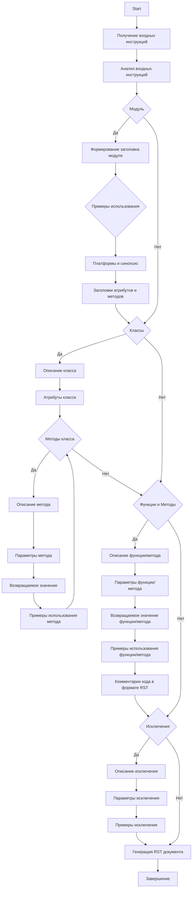

## АНАЛИЗ КОДА

### 1. <алгоритм>
**Описание процесса обработки и документирования кода:**

1. **Начало**: Получаем текстовый ввод с инструкциями по документированию кода.
2. **Анализ ввода**: Разбор инструкций, извлечение ключевых требований к форматированию и документации.
3. **Раздел модуля**:
   - Формируется заголовок модуля с описанием его назначения.
   - Если возможно, добавляются примеры использования модуля в блоке кода.
   - Указываются платформы и краткое описание модуля (синопсис).
   - Вставляются заголовки для атрибутов и методов модуля.
4. **Раздел классов**:
   - Для каждого класса генерируется описание его назначения.
   - Описываются атрибуты класса.
   - Для каждого метода класса:
     - Описывается его назначение.
     - Описываются параметры и возвращаемые значения.
     - Приводятся примеры использования в блоке кода.
5. **Раздел функций и методов**:
   - Для каждой функции или метода:
     - Описывается ее назначение.
     - Описываются параметры и возвращаемые значения.
     - Приводятся примеры использования в блоке кода.
6. **Комментарии кода**:
    - Генерируются комментарии в формате RST для описания логики кода.
    - Комментарии пишутся блоками, а не в строках.
7. **Раздел исключений**:
   - Документируются исключения, которые могут быть вызваны для классов, методов и функций.
   - Указывается, когда и при каких обстоятельствах возникают исключения.
8. **Генерация вывода**: Все сгенерированные разделы объединяются в единый RST документ.
9. **Завершение**: Вывод сохраняется или предоставляется пользователю.

**Пример:**

```python
# Исходный код для анализа
class CodeAssistant:
    def __init__(self, role, lang, model):
        """
        Инициализация CodeAssistant.
        :param role: Роль ассистента.
        :param lang: Язык.
        :param model: Модель ИИ.
        """
        self.role = role
        self.lang = lang
        self.model = model

    def process_files(self, files=None, options=None):
        """
        Обработка файлов.
        :param files: Список файлов.
        :param options: Дополнительные параметры.
        :return: Результат обработки.
        """
        # Обрабатываем файлы и возвращаем результаты
        return ["result1", "result2"]

# Модуль
# Класс CodeAssistant
# Методы __init__, process_files
# комментарии в коде

```

### 2. <mermaid>

**Анализ зависимостей `mermaid`:**
- Диаграмма начинается с `Start` и заканчивается на `End`.
- Все узлы связаны последовательно через стрелки, представляющие поток данных.
- **`Input`**: Получение инструкций для документации.
- **`Analyze`**: Анализ полученных инструкций.
- **`Module_Section`**: Проверка, нужно ли формировать раздел модуля.
- **`Module_Header`**: Формирование заголовка модуля.
- **`Module_Examples`**: Добавление примеров использования модуля.
- **`Module_Platform`**: Указание платформ и синопсиса.
- **`Module_Attributes_Methods`**: Добавление заголовков атрибутов и методов.
- **`Class_Section`**: Проверка, нужно ли формировать раздел класса.
- **`Class_Description`**: Описание класса.
- **`Class_Attributes`**: Атрибуты класса.
- **`Class_Methods`**: Методы класса.
- **`Method_Description`**: Описание метода.
- **`Method_Parameters`**: Параметры метода.
- **`Method_Returns`**: Возвращаемое значение метода.
- **`Method_Examples`**: Примеры использования метода.
- **`Function_Method_Section`**: Проверка, нужно ли формировать раздел функций/методов.
- **`Function_Description`**: Описание функции/метода.
- **`Function_Parameters`**: Параметры функции/метода.
- **`Function_Returns`**: Возвращаемое значение функции/метода.
- **`Function_Examples`**: Примеры использования функции/метода.
- **`Code_Comments`**: Вставка комментариев кода.
- **`Exception_Section`**: Проверка, нужно ли документировать исключения.
- **`Exception_Description`**: Описание исключения.
- **`Exception_Parameters`**: Параметры исключения.
- **`Exception_Examples`**: Примеры использования исключения.
- **`Output`**: Формирование финального RST документа.

### 3. <объяснение>

**Объяснение:**

- **Инструкция:**
  - Данный код представляет собой инструкцию для создания автоматизированной системы документирования кода на языке RST.
  - Инструкция подробно описывает формат документации, разделы, а также правила для классов, методов, функций, исключений и комментариев.
  - Требуется генерация документации в формате ReST (`*.rst`), что подразумевает использование определенных блоков (`.. code-block:: python`) для примеров кода и структурирование текста.
  - Цель - обеспечить автоматизированный процесс документирования, делая его четким и понятным.

- **Раздел модуля:**
  - Описывает, как следует документировать модули, включая описание модуля, примеры использования, платформы, синопсис, атрибуты и методы.
  - Пример:  
    ```rst
    Module for working with a programming assistant
    =========================================================================================

    This module contains the :class:`CodeAssistant` class, which is used to interact with various AI models, 
    such as Google Gemini and OpenAI, for code processing tasks.

    Example usage
    --------------------

    Example of using the `CodeAssistant` class:

    .. code-block:: python

        assistant = CodeAssistant(role='code_checker', lang='ru', model=['gemini'])
        assistant.process_files()
    ```

- **Раздел классов:**
  - Показывает, как документировать классы, включая описание класса, атрибуты и методы с их описаниями и примерами.
  - Пример:
    ```rst
    Class for working with the programming assistant
    =========================================================================================

    The :class:`CodeAssistant` class is used to interact with various AI models such as Google Gemini, 
    and provides methods for analyzing and generating documentation for code.

    Attributes:
    ----------
    - `role`: The role of the assistant (e.g., 'code_checker').
    - `lang`: The language the assistant will use (e.g., 'ru').
    - `model`: List of AI models used (e.g., ['gemini']).

    Methods:
    --------
    - `process_files`: Method for processing code files.

    Example usage:
    ---------------------

    .. code-block:: python

        assistant = CodeAssistant(role='code_checker', lang='ru', model=['gemini'])
        assistant.process_files()
    ```

- **Раздел функций и методов:**
  - Описывает, как документировать функции и методы, включая их параметры, возвращаемые значения, описания и примеры.
  - Пример:
    ```rst
    Method for processing files
    =========================================================================================

    This method is used to analyze and process code files.

    Parameters:
    ----------
    - `files`: A list of files to process.
    - `options`: Additional parameters for configuring the processing.

    Return value:
    ----------------------
    - Returns the processing result as a list of analyzed data.

    Example usage:
    ---------------------

    .. code-block:: python

        assistant = CodeAssistant(role='code_checker', lang='ru', model=['gemini'])
        result = assistant.process_files(files=['file1.py', 'file2.py'], options={})
    ```

- **Комментарии кода:**
  - Указывает на необходимость подробных комментариев к коду в формате RST для описания логики и решений.
  - Пример:
    ```python
    # Здесь обрабатывается исключение, чтобы продолжить выполнение, если файл не найден
    try:
        process_file(file)
    except FileNotFoundError as ex:
        handle_exception(ex)
    ```

- **Раздел исключений:**
  - Инструктирует о документировании исключений, которые могут быть вызваны в коде, с указанием параметров и примеров.
  - Пример:
    ```rst
    File Not Found Exception
    =========================================================================================

    This exception is raised when a file is not found during processing.

    Parameters:
    ----------
    - `file`: The path of the file that was not found.

    Example usage:
    --------------------

    .. code-block:: python

        try:
            open(file)
        except FileNotFoundError as ex:
            raise FileNotFoundError("File not found") from ex
    ```

- **Использование RST:**
   -  Вся документация должна быть написана в ReStructuredText, который является форматом разметки текста. RST позволяет форматировать текст и добавлять элементы, такие как заголовки, списки, блоки кода и т.д.

**Потенциальные ошибки и улучшения:**
- **Ошибки**:
  - Неполное или неточное описание исключений.
  - Неправильное использование RST.
  - Недостаточные примеры использования.
  - Отсутствие комментариев в коде.
- **Улучшения**:
  - Автоматическая генерация кода для RST документации.
  - Проверка на наличие обязательных разделов и элементов.
  - Улучшенное форматирование и стилизация документации.
  - Добавление большего количества вариантов использования.
  - Внедрение средств проверки синтаксиса RST.

**Взаимосвязь с другими частями проекта:**
- Эта инструкция является частью системы `hypotez`, которая предназначена для автоматизации различных задач, связанных с разработкой программного обеспечения, включая документирование. Эта инструкция, в свою очередь, направлена на улучшение качества документации, что является важной частью жизненного цикла разработки.