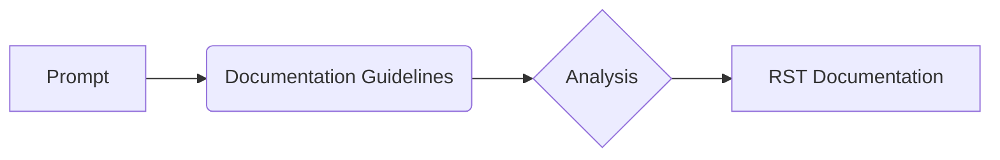
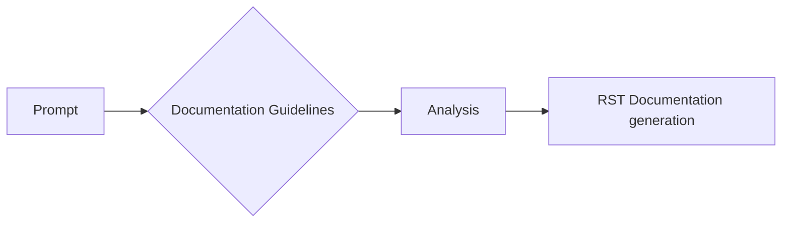

# <input code>

```
  "prompt": "You must document code in the following style. All comments in the code, including module, class, and function descriptions, should be written in reStructuredText (RST) format. For each module, class, and function, follow this template:\n\n1. **Module**:\n    - The module description should be written in the header, indicating its purpose.\n    - Provide examples of using the module, if possible. Code examples should be enclosed in a `.. code-block:: python` block.\n    - Specify the platforms and synopsis of the module.\n    - Use headers for attributes and methods of the module where necessary.\n\nExample of module documentation:\n```\nModule for working with a programming assistant\n=========================================================================================\n\nThis module contains the :class:`CodeAssistant` class, which is used to interact with various AI models, \nsuch as Google Gemini and OpenAI, for code processing tasks.\n\nExample usage\n--------------------\n\nExample of using the `CodeAssistant` class:\n\n.. code-block:: python\n\n    assistant = CodeAssistant(role=\'code_checker\', lang=\'ru\', model=[\'gemini\'])\n    assistant.process_files()\n```\n\n2. **Classes**:\n    - Each class should be described according to its purpose. Include the class description, its attributes, and methods.\n    - In the class section, list all methods, their purpose, and examples of usage.\n    - For each method, include descriptions of its parameters and return values, as well as examples.\n\nExample of class documentation:\n```\nClass for working with the programming assistant\n=========================================================================================\n\nThe :class:`CodeAssistant` class is used to interact with various AI models such as Google Gemini, \nand provides methods for analyzing and generating documentation for code.\n\nAttributes:\n----------\n- `role`: The role of the assistant (e.g., \'code_checker\').\n- `lang`: The language the assistant will use (e.g., \'ru\').\n- `model`: List of AI models used (e.g., [\'gemini\']).\n\nMethods:\n--------\n- `process_files`: Method for processing code files.\n\nExample usage:\n---------------------\n\n.. code-block:: python\n\n    assistant = CodeAssistant(role=\'code_checker\', lang=\'ru\', model=[\'gemini\'])\n    assistant.process_files()\n```\n\n3. **Functions and Methods**:\n    - Document each function or method by specifying parameters and return values.\n    - For each function, provide a description of its purpose and usage examples in the `.. code-block:: python` format.\n\nExample of method documentation:\n```\nMethod for processing files\n=========================================================================================\n\nThis method is used to analyze and process code files.\n\nParameters:\n-----------\n- `files`: A list of files to process.\n- `options`: Additional parameters for configuring the processing.\n\nReturn value:\n----------------------\n- Returns the processing result as a list of analyzed data.\n\nExample usage:\n---------------------\n\n.. code-block:: python\n\n    assistant = CodeAssistant(role=\'code_checker\', lang=\'ru\', model=[\'gemini\'])\n    result = assistant.process_files(files=[\'file1.py\', \'file2.py\'], options={})\n```\n\n4. **Code Comments**:\n    - All comments in the code should be written in RST format and should explain what the specific part of the code does.\n    - Leave comments in blocks, not in lines. Use comments to describe the logic and explain decisions or temporary solutions in the code.\n    - Example:\n    ```\n    # Here, the exception is being handled to continue execution if the file is not found\n    try:\n        process_file(file)\n    except FileNotFoundError as ex:\n        handle_exception(ex)\n    ```\n\n5. **Exceptions**:\n    - Document exceptions for classes, methods, and functions.\n    - Specify which exceptions can be raised and under what circumstances.\n\nExample of exception documentation:\n```\nFile Not Found Exception\n=========================================================================================\n\nThis exception is raised when a file is not found during processing.\n\nParameters:\n-----------\n- `file`: The path of the file that was not found.\n\nExample usage:\n---------------------\n\n.. code-block:: python\n\n    try:\n        open(file)\n    except FileNotFoundError as ex:\n        raise FileNotFoundError("File not found") from ex\n```\n\nFollow these instructions for documenting your code. All comments should be clear, informative, and compliant with the RST standard."\n```

```markdown
# <algorithm>

No code is present for a step-by-step algorithm. The input is a set of documentation guidelines, not executable code.  Therefore, no algorithm can be described.
```



# <mermaid>



# <explanation>

The provided input is not executable code but rather a *prompt* defining a set of instructions for documenting code using reStructuredText (RST).  It outlines a template for writing documentation for modules, classes, functions, methods, and exceptions in RST format, including examples for each.

* **Импорты**: There are no imports as this is a documentation prompt, not code.  This prompt outlines *how* to document code, not *what* code to document.

* **Классы**: The prompt defines the structure and format for documenting Python classes, including `CodeAssistant`. It details attributes (like `role`, `lang`, `model`) and methods (like `process_files`) with instructions on how to document their purpose, parameters, return values, and usage.


* **Функции**: The prompt outlines the format for documenting Python functions or methods within classes, specifying how to document their parameters, return values, and descriptions using RST.


* **Переменные**: There are no variables to explain, since the prompt is about documentation, not code execution.


* **Возможные ошибки или улучшения**: The prompt is well-defined, but could be improved by suggesting more complex examples (such as handling errors or using different types of variables) to cover more advanced aspects of RST documentation.


**Взаимосвязь с другими частями проекта**: The prompt does not pertain to a specific project, as it is a general instruction on how to document code in RST for *any* project.  The documentation will be used to improve readability and maintainability of the eventual code, but it's not interacting with any code base itself.