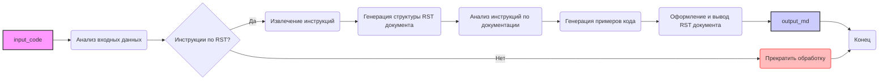

## <алгоритм>

1.  **Начало**: Анализ входных данных (`input_code`) на предмет наличия кода и инструкций. В данном случае `input_code` представляет собой текстовое описание требований к документации, а не исполняемый код.

2.  **Извлечение инструкций**: Разбор инструкций по генерации документации, включая:
    *   Формат вывода: Restructured Text (`.rst`).
    *   Тип документации: Модули, классы, функции, методы, комментарии к коду, исключения.
    *   Содержание документации: Описания, примеры, параметры, возвращаемые значения, исключения.
    *   Примеры: Примеры использования с кодом в блоках `.. code-block:: python`.

3.  **Генерация структуры документации**: Создание структуры `.rst` документа, включая заголовки для модулей, классов, методов, и т.д.

4.  **Анализ инструкций по документации**: Наполнение структуры документации на основе анализа инструкций. Например:
    *   Для модулей: Добавить описание, пример использования, платформы, синопсис.
    *   Для классов: Добавить описание, атрибуты, методы, пример использования.
    *   Для функций и методов: Добавить описание, параметры, возвращаемые значения, пример использования.
    *   Для комментариев: Указать необходимость их написания в блоках, объясняя логику кода.
    *   Для исключений: Добавить описание исключений, параметров и примеры их обработки.

5.  **Генерация примеров кода**: Формирование примеров кода, соответствующих требованиям.
    *   Использование `.. code-block:: python` для обрамления примеров.
    *   Создание примеров для модулей, классов, методов, исключений.

6.  **Оформление и вывод**: Оформление `.rst` документа с помощью соответствующих синтаксических элементов, сохранение и выдача результата в формате `.md` (markdown).

## <mermaid>

**Описание зависимостей `mermaid`:**

*   `A` (`input_code`): Начальные входные данные, представляющие собой текст с инструкциями.

*   `B` (Анализ входных данных): Функция или блок кода, который анализирует входные данные на наличие кода и инструкций.

*   `C` (Инструкции по RST?): Условный блок, проверяющий наличие инструкций для генерации RST-документации.

*   `D` (Извлечение инструкций): Блок кода, извлекающий конкретные требования к документации.

*   `E` (Прекратить обработку): Блок кода, который останавливает процесс, если нет инструкций по RST.

*   `F` (Генерация структуры RST документа): Создание начальной структуры документа в формате RST.

*   `G` (Анализ инструкций по документации): Анализ конкретных инструкций для наполнения документации.

*   `H` (Генерация примеров кода): Блок кода, генерирующий примеры кода в формате Python, обернутые в `.. code-block:: python`.

*   `I` (Оформление и вывод RST документа): Блок кода, форматирующий и выводящий документ в RST-формате.

*   `J` (`output_md`): Конечный вывод в формате `.md`.

*   `K` (Конец): Завершение процесса.

**Зависимости:**

*   Блок `B` зависит от входных данных `A`.
*   Блок `C` зависит от результата анализа `B`.
*   Блок `D` зависит от положительного ответа в `C`.
*   Блоки `F`, `G`, `H` зависят от `D`.
*   Блок `I` зависит от `F`, `G`, `H`.
*   Блок `J` зависит от `I`.
*   Блок `K` является терминальным и зависит от `C` и `J`.

Все имена переменных, использованные в диаграмме `mermaid`, осмыслены и описывают выполняемые действия на каждом этапе обработки.

## <объяснение>

**Импорты:**
В данном коде нет импортов, поскольку это текстовое описание процесса обработки, а не исполняемый код. Однако, если бы была реализация кода для данного процесса, могли бы потребоваться импорты из следующих модулей:

*   `re` - Для разбора текста и поиска определенных паттернов (например, поиска ключевых слов, заголовков).
*   `os` и `pathlib` - Для работы с файловой системой (если требуется сохранять сгенерированную документацию в файл).
*   `typing` - Для аннотации типов (для лучшей читаемости и поддержки кода).

**Классы:**
В данном контексте нет классов, поскольку это описание процесса генерации документации, а не реализация конкретного кода.

**Функции:**
В данном описании нет функций, но если бы мы разрабатывали код, то потребовались бы следующие функции:

*   `analyze_input_data(input_code)`: Анализирует `input_code` и определяет наличие инструкций.
*   `extract_instructions(input_code)`: Извлекает инструкции по документации из `input_code`.
*   `generate_rst_structure()`: Создает базовую структуру RST-документа.
*   `analyze_instructions_and_fill(instructions)`: Заполняет структуру документа на основе инструкций.
*   `generate_code_examples(instruction)`: Генерирует примеры кода в нужном формате.
*   `format_and_output_rst(doc_structure)`: Форматирует и выводит документ в формате RST.
*   `convert_rst_to_md(rst_content)`: конвертирует RST в MD формат

**Переменные:**
В контексте описания процесса, переменные могут включать:

*   `input_code`: Входной текст с инструкциями.
*   `instructions`: Список или структура, содержащая извлеченные инструкции.
*   `doc_structure`: Структура RST-документа, которую нужно наполнить.
*   `rst_content`: Текст, содержащий сформированный RST документ.
*   `output_md`: Текст, содержащий сформированный MD документ.

**Цепочка взаимосвязей с другими частями проекта:**

*   Этот модуль (`doc_wrter_rst_en.md`) является частью системы обработки документации в проекте `hypotez`. Он отвечает за автоматическую генерацию документации в формате RST на основе предоставленных инструкций.
*   Этот модуль может зависеть от модулей обработки кода, которые будут предоставлять структурированный код для анализа и документирования.
*   Сгенерированная документация может использоваться другими модулями проекта, например, для публикации на веб-сайте или для создания пользовательских руководств.

**Потенциальные ошибки и области для улучшения:**

*   **Жесткая зависимость от формата ввода:**  Процесс может быть уязвим к изменениям в формате `input_code`.
*   **Отсутствие обработки ошибок:**  Код, выполняющий этот процесс, должен быть устойчив к ошибкам и уметь обрабатывать неожиданные форматы входных данных.
*   **Сложность поддержки:** Код для создания документации должен быть гибким, чтобы его можно было адаптировать к новым требованиям и изменениям в структуре проекта.
*   **Отсутствие валидации:** Перед генерацией документации необходимо валидировать входные данные.

**Выводы:**

Данное описание предоставляет чёткую структуру и шаги для разработки системы автоматической генерации документации в формате RST. Выполнение этих инструкций поможет создать надежный и масштабируемый инструмент.