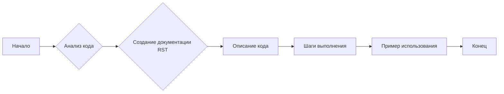
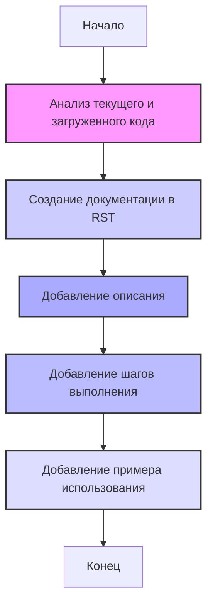

## <алгоритм>

1. **Анализ кода:**
   - Проверяется текущий блок кода и все ранее загруженные блоки кода в проекте.
   - Код анализируется для определения его назначения, выполняемых действий и необходимых шагов для его выполнения.

2. **Создание документации в reStructuredText (RST):**
   - Для каждого блока кода генерируется документация в формате RST.
   - Документация включает следующие разделы:
     - **Описание (Description):** Краткое описание назначения кода, например, какие задачи он решает или какие проверки выполняет.
     - **Шаги выполнения (Execution steps):** Пошаговое описание действий, необходимых для выполнения кода.
     - **Пример использования (Usage example):** Пример, показывающий, как использовать данный код в проекте, включая возможные вызовы функций или методов.

3. **Описание шагов выполнения:**
   - Каждый шаг выполнения описывает конкретное действие, которое выполняет код, избегая неточных формулировок.
   - Если код выполняет проверку, описывается, какие данные и как проверяются.
   - Если код вызывает другие функции или методы, указывается, какие именно функции вызываются и с какими параметрами.

4. **Примеры использования:**
   - Примеры использования кода приводятся в виде фрагментов кода на Python.
   - Примеры показывают, как интегрировать рассматриваемый блок кода в общий проект.

**Пример потока данных и работы алгоритма**

## <mermaid>

**Объяснение:**

- `Start`: Начало процесса.
- `AnalyzeCode`: Анализирует текущий блок кода и все предыдущие загруженные блоки в проекте.
- `CreateRST`: Создает структуру документации в формате RST.
- `Description`: Добавляет описание блока кода, объясняющее его назначение и задачи.
- `Steps`: Добавляет подробные пошаговые инструкции по выполнению блока кода.
- `Example`: Добавляет пример использования кода, показывающий, как интегрировать его в проект.
- `End`: Конец процесса.

## <объяснение>

**Описание:**

Этот код предназначен для генерации подробной документации к блокам кода в проекте. Он анализирует каждый блок кода и создает для него структурированное описание в формате reStructuredText (RST).

**Импорты:**

В представленном коде нет явных операторов `import`. Однако подразумевается, что код оперирует с другими частями проекта, а именно, со структурой кода проекта и ранее загруженными блоками кода.

**Классы:**

Классы явно не используются в данном фрагменте кода, но можно предположить, что для работы с кодом и генерации документации могут использоваться классы, но они не описаны в данном фрагменте.

**Функции:**

В предоставленном коде не используются явно определенные функции, однако описаны шаги, которые по сути являются функцией, отвечающей за генерацию документации:

1. **Анализ кода:** Функция анализирует предоставленный код и все ранее загруженные блоки кода.
2. **Создание документации:** Функция генерирует документацию в формате RST. Документация включает описание, пошаговые инструкции и примеры использования кода.
3. **Форматирование:** Функция форматирует документацию в соответствии с заданной структурой.

**Переменные:**

В данном коде явно не используются переменные, однако подразумевается, что он оперирует с переменными, представляющими загруженные блоки кода и их структуру.

**Детализация процесса:**

1. **Описание:** На этапе описания  функция объясняет назначение блока кода, то есть, какую задачу решает код или какие проверки он выполняет. 
2. **Шаги выполнения:** На этапе описания шагов выполнения  функция предоставляет пошаговую инструкцию, как именно код выполняет свою задачу. Шаги включают вызовы функций или методов, с указанием параметров и выполняемых проверок.
3. **Пример использования:** На этапе добавления примера использования функция предоставляет пример использования блока кода в проекте. Примеры могут включать вызовы функций или методов, которые используются в коде.

**Потенциальные ошибки или области для улучшения:**

1.  **Отсутствие обработки ошибок:** Код не учитывает, что может пойти не так при анализе или создании документации. Например, если код не может быть проанализирован, то должна быть предусмотрена обработка этой ситуации.
2.  **Зависимости:** Код зависит от наличия структуры кода и предыдущих блоков кода, но в нем нет механизмов для проверки корректности и доступности этих данных.
3.  **Формат вывода:** Код предполагает генерацию документации в формате reStructuredText, но не предоставляет возможностей для использования других форматов.

**Цепочка взаимосвязей с другими частями проекта:**

Этот код связан с другими частями проекта, которые управляют загрузкой и хранением блоков кода. Взаимосвязь обеспечивается через доступ к данным о загруженных блоках кода, которые необходимы для проведения анализа и генерации документации.